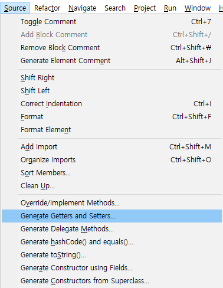

#### 1. 달력 출력 프로그램을 수정해서 일요일부터 한 주를 시작하게 하라. 또한, 끝에 줄 넘김을 한 번만 출력하게 만든다.

```java
public class Ex01 {

	public static void main(String[] args) {
		LocalDate date = LocalDate.now().withDayOfMonth(1);
		int month = date.getMonthValue();

		System.out.println(" Sun Mon Tue Wed Thu Fri Sat");
		DayOfWeek weekday = date.getDayOfWeek();

		int value = convertWeek(weekday.getValue());

		for (int i = 1; i < value; i++) {
			System.out.print("    ");
		}

		while (date.getMonthValue() == month) {
			System.out.printf("%4d", date.getDayOfMonth());
			date = date.plusDays(1);
			if (convertWeek(date.getDayOfWeek().getValue()) == 1) {
				System.out.println();
			}
		}
	}
	
	/**
	 * 요일 번호를 월요일(1)~일요일(7)에서 일요일(1)~토요일(7)으로 변경한다.
	 * 
	 * @param value 요일 번호. 월요일(1) ~ 일요일(7)
	 * @return 요일 번호. 일요일(1) ~ 토요일(7)
	 */
	private static int convertWeek(int value) {
		// 7 -> 1
		// 1 -> 2
		// 2 -> 3
		// 3 -> 4
		// 4 -> 5
		// 5 -> 6
		// 6 -> 7
		return value + 1 > 7 ? 1 : value + 1;
	}

}
```

#### 2. Sanner 클래스의 nextInt 메서드를 생각해보자. 이 메서드는 접근자인가 변경자인가? 그 이유는 무엇인가? Random 클래스의 nextInt 메서드는 어떤가?

Scanner 클래스의 nextInt 메서드는 변경자이다. 인스턴스 변수들의 값이 바뀐다.

readInt() -> readInt(int radix) -> next(pattern) -> readInput()

```java
public final class Scanner implements Iterator<String>, Closeable {

    // Internal buffer used to hold input
    private CharBuffer buf;
    // The index into the buffer currently held by the Scanner
    private int position;
    
    public int nextInt() {
        return nextInt(defaultRadix);
    }
    
    public int nextInt(int radix) {
        // Check cached result
        if ((typeCache != null) && (typeCache instanceof Integer)
            && this.radix == radix) {
            int val = ((Integer)typeCache).intValue();
            useTypeCache();
            return val;
        }
        setRadix(radix);
        clearCaches();
        // Search for next int
        try {
            String s = next(integerPattern());
            if (matcher.group(SIMPLE_GROUP_INDEX) == null)
                s = processIntegerToken(s);
            return Integer.parseInt(s, radix);
        } catch (NumberFormatException nfe) {
            position = matcher.start(); // don't skip bad token
            throw new InputMismatchException(nfe.getMessage());
        }
    }
    
    public String next(Pattern pattern) {
        ensureOpen();
        if (pattern == null)
            throw new NullPointerException();

        // Did we already find this pattern?
        if (hasNextPattern == pattern)
            return getCachedResult();
        clearCaches();

        // Search for the pattern
        while (true) {
            String token = getCompleteTokenInBuffer(pattern);
            if (token != null) {
                matchValid = true;
                skipped = false;
                return token;
            }
            if (needInput)
                readInput();
            else
                throwFor();
        }
    }
    
    private void readInput() {
        if (buf.limit() == buf.capacity())
            makeSpace();

        // Prepare to receive data
        int p = buf.position();
        buf.position(buf.limit());
        buf.limit(buf.capacity());

        int n = 0;
        try {
            n = source.read(buf);
        } catch (IOException ioe) {
            lastException = ioe;
            n = -1;
        }

        if (n == -1) {
            sourceClosed = true;
            needInput = false;
        }

        if (n > 0)
            needInput = false;

        // Restore current position and limit for reading
        buf.limit(buf.position());
        buf.position(p);
    }
    
}
```

Random 클래스의 nextInt 메서드는 접근자이다.

```java
    public int nextInt(int bound) {
        if (bound <= 0)
            throw new IllegalArgumentException(BadBound);

        int r = next(31);
        int m = bound - 1;
        if ((bound & m) == 0)  // i.e., bound is a power of 2
            r = (int)((bound * (long)r) >> 31);
        else {
            for (int u = r;
                 u - (r = u % bound) + m < 0;
                 u = next(31))
                ;
        }
        return r;
    }
```

#### 3. void 외의 것을 반환하는 변경자 메서드가 있을 수 있는가? void를 반환하는 접근자 메서드가 있을 수 있는가? 가능하면 예를 제시하라.

```java
public final class StringBuilder extends AbstractStringBuilder implements java.io.Serializable, CharSequence {
	// 자기 자신을 반환하는 변경자 메서드    
	@Override
	public StringBuilder append(CharSequence s) {
		super.append(s);
		return this;
	}
}
```

```java
// void를 반환하는 접근자 메서드가 있을 수 있는가?
```

#### 4. 자바에서는 두 int 변수의 내용을 맞바꾸는 메서드를 구현할 수 없는 이유는 무엇인가? 대신 두 IntHolder 객체의 내용을 맞바꾸는 메서드를 작성하라

메서드로 값을 넘길떄 두 int 변수 값이 **복사**가 되기 때문에 메서드를 호출할 당시의 두 int 변수는 변하지 않는다.

```java
IntHolder ih1 = new IntHolder(10);
IntHolder ih2 = new IntHolder(20);
// ih1 = 10, ih2 = 20
System.out.println("ih1 = " + ih1.value + ", ih2 = " + ih2.value);

// 교체
int temp = ih1.value;
ih1.value = ih2.value;
ih2.value = temp;
// ih1 = 20, ih2 = 10
System.out.println("ih1 = " + ih1.value + ", ih2 = " + ih2.value);
```

```java
Integer i1 = new Integer(111);
Integer i2 = new Integer(222);
// i1 = 111, i2 = 222
System.out.println("i1 = " + i1 + ", i2 = " + i2);

Integer t = i1;
i1 = i2;
i2 = t;
// i1 = 222, i2 = 111
System.out.println("i1 = " + i1 + ", i2 = " + i2);
```

#### 5. 평면에 놓인 점을 기술하는 불변 클래스 Point를 구현하라.

```java
public class Point {

	private final double x;
	private final double y;

	public Point() {
		this(0, 0);
	}

	public Point(double x, double y) {
		this.x = x;
		this.y = y;
	}

	public double getX() {
		return x;
	}

	public double getY() {
		return y;
	}

	public Point translate(double x, double y) {
		Point p = new Point(getX() + x, getY() + y);
		return p;
	}

	public Point scale(double scale) {
		Point p = new Point(getX() * scale, getY() * scale);
		return p;
	}

}
```

#### 6. 연습문제 5번을 반복하되 이벤에는 translate와 scale을 변경자로 만들라.

```java
public class Point {

	private double x;
	private double y;

	public Point() {
		this(0, 0);
	}

	public Point(double x, double y) {
		this.x = x;
		this.y = y;
	}

	public double getX() {
		return x;
	}

	public double getY() {
		return y;
	}

	public Point translate(double x, double y) {
		this.x = this.x + x;
		this.y = this.y + y;
		return this;
	}

	public Point scale(double scale) {
		this.x = this.x * scale;
		this.y = this.y * scale;
		return this;
	}

}
```

#### 7. 연습문제 5번과 6번에서 만든 Point 클래스의 두 버전에 javadoc 주석을 추가하라.

```java
package ch02.ex05;

/**
 * 평면에 놓인 점을 기술하는 점 클래스
 * 
 * @author antop
 *
 */
public class Point {

	private final double x;
	private final double y;

	/**
	 * 0,0으로 점을 생성한다.
	 */
	public Point() {
		this(0, 0);
	}

	/**
	 * x좌표와 y좌표를 지정하여 점을 생성한다.
	 * 
	 * @param x
	 * @param y
	 */
	public Point(double x, double y) {
		this.x = x;
		this.y = y;
	}

	/**
	 * x 좌표
	 * 
	 * @return
	 */
	public double getX() {
		return x;
	}

	/**
	 * y 좌표
	 * 
	 * @return
	 */
	public double getY() {
		return y;
	}

	/**
	 * 지정한 x, y 좌표만큼 이동한다.
	 * 
	 * @param x 이동할 x 크기
	 * @param y 이동할 y 크기
	 * @return 새로운 {@link Point}
	 */
	public Point translate(double x, double y) {
		Point p = new Point(getX() + x, getY() + y);
		return p;
	}

	/**
	 * 
	 * 지정한 배율만큼 좌표를 확대/축소한다.
	 * 
	 * @param scale 배율
	 * @return 새로운 {@link Point}
	 */
	public Point scale(double scale) {
		Point p = new Point(getX() * scale, getY() * scale);
		return p;
	}

}
```

```java
package ch02.ex06;

/**
 * 평면에 놓인 점을 기술하는 점 클래스
 * 
 * @author antop
 *
 */
public class Point {

	private double x;
	private double y;

	/**
	 * 0,0으로 점을 생성한다.
	 */
	public Point() {
		this(0, 0);
	}

	/**
	 * x좌표와 y좌표를 지정하여 점을 생성한다.
	 * 
	 * @param x
	 * @param y
	 */
	public Point(double x, double y) {
		this.x = x;
		this.y = y;
	}

	/**
	 * x 좌표
	 * 
	 * @return
	 */
	public double getX() {
		return x;
	}

	/**
	 * y 좌표
	 * 
	 * @return
	 */
	public double getY() {
		return y;
	}

	/**
	 * 지정한 x, y 좌표만큼 이동한다.
	 * 
	 * @param x 이동할 x 크기
	 * @param y 이동할 y 크기
	 * @return {@link Point}
	 */
	public Point translate(double x, double y) {
		this.x = this.x + x;
		this.y = this.y + y;
		return this;
	}

	/**
	 * 
	 * 지정한 배율만큼 좌표를 확대/축소한다.
	 * 
	 * @param scale 배율
	 * @return 새로운 {@link Point}
	 */
	public Point scale(double scale) {
		this.x = this.x * scale;
		this.y = this.y * scale;
		return this;
	}

}
```

#### 8. 연습문제 7번에서 Point 클래스의 생성자와 케터(getter) 메서드를 제공하는 일은 다소 반복적인 일이었다. IDE 대부분에는 상투적으로 반복되는 코드를 단축하여 작성하는 기능이 있다. 여러분이 사용하는 IDE는 어떤 단축 기능을 제공하는가?



#### 9. x 축을 따라 이동하며 가스를 소비하는 자동차를 모델링하는 Car 클래스를 구현하라.

```java
public class Car {

	private final double milesPerGallon;
	private Gas gas;

	/**
	 * 
	 * @param milesPerGallon 연료 효율성(갤런당 마일 단위)
	 */
	public Car(int milesPerGallon) {
		this.gas = new Gas();
		this.milesPerGallon = milesPerGallon;
	}

	/**
	 * 지정한 거리(mile)만큼 이동한다.
	 * 
	 * @param miles 거리
	 * @return
	 */
	public Car drive(double miles) {
		gas.use(miles / milesPerGallon);
		return this;
	}

	/**
	 * 지정한 수만큼 가스 탱크에 갤런을 채운다.
	 * 
	 * @param gallons 가스(gallon)
	 * @return
	 */
	public Car charge(double gallons) {
		gas.charge(gallons);
		return this;
	}

	public double getMiles() {
		return gas.getUsed() * milesPerGallon;
	}

	public double getMilesPerCallon() {
		return milesPerGallon;
	}

	public Gas getGas() {
		return gas;
	}

}
```

```java
public class Gas {

	private double capacity = 0;
	private double used = 0;

	public void use(double gallons) {
		this.capacity -= gallons;
		this.used += gallons;
	}

	/**
	 * 가스 충전
	 * 
	 * @param gallons
	 */
	public void charge(double gallons) {
		this.capacity += gallons;
	}

	/**
	 * 남은 가스량
	 * 
	 * @return
	 */
	public double getCapacity() {
		return capacity;
	}

	/**
	 * 사용한 가스량
	 * 
	 * @return
	 */
	public double getUsed() {
		return used;
	}

}
```

#### 10. RandomNumbers 클래스 안에 정적 메서드 randomElement 두 개를 구현하라. randomElement는 정수의 배열이나 배열 리스트로부터 임의의 요소를 얻는다(해당 배열이나 배열 리스트가 비어 있으면 0을 반환한다). 이 메서드들을 int[]나 ArrayList<Integer>의 인스턴스 메서드로 만들 수 없는 이유는 무엇인가?

```java
package ch02.ex10;

import java.util.ArrayList;
import java.util.Random;

public class RandomNumbers {

	private static final Random r = new Random();

	public static int randomElement(int[] array) {
		ArrayList<Integer> list = new ArrayList<>(array.length);
		for (int i : array) {
			list.add(i);
		}

		return randomElement(list);
	}

	public static int randomElement(ArrayList<Integer> list) {
		if (list == null || list.isEmpty()) {
			return 0;
		}

		return list.get(r.nextInt(list.size()));
	}

}
```

int[] 는 클래스가 아니라서 인스턴스 메서드를 만들 수 없다.

ArrayList<Integer> 는 만들 수 있을 것 같은데!?

```java
package ch02.ex10;

import java.util.ArrayList;
import java.util.Random;

public class MyArrayList<E> extends ArrayList<E> {

	private final Random r = new Random();
	
	/**
	 * 임의의 요소를 얻는다.
	 * @return
	 */
	public E randomElement() {
		if (isEmpty()) {
			return null;
		}
		return get(r.nextInt(size()));
	}
}
```

#### 11. Cal 클래스를 다시 작성해서 System과 LocalDate 클래스에 정적 임포트를 사용하도록 하라.

```java
package ch02;

import static java.lang.System.*;
import static java.time.LocalDate.*;

import java.time.DayOfWeek;
import java.time.LocalDate;

public class Ex11 {

	public static void main(String[] args) {
		LocalDate date = now().withDayOfMonth(1);
		int month;
		if (args.length >= 2) {
			month = Integer.parseInt(args[0]);
			int year = Integer.parseInt(args[1]);
			date = of(year, month, 1);
		} else {
			month = date.getMonthValue();
		}

		
		out.println(" Mon Tue Wed Thu Fri Sat Sun");
		DayOfWeek weekday = date.getDayOfWeek();
		int value = weekday.getValue(); // 1 = Monday, ... 7 = Sunday
		for (int i = 1; i < value; i++)
			out.print("    ");
		while (date.getMonthValue() == month) {
			out.printf("%4d", date.getDayOfMonth());
			date = date.plusDays(1);
			if (date.getDayOfWeek().getValue() == 1)
				out.println();
		}
		if (date.getDayOfWeek().getValue() != 1)
			out.println();
	}

}
```

#### 12. ch01.sec01 패키지에 HelloWorld 클래스를 선언하는 HelloWorld.java 파일을 만든다 ....

컴파일을 하면 동일한 디렉터리에 class 파일이 생성된다.

실행을 하면 클래스를 찾을 수 없다고 한다.
```
> java HelloWorld
오류: 기본 클래스 HelloWorld을(를) 찾거나 로드할 수 없습니다.
```

```
> javap HelloWorld
Warning: Binary file HelloWorld contains ch01.sec01.HelloWorld
Compiled from "HelloWorld.java"
public class ch01.sec01.HelloWorld {
  public ch01.sec01.HelloWorld();
  public static void main(java.lang.String[]);
}
```

아래 명령어를 수행 하면 현재 디렉터리 기준으로 **패키지에 맞는 디렉터리를 생성**해서 컴파일 한다.

```
javac -d , HelloWorld.java
```

#### 13. 먼저 [OpenCSV](http://opencsv.sourceforge.net/)의 JAR 파일을 내려받는다. 여러분이 선택한 CSV 파일을 읽고 내용 일부를 출력하는 main 메서드를 포함하는 클래스를 작성하라.

```java
package ch02;

import java.io.FileReader;
import java.util.List;

import com.opencsv.bean.CsvBindByPosition;
import com.opencsv.bean.CsvToBeanBuilder;

public class Ex13 {

	public static void main(String[] args) throws Exception {
		FileReader reader = new FileReader("docs/ch02/dump.csv");
		List<OsCpu> beans = new CsvToBeanBuilder<OsCpu>(reader).withType(OsCpu.class).build().parse();
		for (OsCpu bean : beans) {
			System.out.println(bean);
		}
	}

	public static class OsCpu {
		@CsvBindByPosition(position = 0)
		private String svrYmdhms;
		@CsvBindByPosition(position = 1)
		private String sstmId;
		@CsvBindByPosition(position = 2)
		private String instId;
		@CsvBindByPosition(position = 3)
		private Integer type;
		@CsvBindByPosition(position = 4)
		private Integer subtype;
		@CsvBindByPosition(position = 5)
		//...
	}
}
```

#### 14. Network 클래스를 컴파일하자. 내부 클래스 파일의 이름이 Network$Member.class임을 유의해야 한다. 생성된 코드를 javap. 프로그램을 조사해보자. 다음 명령은 메서드와 인스턴스 변수를 표시한다. 외부 클래스에 대한 참조가 어디에 있는가?

`javap -private 클래스명`

외부 클래스에 대한 참조는 **생성자**에 있다.

```
> javac ch02\sec06\Network.java

> javap -private ch02.sec06.Network$Member
Compiled from "Network.java"
public class ch02.sec06.Network$Member {
  private java.lang.String name;
  private java.util.ArrayList<ch02.sec06.Network$Member> friends;
  final ch02.sec06.Network this$0;
  public ch02.sec06.Network$Member(ch02.sec06.Network, java.lang.String);
  public void leave();
  public void addFriend(ch02.sec06.Network$Member);
  public boolean belongsTo(ch02.sec06.Network);
  public java.lang.String toString();
}
```

#### 15. 2.6.1 정적 중첩 클래스의 Invoice 클래스를 완전히 구현하라. 청구서를 출력하는 메서드와 샘플 청구서를 만들어 출력하는 데모 프로그램을 제공하라.

ch02.sec06.Invoice

ch02.sec06.InvoiceDemo

#### 16. 경계가 없는 문자열의 큐를 표현하는 Queue 클래스를 구현하라. 뒤에 추가하는 add 메서드와 앞에서 제거하는 remove 메서드를 구현한다. 요소들은 노드의 연결 리스트로 저장한다. Node 는 중첩 클래스로 만든다. Node가 정적 클래스여야 하는가, 그렇지 않아야 하는가?

정적 클래스여야 한다. Queue 클래스와 아무 관련이 없다. 단순 Queue 안에 들어갈 Node 라는 구분을 위해서 중첩 클래스로 표현 되었다.

```java
package ch02.ex16;

import java.util.ArrayList;

public class Queue {

	/**
	 * 문자열을 담고 있는 노드
	 * 
	 * @author antop
	 *
	 */
	public static class Node {
		private final String value;

		public Node(String value) {
			this.value = value;
		}

		public String getValue() {
			return value;
		}

		@Override
		public String toString() {
			return "Node [value=" + value + "]";
		}

	}

	// 노드를 가지고 있는 배열 리스트
	private final ArrayList<Node> list = new ArrayList<>();

	/**
	 * 마지막에 노드 추가
	 * 
	 * @param node
	 *            추가할 노드
	 */
	public void add(Node node) {
		list.add(node);
	}

	/**
	 * 맨 처음 노드 제거
	 * 
	 * @return 제거된 노드
	 */
	public Node remove() {
		return list.remove(0);
	}

}
```

#### 17. 연습문제 16번에서 클래스로 만든 큐용으로 반복자(이터레이터)를 구현하라. 큐 반복자는 큐의 요소들을 차례로 내어주는 객체다. Iterator 클래스는 next와 hasNext 메서드를 구현한 중첩 클래스로 만든다. Queue.Iterator를 돌려주는 Queue의 Iterator() 메서드를 구현한다. Iterator 가 정적 클래스여야 하는가, 그렇지 않아야 하는가?

내부 클래스여야 한다. 외부(Queue) 클래스의 배열 리스트 객체를 참조한다. 

```java
package ch02.ex17;

import java.util.ArrayList;

public class Queue {

	public static class Node {
		private final String value;

		public Node(String value) {
			this.value = value;
		}

		public String getValue() {
			return value;
		}

		@Override
		public String toString() {
			return "Node [value=" + value + "]";
		}

	}

	private final ArrayList<Node> list = new ArrayList<>();

	public void add(Node node) {
		list.add(node);
	}

	public Node remove() {
		return list.remove(0);
	}

	/**
	 * 이터레이터를 반환한다. {@link Queue}의
	 * 
	 * @author antop
	 *
	 */
	public class Iterator {

		private int index = 0;

		public boolean hasNext() {
			return index < list.size();
		}

		public Node next() {
			return list.get(index++);
		}
	}

	/**
	 * 이터레이터를 반환한다.
	 * 
	 * @return
	 */
	public Iterator getIterator() {
		return new Iterator();
	}

}
```
