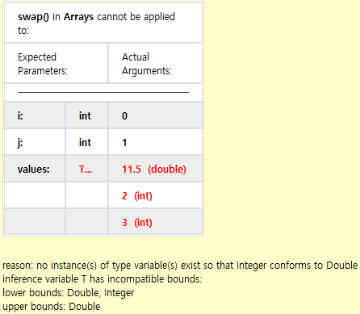
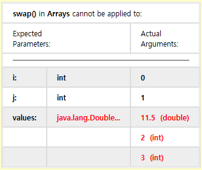

#### 1. E 타입 요소로 구성된 배열 리스트를 관리하는 Stack&lt;E&gt; 클래스를 구현하라. push, pop, isEmpty 메서드를 제공해야 한다.

```java
package ch06.ex01;

import java.util.ArrayList;
import java.util.List;

public class Stack<E> {

	private List<E> list = new ArrayList<>();

	public void push(E e) {
		list.add(e);
	}

	public E pop() {
	    if (isEmpty()) {
            return null;
        }
		return list.remove(list.size() - 1);
	}

	public boolean isEmpty() {
		// return list.isEmpty();
		return list.size() == 0;
	}

}
```

#### 2. 요소를 배열에 저장하는 방법으로 Stack&lt;E&gt; 클래스를 다시 구현하라. 필요하면 push 메서드에서 배열의 크기를 늘린다. E[] 배열과 Object[] 배열로 두 가지 해법을 제시하라. 두 해법 모두 경고 없이 컴파일할 수 있어야 한다. 어느 배열을 선호하는지 답하고, 그 이유를 설명하라.

```java
package ch06.ex02;

import java.util.Arrays;

public class Stack<E> {
	private Object[] array = new Object[0];
	// 마지막 데이터가 들어있는 위치를 가리키는 포인터
	private int pos = -1;

	public void push(E e) {
		pos++;
		if (array.length == pos) {
			// 배열 크기 증가
			array = Arrays.copyOf(array, array.length + 1);
		}
		array[pos] = e;
	}

	public E pop() {
		if (isEmpty()) {
			return null;
		}
		Object o = array[pos];
		array[pos] = null;
		pos--;
		return (E) o; // 형변환
	}

	public boolean isEmpty() {
		return pos < 0;
	}

}
```

```java
package ch06.ex02;

import java.util.Arrays;

public class Stack2<E> {
    // 형변환
	private E[] array = (E[]) new Object[0];
	private int pos = -1;

	public void push(E e) {
		pos++;
		if (array.length == pos) {
			array = Arrays.copyOf(array, array.length + 1);
		}
		array[pos] = e;
	}

	public E pop() {
		if (isEmpty()) {
			return null;
		}
		E o = array[pos];
		array[pos] = null;
		pos--;
		return o;
	}

	public boolean isEmpty() {
		return pos < 0;
	}

}
```

#### 3. Entry&lt;K, V&gt; 요소로 구성된 배열 리스트를 관리하는 Table&lt;K, V&gt; 클래스를 구현하라. 키와 연관된 값을 얻어오는 메서드와 키에 대응하는 값을 집어넣는 메서드, 키를 삭제하는 메서드를 제공해야 한다.

```java
package ch06.ex03;

import ch06.sec01.Entry;

import java.util.ArrayList;
import java.util.List;
import java.util.Objects;

public class Table<K, V> {

	private List<Entry<K, V>> list = new ArrayList<>();

	public V get(K key) {
		int idx = findByKey(key);
		if (idx == -1) {
			return null;
		}
		return list.get(idx).getValue();
	}

	public void put(K key, V value) {
		Objects.requireNonNull(key, "key can't not null");
		Entry<K, V> e = new Entry<>(key, value);
		list.add(e);
	}

	public void remove(K key) {
		int idx = findByKey(key);
		if (idx == -1) {
			return;
		}
		list.remove(idx);
	}

	private int findByKey(K key) {
		for (int i =  list.size() -1  ; i >=0 ; i-- ) {
			Entry<K, V> e = list.get(i);
			if (e.getKey().equals(key)) {
				return i;
			}
		}
		return -1;
	}

}
```


#### 4. 연습문제 3번에서 Entry를 중첩 클래스로 만들라. 이 클래스가 제네릭이어야 하는가?

```java
package ch06.ex04;

import java.util.ArrayList;
import java.util.List;
import java.util.Objects;

public class Table<K, V> {
	// inner class
	public class Entry {
		private K key;
		private V value;

		public Entry(K key, V value) {
			this.key = key;
			this.value = value;
		}

		public K getKey() {
			return key;
		}

		public V getValue() {
			return value;
		}
	}

	private List<Entry> list = new ArrayList<>();

	public V get(K key) {
		int idx = findByKey(key);
		if (idx == -1) {
			return null;
		}
		return list.get(idx).getValue();
	}

	public void put(K key, V value) {
		Objects.requireNonNull(key, "key can't not null");
		Entry e = new Entry(key, value);
		list.add(e);
	}

	public void remove(K key) {
		int idx = findByKey(key);
		if (idx == -1) {
			return;
		}
		list.remove(idx);
	}

	private int findByKey(K key) {
		for (int i = list.size() - 1; i >= 0; i--) {
			Entry e = list.get(i);
			if (e.getKey().equals(key)) {
				return i;
			}
		}
		return -1;
	}

}
```

#### 5. 배열을 가변 인자로 전달할 수 있게 하는 swap 메서드를 고려해보자.

```java
public static <T> T[] swap(int i, int j, T... values) {
    T temp = values[i];
    values[i] = values[j];
    values[j] = temp;
    return values;
}
```

이제 다음 호출을 보자.

```java
Double[] result = Arrays.swap(0, 1, 1.5, 2, 3);
```

어떤 오류 메시지를 얻게 될까?

```
Error:(13, 46) java: incompatible types: inferred type does not conform to upper bound(s)
    inferred: java.lang.Number&java.lang.Comparable<? extends java.lang.Number&java.lang.Comparable<?>>
    upper bound(s): java.lang.Double,java.lang.Object
```



이번에는 다음과 같이 호출하자.

```java
Double[] result = Arrays.<Double>swap(0, 1, 1.5, 2, 3);
```

오류 메시지가 개선되었는가?

```
Error:(13, 41) java: method swap in class ch06.ex05.Arrays cannot be applied to given types;
  required: int,int,T[]
  found: int,int,double,int,int
  reason: varargs mismatch; int cannot be converted to java.lang.Double
```



문제를 해결하려면 어떻게 해야 하는가?

```java
Double[] result = Arrays.<Double>swap(0, 1, 11.5, 2D, 3D);
```

#### 6. 한 배열 리스트에 들어 있는 모든 요소를 다른 배열 리스트에 추가하는 제네릭 메서드를 구현하라. 타입 인자 중 하나에 와일드카드를 사용하라. 두 가지 동등한 해법을 제시하되, 하나는 ? extends E 와일드카드를 이용하고 다른 하나는 ? super E 를 이용하라.

```java
package ch06.ex06;

import java.util.List;

public class Lists {

	public static <E> void append1(List<? extends E> from, List<E> to) {
		to.addAll(from);
	}

	public static <E> void append2(List from, List<? super E> to) {
		to.addAll(from);
	}

}
```

#### 7. E 타입 요소 쌍을 저장하는 Pair&lt;E&gt; 클래스를 구현하라. 첫 번째와 두 번째 요소를 얻어오는 접근자를 구현해야 한다.

```java
package ch06.ex07;

public class Pair<E> {

	private E left;
	private E right;

	public Pair(E left, E right) {
		this.left = left;
		this.right = right;
	}

	public E getLeft() {
		return left;
	}

	public E getRight() {
		return right;
	}

}
```

#### 8. 연습문제 7번에서 만든 클래스를 수정해서 각각 두 요소 중 큰 요소와 작은 요소를 얻어오는 max와 min을 추가하라. E에 적절한 타입 경계를 제공하라.

```java
package ch06.ex08;

public class Pair<E extends Comparable> {

	private E left;
	private E right;

	public Pair(E left, E right) {
		this.left = left;
		this.right = right;
	}

	public E getLeft() {
		return left;
	}

	public E getRight() {
		return right;
	}

	public E getMin() {
		return left.compareTo(right) <= 0 ? left : right;
	}

	public E getMax() {
		return left.compareTo(right) <= 0 ? right : left;
	}

}
```

#### 9. 유틸리티 클래스 Arrays에 다음과 같은 메서드를 제공하라.

```java
public static <E> Pair<E> firstLast(ArrayList<___> a)
```

이 메서드는 a의 첫 번째와 마지막 요소로 구성된 쌍을 반환해야 한다. 그리고 적절한 타입 인자를 제공하라.

```java
package ch06.ex09;

import ch06.ex07.Pair;

import java.util.ArrayList;

public class Arrays {

	public static <E> Pair<E> firstLast(ArrayList<? extends Comparable> list) {
		if (list == null || list.size() == 0) {
			return null;
		}

		E first = (E) list.get(0);
		E last = (E) list.get(list.size() - 1);

		Pair<E> pair = new Pair<>(first, last);
		return pair;
	}

}

```

#### 10. Arrays 유틸리티 클래스에 각 배열에서 가장 작은 요소와 가장 큰 요소를 돌려주는 제네릭 메서드 min과 max를 구현하라.

```java
package ch06.ex10;

import java.util.ArrayList;

public class Arrays {

	public static <E> E min(ArrayList<? extends Comparable> list) {
		E min = null;
		for (Comparable o : list) {
			if (min == null || o.compareTo(o) < 0) {
				min = (E) o;
			}
		}
		return min;
	}

	public static <E> E max(ArrayList<? extends Comparable> list) {
		E max = null;
		for (Comparable o : list) {
			if (max == null || o.compareTo(o) > 0) {
				max = (E) o;
			}
		}
		return max;
	}

}
```

#### 11. 연습문제 10번에 이어서 최솟값과 최댓값으로 구성된 Pair를 돌려주는 minMax메서드를 구현하라.

```java
package ch06.ex11;

import ch06.ex07.Pair;

import java.util.ArrayList;

public class Arrays {

	public static <E> Pair<E> minMax(ArrayList<? extends Comparable> list) {
		E first = null;
		E last = null;

		for (Comparable o: list) {
			if (first == null || o.compareTo(first) < 0) {
				first = (E) o;
			}
			if (last == null || o.compareTo(last) > 0) {
				last = (E) o;
			}
		}

		Pair<E> pair = new Pair<>(first, last);
		return pair;
	}

}
```

#### 12. elements에서 가장 작은 요소와 가장 큰 요소를 result 리스트에 저장하는 다음 메서드를 구현하라.

```java
public static <T> void minmax(List<T> elements, Comparator<? super T> comp, List<? super T> result)
```

마지막 파라미터에 있는 와일드카드를 주목하기 바란다(어떤 타입이든 T의 슈퍼타입이면 결과를 저장할 수 있다).

```java
package ch06.ex12;

import java.util.Comparator;
import java.util.List;

public class Arrays {

	public static <T> void minmax(List<T> elements, Comparator<? super T> comp, List<? super T> result) {
		T min = null;
		T max = null;

		for (T ele : elements) {
			if (min == null || comp.compare(ele, min) < 0) {
				min = ele;
			}
			if (max == null || comp.compare(ele, max) > 0) {
				max = ele;
			}
		}

		result.add(min);
		result.add(max);
	}

}
```

#### 13. 연습문제 12번에서 구현한 메서드가 있는 상태에서 다음 메서드를 고려해보자

```java
public static <T> void maxmin(List<T> elements, Comparator<? super T>comp, List<? super T> result) {
    minmax(elements, comp, result);
    Lists.swapHelper(result, 0, 1);
}
```

와일드카드 캡처가 일어나지 않아 이 메서드가 컴파일되지 않는 이유는 무엇일까? (힌트: Lists.&lt;___&gt;swapHelper(result, 0, 1) 형태로 명시적인 타입을 전달해보자)

잘 되는데? -_-;;

#### 14. 6.3절에서 나온 closeAll 메서드를 개선한 버전을 구현하라. 일부에서 예외를 던지더라도 모든 요소를 닫아야 한다. 이럴 때 닫기를 마친 후 예외를 던진다. 두 개 이상의 호출에서 예외를 던지면 이들을 연결하라.

```java
package ch06.ex14;

import java.util.ArrayList;

public class Closeables {
	public static <T extends AutoCloseable> void closeAll(ArrayList<T> elems) throws Exception {
		Exception ex = null;
		for (T elem : elems) {
			try {
				elem.close();
			} catch (Exception e) {
				if (ex == null) {
					ex = e;
				} else {
					ex.addSuppressed(e);
				}
			}
		}
	}
}
```

#### 15. 배열 리스트 한 개와 Function&lt;T, R&lt; 객체(2장 인터페이스와 람다 표현식 참고) 한 개를 받고, 전달받은 함수를 리스트에 있는 요소에 적용한 결과로 구성된 배열 리스트를 반환하는 map 메서드를 구현하라.

```java
package ch06.ex15;

import java.util.ArrayList;
import java.util.List;
import java.util.function.Function;

public class Lists {

	public static <E> List<E> map(List<E> list, Function<E, E> func) {
		List<E> result = new ArrayList<>();
		for(E e : list) {
			result.add(func.apply(e));
		}
		return result;
	}

}
```

#### 16. java.util.Collections 클래스에 들어 있는 다음 메서드에서 소거 대상은 무엇인가?

```java
public static <T extends Comparable<? super T>> void sort(List<T> list)
public static <T extends Object & Comparable<? super T>> T max(Collection<? extends T> coll)
```

```java
public static void sort(List list)
public static Object max(Collection coll)
```

#### 17. Comparable&lt;Employee&gt;를 구현하는 Employee 클래스를 정의하라. javap 유틸리티로 브릿지 메서드가 만들어졌다는 사실을 입증하라. 이 브릿지 메서드는 무슨 일을 하는가?

```
public class ch06.ex17.Employee implements java.lang.Comparable<ch06.ex17.Employee> {
  public ch06.ex17.Employee(java.lang.String);
  public java.lang.String getName();
  public void setSalary(double);
  public double getSalary();
  public int compareTo(ch06.ex17.Employee);
  public int compareTo(java.lang.Object);
}
```

```java
public int compareTo(Object o) {
    return compareTo((Employee) o);
}
```

#### 18. 6.6.3절에서 나온 다음 메서드를 고려해보자.

```java
public static <T> T[] repeat(int n, T obj, IntFunction<T[] constr)
```

Arrays.repeat(10, 42, int[]::new) 호출은 실패한다. 그 이유는 무엇인가?

```
기본 타입형을 제네릭에 사용할 수 없다.
```

이 문제를 어떻게 고칠 수 있는가? [래퍼 클래스](https://en.wikipedia.org/wiki/Primitive_wrapper_class) 사용

```java
Integer[] repeat = Arrays.repeat(10, 42, Integer[]::new);
```

다른 기본 타입이라면 어떤 작업을 해줘야 하는가?

```
Double[] repeat = Arrays.repeat(10, 42D, Double[]::new);
```

#### 19. 6.6.3절에서 나온 다음 메서드를 고려해보자

```java
public static <T> ArrayList<T> repeat(int n, T obj)
```

이 메서드는 T 값의 배열을 담는 ArrayList&lt;T&gt;를 문제 없이 생성할 수 있다. Class 값이나 생성자 참조를 이용하지 않고도 이 배열 리스트에서 T[] 배열을 만들어낼 수 잇는가? 만들 수 없다면 그 이유는 무엇인가?

```
타입 변수의 인스턴스를 만들 수 없다. Object[] 배열은 만들어낼 수 있다.
```

#### 20. 다음 메서드를 구현하라.

```java
@SafeVarargs public static final <T> T[] repeat(int n, T... objs)
```

이 메서드는 전달받은 객체의 사본 n개로 구성된 배열을 반환해야 한다. 리플렉션으로 objs를 증식할 수 있으므로 Class 값이나 생성자 참조가 필요 없다는 점에 유의하기 바란다.

#### 21. @SafeVarargs 애너테이션으로 제네릭 타입의 배열을 생성하는 메서드를 작성하라. 예를 들면 다음과 같다.

```java
List<String>[] result = Arrays.<List<String>>construct(10);
// result를 크기 10인 List<String>[]로 설정한다.
```

#### 22. 6.6.7절에서 나온 public static &lt;V, T&gt; V doWork(Callable&lt;V&gt; c, T ex) throws T 메서드를 개선해서 절대 사용하지 않을 예외 객체를 전달하지 않아도 되게 하라. 대신 예외 클래스의 생성자 참조를 받아야 한다.

#### 23. 6.6.7절의 끝부분에 있는 '주의' 항목에서는 throwAs 엘퍼 메서드를 사용해서 ex를 RuntimeException으로 '타입 변환'하고 다시 던졌다. 일반적인 타입 변환, 즉 throw (RuntimeException) ex를 사용할 수 없는 이유는 무엇인가?

#### 24. 타입 변환 연산자를 사용하지 않고 Class&lt;?&gt; 타입 변수에 호출할 수 있는 메서드는 무엇인가?

#### 25. 메서드 m의 선언을 반환하는 public static String genericDeclaration(Method m) 메서드를 작성하라. 이선언은 타입 경계를 포함해 타입 파라미터를 나열하고, 제네릭 타입인 경우 타입 인자를 포함해 메서드 파라미터의 타입을 나열해야 한다.
