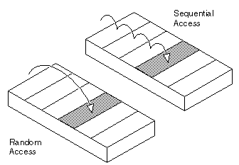

#### 1. n보다 작거나 같은(≤) 소수를 모두 알아내는 데 사용할 '[에라스토테네스의 체(Sieve of Erathostenes)](https://ko.wikipedia.org/wiki/%EC%97%90%EB%9D%BC%ED%86%A0%EC%8A%A4%ED%85%8C%EB%84%A4%EC%8A%A4%EC%9D%98_%EC%B2%B4)' 알고리즘을 구현하라.

```java
int numbers = 100;
Set<Integer> set = new HashSet<>();
for (int i = 2; i <= numbers; i++) {
    set.add(i);
}

while (true) {
    int n = Collections.min(set);
    set.removeIf(integer -> integer % n == 0);
    if (Math.pow(n, 2) > numbers) {
        break;
    }
}

// [13, 17, 19, 23, 29, 31, 37, 41, 43, 47, 53, 59, 61, 67, 71, 73, 79, 83, 89, 97]
System.out.println(set);
```

#### 2. 문자열의 배열 리스트에 들어 있는 각 문자열을 대문자로 만들라. (a) 반복자, (b) 인덱스 값을 이용한 루프, (c) replaceAll 메서드를 이용해서 작성해야 한다.

```java
List<String> list = new ArrayList<>();
list.add("a");
list.add("b");
list.add("c");
list.add("d");
list.add("e");
```

```java
// 반복자
ListIterator<String> iter = list.listIterator();
while (iter.hasNext()) {
    String s = iter.next();
    iter.set(s.toUpperCase());
}
```

```java
// 인덱스 값을 이용한 루프
for (int i = list.size() - 1; i >= 0; i--) {
    String s = list.get(i);
    list.set(i, s.toUpperCase());
}
```

```java
// replaceAll 메서드 (익명 클래스)
list.replaceAll(new UnaryOperator<String>() {
    @Override
    public String apply(String s) {
        return s.toUpperCase();
    }
});
```

```java
// replaceAll 메서드 (람다)
list.replaceAll(s -> s.toUpperCase());
```

#### 3. 루프를 이용하지 않고 Set 인터페이스의 메서드만으로 두 집합의 합집합, 교집합, 차집합을 어떻게 계산하는가?

```java
Set<String> set1 = new HashSet<>();
set1.add("a");
set1.add("b");
set1.add("c");
set1.add("d");
set1.add("e");

Set<String> set2 = new HashSet<>();
set2.add("d");
set2.add("e");
set2.add("f");
set2.add("g");
set2.add("h");

// 교집합
Set<String> intersection = new HashSet<>(set1);
intersection.retainAll(set2);
// 합집합
Set<String> union = new HashSet<>(set1);
union.addAll(set2);
// 차집합(set1 - set2)
Set<String> dos1 = new HashSet<>(set1);
dos1.removeAll(set2);
// 차집합(set2 - set1)
Set<String> dos2 = new HashSet<>(set2);
dos2.removeAll(set1);

System.out.println("intersection = " + intersection);
System.out.println("universal set = " + union);
System.out.println("difference of set1 = " + dos1);
System.out.println("difference of set2 = " + dos2);
```

```
intersection = [d, e]
universal set = [a, b, c, d, e, f, g, h]
difference of set1 = [a, b, c]
difference of set2 = [f, g, h]
```

#### 4. ConcurrentModificationException이 일어나는 상황을 만들라. 이 상황을 어떻게 피할 수 있는가?

#### 5. list 타입이 RandomAccess 인터페이스를 구현하면, 일반적인 방법으로 요소들을 교환하는 public static void swap(List&lt;?&gt; list, int i, int j) 메서드를 구현하라. 그렇지 않으면 인덱스 i와 j에 해당하는 위치에 방문하는 비용을 최소화 해야한다.



```java
package ch07.ex05;

import java.util.Collections;
import java.util.List;
import java.util.ListIterator;
import java.util.RandomAccess;

public class Swaps {

	public static void swap(List<?> list, int i, int j) {
		if (list == null || i == j) {
			return;
		}

		if (i > list.size() || j > list.size()) {
			throw new IndexOutOfBoundsException("Size=" + list.size() + ", Index=" + i + ", " + j);
		}

		swapHelper(list, i, j);
	}

	private static <T> void swapHelper(List<T> list, int i, int j) {
		if (RandomAccess.class.isInstance(list)) {
			// random access
			Collections.swap(list, i, j);
		} else {
			swapNoRandomAccess(list, i, j);
		}

	}

	private static <T> void swapNoRandomAccess(List<T> list, int i, int j) {
		// 리스트의 가운데 인덱스 위치
		int half = list.size() >> 1;
		// 두 인덱스의 위치를 비교하여 순번을 정한다(첫번째, 두번째)
		int firstIndex = Integer.min(i, j);
		int secondIndex = Integer.max(i, j);

		T firstValue = null;
		T secondValue = null;
		int index = -1;

		if (firstIndex < half && secondIndex < half) { // 두개의 인덱스가 모두 절반 인덱스보다 앞에 있을 때
			ListIterator<T> iterator = list.listIterator(firstIndex - 1);

			do { // 맨 앞에서 뒤로 검색
				T o = iterator.next();
				// next() 메서드로 뒤로 이동할 때에 previsousIndex() 메서드가 현재 인덱스 위치를 나타낸다.
				index = iterator.previousIndex();

				if (index == firstIndex) { // 첫번째 값 찾음
					firstValue = o;
				}
				if (index == secondIndex) { // 두번째 값 찾음
					secondValue = o;
					iterator.set(firstValue); // 두번째 자리에 첫번째 값 치환
				}
			} while (index < secondIndex);

			do { // 다시 첫번째 값 위치로 앞으로 이동
				T o = iterator.previous();
				index = iterator.nextIndex();

				if (index == firstIndex) {
					iterator.set(secondValue); // 첫번째 자리에 두번째 값으로 치환
				}
			} while (index > firstIndex);
		} else if (firstIndex > half && secondIndex > half) { // 두개의 인덱스가 모두 절반 인덱스 보다 뒤에 있을 때
			ListIterator<T> iterator = list.listIterator(secondIndex + 1);

			do { // 맨 뒤에서 앞으로 검색
				T o = iterator.previous();
				// previous() 메서드로 뒤로 이동할 때에 nextIndex() 메서드가 현재 인덱스 위치를 나타낸다.
				index = iterator.nextIndex();

				if (index == secondIndex) { // 두번째 값 찾음
					firstValue = o;
				}
				if (index == firstIndex) { // 첫번째 값 참음
					secondValue = o;
					iterator.set(firstValue); // 첫번째 위치에 두번쨰 값으로 치환
				}
			} while (index > firstIndex);

			do { // 다시 두번째 값의 위치로 뒤로 이동
				T o = iterator.next();
				index = iterator.previousIndex();

				if (index == secondIndex) {
					// 두번째 자리에 첫번째 값으로 치환
					iterator.set(firstValue);
				}
			} while (index < secondIndex);
		} else { // 두개의 인덱스가 서로 떨어져 있을 경우
			Collections.swap(list, i, j);
		}
	}

}
```

#### 6. 구체적인 자료 구조보다는 인터페이스를 사용하라고 권장한 바 있다(예를 들면 TreeMap보다는 Map). 안타깝지만 이번에는 이 충고를 따를 수 없다. Map&lt;String, Set&lt;Integer&gt;&gt;으로 목차(table of contents)를 표현할 수 없는 이유는 무엇인가? (힌트: 해당 객체를 어떻게 초기화할 것인가?) 그리고 그 대신 어떤 타입을 사용할 수 있는가?

Map의 구현체를 HashMap으로 사용할 경우 키의 순서를 보장할 수 없다. Set도 마찬가지로 HashSet을 사용할 경우 순서를 보장할 수 없다.

Map의 키를 정렬하려면 TreeMap을 Set을 정렬하려면 TreeSet을 사용하면 된다.

#### 7. 파일에 있는 모든 단어를 읽어와서 각 단어가 나온 횟수를 출력하는 프로그램을 작성하라. TreeMap&lt;String, Integer>&gt;를 이용해야 한다.

```java
BufferedReader reader = Files.newBufferedReader(Paths.get("docs/ch07/cnn.txt"));
Map<String, Integer> counts = new TreeMap<>();

String line = null;
while((line = reader.readLine()) != null) {
    String[] split = line.split("\\s+");
    for (String word : split) {
        counts.merge(word, 1, (i1, i2) -> Integer.sum(i1, i2));
    }
}
```

#### 8. 파일에 있는 모든 단어를 읽어와서 각 단어가 나온 줄(들)을 출력하는 프로그램을 작성하라. 문자열이 집합으로 연관되는 맵을 이용해야 한다.

```java
BufferedReader reader = Files.newBufferedReader(Paths.get("..."));
Map<String, Set<Integer>> map = new TreeMap<>();

String line = null;
for (int lineCount = 1 ; (line = reader.readLine()) != null ; lineCount++) {
    String[] split = line.split("\\s+");
    for (String word : split) {
        Set<Integer> set = map.get(word);
        if (set == null) {
            set = new TreeSet<>();
            map.put(word, set);
        }

        set.add(lineCount);
    }
}
```

#### 9. 다음과 같은 방법으로 카운터의 맵에 들어 있는 카운터를 업데이트할 수 있다.

```java
counts.merge(word, 1, Integer::sum);
```

merge 메서드를 이용하지 말고 (a) contains 메서드, (b) get과 null 검사, (c) getOrDefault 메서드, (d) putIfAbsent 메서드를 이용해서 같은 기능을 구현하라.

```java
Map<String, Integer> counts = new TreeMap<>();

String line = null;
while((line = reader.readLine()) != null) {
    String[] split = line.split("\\s+");
    for (String word : split) {
        // (a) contains 메서드
        if (counts.containsKey(word)) {
            counts.put(word, counts.get(word) + 1);
        } else {
            counts.put(word, 1);
        }
    }
}
```

```java
Map<String, Integer> counts = new TreeMap<>();

String line = null;
while((line = reader.readLine()) != null) {
    String[] split = line.split("\\s+");
    for (String word : split) {
        // (b) get과 null 검사
        Integer count = counts.get(word);
        if (count == null) {
            count = 0;
        }
        count += 1;

        counts.put(word, count);
        // counts.merge(word, 1, (i1, i2) -> Integer.sum(i1, i2));
    }
}
```

```java
Map<String, Integer> counts = new TreeMap<>();

String line = null;
while((line = reader.readLine()) != null) {
    String[] split = line.split("\\s+");
    for (String word : split) {
        // (c) getOrDefault 메서드
        Integer count = counts.getOrDefault(word, 0);
        count += 1;
        counts.put(word, count);
    }
}
```

```java
Map<String, Integer> counts = new TreeMap<>();

String line = null;
while((line = reader.readLine()) != null) {
    String[] split = line.split("\\s+");
    for (String word : split) {
        // (d) putIfAbsent 메서드
        // key 값이 없다면 입력된 key와 value를 입력, null 반환
        // key 값이 있다면 입력 되었던 값 반환
        Integer count = counts.putIfAbsent(word, 0);
        if (count == null) {
            count = 0;
        }
        count += 1;
        counts.put(word, count);
        // counts.merge(word, 1, (i1, i2) -> Integer.sum(i1, i2));
    }
}
```

#### 10. 일부 도로로 연결되어 있는 도시 간 교통망에서 최단 경로를 찾는 다익스트라 알고리즘(Dijkstras algorithm)을 구현하라.

#### 11. 문장을 읽어와서 배열 리스트에 넣는 프로그램을 작성하라. 그러고 나서 Collections.shuffle을 이용해서 처음과 마지막 단어를 빼고 모든 단어를 뒤섞어라. 여기서 단어들을 또 다른 컬렉션으로 복사하는 일은 없어야 한다.

```java
String line = "He has no earthly idea of whether he's coming or going";
List<String> words = Arrays.asList(line.split("\\s+"));
System.out.println(words);

// shuffle
Collections.shuffle(words.subList(1, words.size() - 1));
System.out.println(words);
```

#### 12. 문장을 읽어와서 단어를 뒤섞고 그 결과를 출력하는 프로그램을 작성하라. 이때 Collections.shuffle을 이용해서 작성하다. 그리고 뒤섞기 전과 후에 첫 단어의 대문자 표기와 마지막 단어의 구두점을 바로잡아야 한다.

```java

```

#### 13. LinkedHashMap은 새로운 요소가 삽입될 때마다 removeEldestEntry 메서드를 호출한다. 맵의 크기를 생성자에 지정한 크기로 제한하는 Cache 서브클래스를 구현하라.

```java
package ch07.ex13;

import java.util.LinkedHashMap;
import java.util.Map;

public class Cache<K, V> extends LinkedHashMap<K, V> {

	private int limit;

	public Cache(int limit) {
		this.limit = limit;
	}

	@Override
	protected boolean removeEldestEntry(Map.Entry<K, V> eldest) {
	    // true 리턴 시 가장 오래된 데이터를 삭제한다.
		return size() == limit + 1;
	}
}
```

#### 14. 실제로 숫자를 저장하지 말고 0~n 사이에 있는 숫자의 불변 리스트 뷰를 만들어내는 메서드를 작성하라.

#### 15. 연습문제 14번을 임의의 IntFunction으로 일반화하라. 결과는 무한 컬렉션이다. 그리므로 특정 메서드에서는 UnsupportedOperationException을 던져야 한다.

#### 16. 마지막으로 계산한 함수 값 100개를 캐싱하는 방법으로 연습문제 15번의 구현을 개선하라.

#### 17. 검사 뷰가 힙 펄루션의 원인에 대한 정확한 오류 보고를 제공하는 원리를 설명하라.

#### 18. Collections 클래스는 정적 변수 EMPTY_LIST, EMPTY_MAP, EMPTY_SET을 포함한다. 이 변수들이 empryList, empryMap, emptySet 메서드만큼은 유용하지 못한 이유를 설명하라.