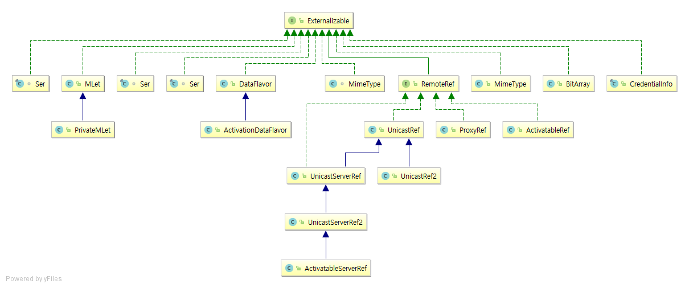

#### 1. 임시 파일을 사용하지 않고 InputStream의 모든 내용을 OutputStream으로 복사하는 유틸리티 메서드를 작성하라. 루프를 사용하지 않고 Files 클래스에서 제공한 연산과 임시 파일을 사용하는 또 다른 해결책을 제시하라.

```java
package ch09;

import java.io.IOException;
import java.io.InputStream;
import java.io.OutputStream;
import java.nio.file.Files;
import java.nio.file.Path;
import java.nio.file.StandardCopyOption;

public class IoUtils {

	public static void copy(InputStream in, OutputStream out) throws IOException {
		byte[] bytes = new byte[1024];

		int length = -1;
		while ((length = in.read(bytes)) != -1) {
			out.write(bytes, 0, length);
		}
	}

	public static void copyWithTemp(InputStream in, OutputStream out) throws IOException {
		Path temp = Files.createTempFile("corejava8-", ".tmp");
		Files.copy(in, temp, StandardCopyOption.REPLACE_EXISTING);
		Files.copy(temp, out);
		Files.delete(temp);
	}

}
```

#### 2. 텍스트 파일을 읽은 후 이름은 같지만 확장자가 .toc인 파일을 만드는 프로그램을 작성하라. 결과 파일은 입력 파일에 들어 있는 모든 단어를 알파벳 순으로 정리하고, 단어별로 나타낸 줄 반호를 나열한 목록을 담아야 한다. 파일의 인코딩은 UTF-8으로 가정한다.

```java
Path source = Paths.get("docs/ch09/alice.txt");
Path target = Paths.get("docs/ch09/alice.toc");

// 파일을 한줄씩 읽으면서 라인 번호를 가져올 수 있는 java.io.LineNumberReader
try (LineNumberReader reader = new LineNumberReader(Files.newBufferedReader(source, StandardCharsets.UTF_8));) {
    // Map<라인번호, List<단어>> 로 변환한다.
    Map<Integer, List<String>> mapFrom = reader.lines()
            // 비어있는 라인 필터
            .filter(v -> !v.trim().isEmpty())
            // 모두 소문자로 변경
            .map(String::toLowerCase)
            // Map<라인번호, List<문자>> 으로 변경
            .collect(Collectors.toMap(
                    // 키를 라인 번호로 사용
                    t -> reader.getLineNumber(),
                    // 값를 String -> List<String> 으로 사용 (빈문자 필터, 단어 중복 제거)
                    t -> Arrays.stream(t.split("\\PL+")).filter(v -> !v.trim().isEmpty()).distinct()
                            .collect(Collectors.toList())));

    // Map<라인번호, List<단어>> 를 Map<단어, List<라인번호>> 로 변경한다.
    Map<String, List<Integer>> mapTo = mapFrom.entrySet().stream()
            // Map<라인번호, List<단어> -> Stream<Map<단어, 라인번호>> 로 쪼갠다.
            .flatMap(e -> e.getValue().stream().map(v -> new AbstractMap.SimpleImmutableEntry<>(e.getKey(), v)))
            // 단어로 그룹핑 (키 = 단어, 값 = List<라인번호>)
            .collect(Collectors.groupingBy(AbstractMap.SimpleImmutableEntry::getValue,
                    Collectors.mapping(AbstractMap.SimpleImmutableEntry::getKey, Collectors.toList())));

    // 파일로 출력
    try (PrintWriter pw = new PrintWriter(Files.newBufferedWriter(target, StandardCharsets.UTF_8));) {
        mapTo.forEach((k, v) -> {
            pw.println(k + " = " + v.stream().map(Object::toString).collect(Collectors.joining(", ")));
        });
    }
}
```

#### 3. 텍스트를 담고 잇는 파일을 읽은 후 단어 대부분이 영어로 되어 있다고 가정하고 인코딩이 아스키, ISO-8859-1, UTF-8, UTF-16 중 어느 것인지 추측하는 프로그램을 작성하라. UTF-16일 때는 사용한 바이트 순서도 추측해야 한다.

#### 4. Scanner는 사용하기 편리하지만 BufferedReader보다는 약간 느리다. 긴 파일을 한 번에 읽어와서 입력 줄의 개수를 (a) Scanner의 hasNextLine/nextLine, (b) BufferedReader의 readLine, (c) BufferedReader의 lines로 세어보자. 어느 것이 가장 빠른가? 또한, 어느 것이 가장 편리한가?

[Scanner vs. BufferedReader](https://stackoverflow.com/questions/2231369/scanner-vs-bufferedreader)

```java
// 7s 176ms
try (Scanner scanner = new Scanner(Paths.get("docs/ch09/catalina.out"));) {
    while (scanner.hasNextLine()) {
        String line = scanner.nextLine();
    }
}
```

```java
// 988ms
try (BufferedReader reader = Files.newBufferedReader(Paths.get("docs/ch09/catalina.out"));) {
    String line = null;
    while((line = reader.readLine()) != null) {

    }
}
```

```java
// 1s 229ms
try (BufferedReader reader = Files.newBufferedReader(Paths.get("docs/ch09/catalina.out"));) {
    reader.lines().forEach(v -> {});
}
```

#### 5. 유니코드의 일부분을 담당하는 Charset의 인코더가 문자를 인코드할 수 없을 때는 해당 문자를 기본값(늘 그런건 아니지만 "?"인코딩)으로 교체한다. 인코딩을 지원하는 이용 가능한 모든 문자 집합의 교체 값을 찾아라. 먼저 newEncoder 메서드로 인코더를 얻은 다음, 해당 인코더의 replacement 메서드를 호출해서 교체 값을 얻는다. 각각의 고요한 결과별로 해당 교체 값을 사용하는 문자 집합의 정식 이름을 보고하라.

#### 6. 무압축 이미지 파일용 BMP 파일 형식은 문서화도 잘 되어 있고 단순하다. 임의 접근으로 새 파일을 쓰지 않고 각 픽셀의 행을 뒤집는 프로그램을 작성하라.

[BMP 파일 포맷](https://ko.wikipedia.org/wiki/BMP_%ED%8C%8C%EC%9D%BC_%ED%8F%AC%EB%A7%B7)

```java
Path path = Paths.get("docs/ch09/mario.bmp");

try (RandomAccessFile raf = new RandomAccessFile(path.toFile(), "rw");) {
    // BMP 파일인지 검증
    int header = raf.readUnsignedShort();
    if (header != 0x424D) {
        System.err.println(path + " is not bitmap");
    }

    // 이미지 데이터의 위치를 찾는다.
    raf.seek(0x000A);
    int offset = raf.read() | (raf.read() << 8) | (raf.read() << 16) | (raf.read() << 24);

    // 1바이트씩 이동하면서 색 반전
    raf.seek(offset);
    int read = -1;
    while ((read = raf.read()) != -1) {
        raf.seek(raf.getFilePointer() - 1);
        raf.write(255 - read);
    }
}
```

#### 7. MessageDigest 클래스의 API 문서를 살펴보고 파일의 SHA-1 다이제스트(digest)를 계산하는 프로그램을 작성하라. update 메서드로 MessageDigest 객체에 바이트의 블록을 공급한 다음, digest를 호출한 결과를 표시하라. 프로그램이 sha1sum 유틸리티와 같은 결과를 만들어내는지 확인하라.

#### 8. 어떤 디렉터리와 그 자손에 들어 있는 모든 파일을 담은 ZIP 파일을 만들어내는 유틸리티 메서드를 작성하라.

```java
// 압축할 대상 디렉터리
Path path = Paths.get("D:\\develoment\\javaimpatient");
// 만들어지는 zip 파일
Path zipPath = Paths.get("D:\\ch09-ex08.zip");

try (ZipOutputStream out = new ZipOutputStream(Files.newOutputStream(zipPath));) {
    // 모든 하위 목록 가져옴
    try (Stream<Path> entries = Files.walk(path);) {
        entries.filter(p -> !Files.isDirectory(p)).forEach(p -> {
            try {
                out.putNextEntry(new ZipEntry(path.relativize(p).toString()));
                Files.copy(p, out);
                out.closeEntry();
            } catch (IOException e) {
                throw new UncheckedIOException(e);
            }
        });
    }
}
```

|Class|Modifier and Type|Method and Description|
|:--|:--|:--|
|[java.nio.file.Path](https://docs.oracle.com/javase/8/docs/api/java/nio/file/Path.html)|Path|[relativize](https://docs.oracle.com/javase/8/docs/api/java/nio/file/Path.html#relativize-java.nio.file.Path-)(Path other)<br/>Constructs a relative path between this path and a given path.|

#### 9. URLConnection 클래스로 기본 인증(basic authentication)을 사용해 패스워드로 보호된 웹 페이지에서 데이터를 읽어라 먼저 다음과 같이 사용자명, 콜론, 패스워드를 연결해서 Base64 인코딩을 계산한다.

```java
String http = "http://httpbin.org/basic-auth/user/passwd";
String username = "user";
String password = "passwd";

String input = username + ":" + password;
String encoding = Base64.getEncoder().encodeToString(input.getBytes(StandardCharsets.UTF_8));

URL url = new URL(http);
URLConnection conn = url.openConnection();
conn.setRequestProperty("Authorization", "Basic " + encoding);
conn.connect();

try (BufferedReader reader = new BufferedReader(new InputStreamReader(conn.getInputStream(), StandardCharsets.UTF_8));) {
    reader.lines().forEach(System.out::println);
}
```

#### 10. (a) find, (b) split을 사용해 정규 표현식으로 문자열에서 10진수를 모두(음수 포함) 추출해서 ArrayList&lt;Integer&gt;에 넣어라. +나 -기호는 뒤에 숫자가 오지 않으면 구분자를 나타낸다는 점을 유의해야 한다.

```java
// (a) find
String s = "antop name 10.12 is aaa, antop is+33 -15";
String regex = "[+-]?[0-9]+";

Pattern pattern = Pattern.compile(regex);
Matcher matcher = pattern.matcher(s);

List<Integer> list = new ArrayList<>();
while (matcher.find()) {
    list.add(Integer.parseInt(matcher.group()));
}

System.out.println(list);
// [10, 12, 33, -15]
```

```java
// (b) split
String s = "antop name 10.12 is aaa! antop is+33 -15";
String regex = "[^+\\-0-9]";

Pattern pattern = Pattern.compile(regex);
List<String> list = Arrays.stream(pattern.split(s)).filter(v -> !v.trim().isEmpty()).collect(Collectors.toList());

System.out.println(list);
// [10, 12, +33, -15]
```

#### 11. 정규 표현식을 사용해 /home/cay/myfile.txt 같은 절대 경로 또는 상대 경로에서 디렉터리 경로 이름들(문자열의 배열), 파일 이름, 파일 확장자를 추출하라.

```java
class FileInfo {
    // 디렉터리 경로 이름들
    private String[] directories;
    // 파일 이름
    private String name;
    // 확장자
    private String extension;

    @Override
    public String toString() {
        return "FileInfo{" + "directories=" + Arrays.toString(directories) + ", name='" + name + '\'' + ", extension='" + extension + '\'' + '}';
    }
}

// 찾을 루트 경로
Path root = Paths.get(".");
// OS 에서 사용하는 경로 구분자
String separator = Pattern.quote(File.separator);
// 디렉터리 경로 + 파일 정규 표현식
Pattern pathPattern = Pattern.compile("(?<directory>([^+]+" + separator + ")+)(?<name>[^+]+$)");
// 파일 이름 + 확장자 정규 표현식
Pattern fileNamePattern = Pattern.compile("(?<name>[^+]+)(?<ext>\\.[^.]+$)");

try (Stream<Path> entries = Files.walk(root);) {
    List<FileInfo> result = entries
            // 파일만 걸러낸다.
            .filter(p -> !Files.isDirectory(p))
            // 파일 경로를 정규화 한다. (/home/antop/./doc/../app -> /home/antop/app)
            .map(p -> p.toAbsolutePath().normalize()).map(p -> {
                FileInfo f = new FileInfo();

                Matcher m1 = pathPattern.matcher(p.toString());
                if (m1.matches()) { // 디렉터리 + 파일명으로 분리
                    String directory = m1.group("directory");
                    String fileName = m1.group("name");

                    // 디렉터리는 구분자로 분리
                    String[] directories = directory.split(separator);
                    f.directories = directories;

                    // 파일명은 이름과 확장자로 분리
                    Matcher m2 = fileNamePattern.matcher(fileName);
                    if (m2.matches()) {
                        f.name = m2.group("name");
                        f.extension = m2.group("ext").substring(1);
                    } else {
                        f.name = fileName;
                    }
                }

                return f;

            }).collect(Collectors.toList());

    // 출력
    result.forEach(System.out::println);
}
```

#### 12. Matcher.replaceAll에서 그룹 참조를 사용하는 현실적인 사용 예를 제시하고 구현하라.

#### 13. 직렬화 가능한 객체를 바이트 배열로 직렬화한 다음 역직렬화해서 해당 객체의 복제본을 만들어내는 메서드를 구현하라.

```java
Employee source = new Employee("antop", 5000);
System.out.println(source); // ch09.Employee@694f9431 {name='antop', salary=5000.0}

try (ByteArrayOutputStream bas = new ByteArrayOutputStream();
     ObjectOutputStream oos = new ObjectOutputStream(bas);) {
    oos.writeObject(source); // write

    try (ByteArrayInputStream bai = new ByteArrayInputStream(bas.toByteArray());
         ObjectInputStream ois = new ObjectInputStream(bai);) {
        try {
            Employee target = (Employee) ois.readObject(); // read
            System.out.println(target); // ch09.Employee@4aa8f0b4 {name='antop', salary=5000.0}
        } catch (ClassNotFoundException e) {
            e.printStackTrace();
        }

    }

}
```

#### 14. 인스턴스 변수로 x와 y가 포함된 직렬화 기능한 클래스 Point를 구현하라. Point 객체의 배열을 파일로 직렬화하는 프로그램과 해당 파일을 읽는 프로그램을 작성하라.

```java
// create point object
int size = 5;
Random random = new Random();
Point[] points = new Point[size];
for (int i = 0; i < size; i++) {
    points[i] = new Point(random.nextInt(10), random.nextInt(10));
}
System.out.println("points = " + Arrays.toString(points));
// points = [ch09.Point@f2a0b8e {x=0, y=6}, ch09.Point@593634ad {x=5, y=4}, ch09.Point@20fa23c1 {x=2, y=8}, ch09.Point@3581c5f3 {x=4, y=5}, ch09.Point@6aa8ceb6 {x=8, y=4}]

// save to file
PointDisk.save(Paths.get("D:\\points.txt"), points);
// load from file
Point[] loaded = PointDisk.load(Paths.get("D:\\\\points.txt"));

System.out.println("points = " + Arrays.toString(loaded));
// points = [ch09.Point@2c13da15 {x=0, y=6}, ch09.Point@77556fd {x=5, y=4}, ch09.Point@368239c8 {x=2, y=8}, ch09.Point@9e89d68 {x=4, y=5}, ch09.Point@3b192d32 {x=8, y=4}]
```

#### 15. 연습문제 14번에서 이어서 하되, Point의 데이터 표현을 변경해서 배열 하나에 좌표를 저장하게 하라. 새 버전에서 기존 버전으로 만든 파일을 읽으려고 하면 어떻게 되는가? serialVersionUID를 고치면 어떻게 되는가? 여러분의 인생이 기본 버전과 호환되는 새 버전을 만드는 데 달렸다고 하자. 무슨 조치를 할 수 있는가?

#### 16. 표준 자바 라이브러리에서 어느 클래스가 Externalizable을 구현하는가?



그중 어느 클래스가 writeReplace/readResolve를 사용하는가?

```
없는데? -_-;;
```