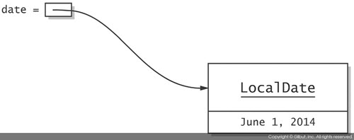
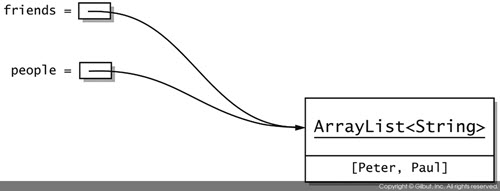
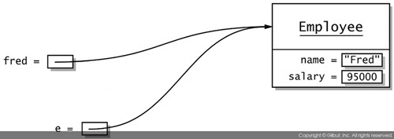
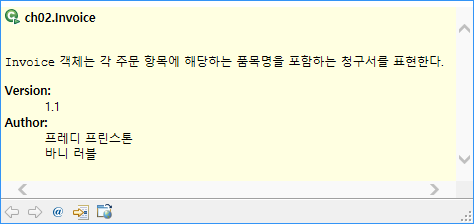
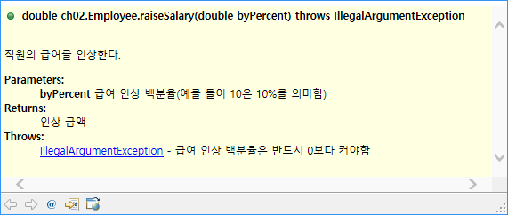
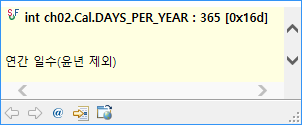
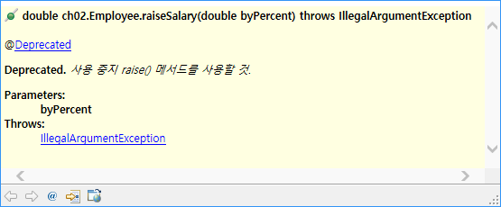
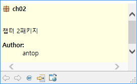

# 2장 객체 지향 프로그래밍


## 2.1 객체 이용하기

### 2.1.1 접근자 메서드와 변경자 메서드

변경자(mutator)
* 호출 대상 객체를 변경하는 메서드

```java
ArrayList<String> friends = new ArrayList();
// friends가 비어 있다.
friends.add("Peter");
// friedns의 크기는 1이다.
```

접근자(accessor)
* 객체를 변경하지 않는 메서드

```java
LocalDate d1 = LocalDate.of(year, month, 1);
// d1의 날짜가 바뀌는 것이 아니라 새로운 LocalDate 객체를 반환한다. 
LocalDate d2 = d1.plusDays(1);
// d1과 d2는 다른 객체이다.
```

### 2.1.2 객체 참조

자바에서는 변수에 오직 객체에 대한 참조만 담을 수 있다.

```java
LocalDate date = LocalDate.of(2014, 6, 1);
```



객체 참조를 담고 있는 변수를 다른 변수에 할당하면 같은 객체에 대한 참조 두개를 갖게 된다.

```java
ArraryList<String> friends = new ArrayList<>();
friends.add("Peter");
friends.add("Paul");

ArrayList<String> poeple = friends;
```



객체 변수를 특별한 값인 null로 설정해서 변수가 아무 객체도 참조하지 않게 할 수도 있다.

```java
LocalDate date = LocalDate.of(year, month, 1);
date = d1.plusDays(1);
```

첫 번째 객체는 그에 대한 참조가 없으므로 더는 필요 없다. 결국에는 가비지 컬렉터가 메모리를 정리해서 재사용할 수 있게 만든다.


## 2.2 클래스 구현하기

Employee 클래스를 통해 다양한 언어 규칙을 알아본다. 직원은 이름과 급여 정보를 갖고 있다. 이름은 변경할 수 없지만, 급여 인상은 할 수 있다.

### 2.2.1 인스턴스 변수

직원 객체는 이름과 급여 두 값으로 직원 객체의상태를 나타낸다. 인스턴스 변수로 객체의 상태를 나타낸다.

```java
public class Employee {
	private String name;
	private double salary;
}
```

### 2.2.2 메서드 선언부

메서드를 선언할 때는 메서드의 이름, 파라미터의 타입과 이름, 반환 타입을 선언한다.

```java
// double 타입 파라미터 한개를 받으며, 어떤 값도 반환하지 않는다.
public void raiseSalary(double byPercent)
// 파라미터가 없고 String을 반환한다.
public String getName()
```

### 2.2.3 메서드 구현부

```java
public class Employee {
	private String name;
	private double salary;
	
	public void raiseSalary(double byPercent) {
		// 구현부
		double raise = salary * byPercent /100;
		salary += raise;
	}
	
	public String getName() {
		// 메서드에서 값을 돌려준 때는 return 키워드를 사용
		return name;
	}	
}
```

### 2.2.4 인스턴스 메서드 호출

```java
fred.raiseSalary(5);

double byPercent = 5;
double raise = fred.salary * byPercent / 100;
fred.salary += raise;
```
### 2.2.5 this 참조

객체에 있는 메서드를 호출할 때는 해당 객체를 this로 접근할 수 있다.

```java
public void raiseSalary(double byPercent) {
	double raise = this.salary * byPercent / 100;
	this.salary += raise;
}
```

* 일부 개발자는 지역 변수와 인스턴스 변수를 명확히 구별하기 위해 이 스타일을 선호한다.
* 일부 프로그래밍 언어에서는 인스턴스 변수를 _name 이나 _salary 처럼 쓰기도 한다.
* ~~원한다면 this를 메서드의 파라미터로도 선언할 수 있다(생성자의 파라미터로는 선언할 수 없다.)~~

### 2.2.6 값을 이용한 호출

메서드에 객체를 전달하면 해당 메서드가 객체 참조의 사본을 얻는다.

```java
public class EvilManager {
	private Random generator;

	public void giveRandomRaise(Employee e) {
		double percentage = 10 * generator.nextGaussian();
		e.raiseSalary(percentage);
	}
}
```

다음과 같은 호출이 있을 경우 fred가 변수 e로 복사된다.



* 파라미터 변수는 메서드가 끝나면 유효 범위를 벗어나고 효력을 잃는다.
* 자바에서는 기본 타입 값은 물론 객체 참조까지 모든 파라미터가 값으로 전달된다.

## 2.3 객체 생성

### 2.3.1 생성자 구현하기

생성자 선언은 메서드 선언과 비슷하다. 그러나 생성자는 이름이 클래스 이름과 같고, 반환 타입이 없다.

```java
public class Employee {
	// 생성자
	public Employee(String name, double salary) {
		this.name = name;
		this.salary = salary;
	}
}
```

생성자는 new 연산자로 실행된다.

```java
Employee james = new Employee("James Bond", 500000);
```

### 2.3.2 오버로딩

생성자는 두 가지 이상의 다른 버전으로도 제공할 수 있다.

```java
public class Employee {
	// 생성자 1
	public Employee(String name, double salary) {
		this.name = name;
		this.salary = salary;
	}
	
	// 생성자 2
	public Employee(double salary) {
		this.name = "";
		this.salary = salary;
	}
}
```

호출되는 생성자는 인자에 따라 결정된다.

```java
// Employee(String, double) 생성자를 호출한다.
Employee james = new Employee("James Bond", 500000);

// Employee(double) 생성자를 호출한다.
Employee anonymous = new Employee(40000);
```

### 2.3.3 다른 생성자에서 특정 생성자 호출하기

비슷한 작업을 수행하는 생성자가 여러개 있다면 코드 중복을 제거하는 것이 가장 좋다.

```java
public class Employee {
	// 생성자 1
	public Employee(String name, double salary) {
		this.name = name;
		this.salary = salary;
	}
	
	// 생성자 2
	public Employee(double salary) {
		// Employee(String, double)를 호출한다.
		this("", salary);
		
		// 이후에 다른 문장이 올 수 있다.
	}
}
```

### 2.3.4 기본 초기화

생성자 안에서 인스턴스 변수를 명시적으로 설정하지 않으면 자동으로 기본값으로 설정된다.

* 숫자는 0
* 불(boolean) 값은 false
* 객체 참조는 null

예를 들어 다음과 같이 무급 인턴에 해당하는 생성자를 작성할 수 있다.

```java
public class Employee {

	public Employee(String name) {
		this.name = name;
		// salary는 자동으로 0으로 설정된다.
	}
	
}
```

객체 참조는 기본값이 null로 초기화 되므로 흔한 오류의 원인이 된다.

```java
public class Employee {

	public Employee(double salary) {
		this.salary = salary;
		// name은 자동으로 null로 설정된다.
	}
	
}

if (e.getName().equals("James Bond")) // NullPointException
```

### 2.3.5 인스턴수 변수 초기화

초기화는 객체가 할당되고 생성자가 실행되기 전에 일어난다.

``` java
public class Employee {
	private String name = ""; // 인스턴스 변수 초기화
}
```

클래스 선언부에 임의의 초기화 블록을 포함시키는 방법도 있다.

```java
public class Employee {
	private String name = "";
	private int id;
	
	{ // 초기화 블럭
		Random generator = new Random();
		id = 1 + generator.nextInt(1_000_000);
	}
	
	// 생성자
	public Employee(String name, double salary) { ... }
}
```

### 2.3.6 최종 인스턴스 변수

인스턴스 변수를 최종(final)으로 선언할 수 있다.
* 최종으로 선언한 변수는 반드시 모든 생성자가 작업을 마치기 전에 초기화해야 한다.
* 초기화한 후에는 해당 변수를 다시 수정할 수 없다.

```java
public class Employee {
	private final String name;
}
```

final 제어자는 그저 해당 참조가 절대 변하지 않는다는 사실만 나타낸다. 따라서 **객체를 변경하는 일은 완전히 합법적이다.**

```java
public class Person {
	private final ArrayList<Person> friends = new ArrayList<>();
}

// 가능
friends.add(tom);
// 불가능
friends = new ArrayList<>();
```
### 2.3.7 인자 없는 생성자

클래스에 생성자가 없으면 자동으로 아무 작업도 하지 않는 인자 없는 생성자를 받는다.

따라서 모든 클래스에는 생성자가 적어도 하나는 있다.

## 2.4 정적 변수와 정적 메서드

static 제어자의 의미를 알아보자

### 2.4.1 정적 변수

클래스 안에 있는 변수를 static으로 선언하면 해당 변수는 클래스당 하나만 있게 된다.

```java
public class Employee {
	private static int lastId = 0;
	private int id;
	
	public Employee() {
		lastId++;
		id = lastId;
	}
}
```

### 2.4.2 정적 상수

변경 가능한 정적 변수는 드물지만, 정적 상수(static final 변수)는 아주 일반적이다.

```java
public class Math {
	public static final double PI = 3.14159265358979323846;
}
```

static 키워드가 없으면 PI는 Math 클래스의 인스턴스 변수가 된다.

즉, PI에 접근하려면 Math 클래스의 객체가 필요하며, 모든 Math 객체가 자체적으로 PI의 사본을 보유해야 한다.

### 2.4.3 정적 초기화 블록

초기화 작업이 추가로 필요할 때 정적 초기화 블록 안에 넣을 수 있다.

```java
public class CreditCardForm {
	private static final ArrayList<Integer> expirationYear = new ArrayList<>();
	
	static {
		// 다음 20개 연도를 배열 리스트에 추가한다.
		int year = LocalDate.now().getYear();
		for (int i = year; i <= year + 20; i++) {
			expirationYear.add(i);
		}
	}
	
}
```

### 2.4.4 정적 메서드

정적 메서드는 객체로 동작하지 않는다.

다른 사람이 만든 클래스에 부가 기능을 제공하는 것이다.

```java
public class Math {
	public static double pow(double base, double exponent) {
		// ...
	}
}
```

정적 메서드는 객체에 동작하지 않으므로 인스턴스 변수에 접근할 수 없다. 대신 자신이 속한 클래스의 정적 변수에는 접근할 수 있다.

```java
public class RansomNumbers {
	private static Random generator = new Random();
	public static int nextInt(int low, int high) {
		// 정적 변수 generator에 접근
		return low + generator.nextInt(high - low + 1);
	}
}

```

### 2.4.5 팩토리 메서드

정적 메서드는 흔히 팩토리 메서드를 만드는 데 사용한다. 팩토리 메서드는 클래스의 새로운 인스턴스를 반환하는 정적 메서드다.

```java
public class Employee() {

	public static double MIN_SALARY = 5000;

	public static Employee hire(String name, double salary) {
		if (salary < MIN_SALARY) {
			salary = MIN_SALARY;
		}
		
		Employee e = new Employee(name, salary);
		return e;
	}
	
	private Employee(String name, String salary) {
		// ...
	}

}
```

```java
Employee e = Employee.hire("Tom", 4000);
```

## 2.5 패키지

* 패키지를 사용하면 작업을 조직화하고 다른 사람이 제공한 코드 라이브러리와 분리하기가 편리하다.
* 패키지는 주로 클래스 이름의 유일성을 보장하려고 하용한다.
* 같은 이름의 클래스를 ㄷ서로 다른 패키지에 넣으면 충돌이 일어나지 않는다.

### 2.5.1 패키지 선언

패키지 이름은 java.util.regex 처럼 점(.)으로 구분된 식별자 목록이다.

패키지 이름이 유일함을 보장하려면 유일하다고 알려진 인터넷 도메인 이름을 뒤집어서 사용하는 것이 좋다.

**패키지는 중첩되지 않는다.** 예를 들어 java.util과 java.util.regex 패키지는 서로 관련이 없다. 가각은 자체적으로 독립된 클래스 묶음이다.

```java
package com.horstmann.corejava

public class Employee {
	// ...
}
```

파일 시스템에서 클래스 파일을 읽어올 때 경로 이름이 패키지 이름과 반드시 일치해야 한다.

``
com/horstmann/corejava/Employee.java -> com.horstmann.corejava.Employee
``

### 2.5.2 클래스 패스

클래스 파일을 파일 시스템에 저장하는 대신에 JAR 파일이라는 아카이브 파일 하나 이상에 넣을 수도 있다.

### 2.5.3 패키지 유효 범위

* public : 모든 클래스에서 사용할 수 있다.
* private : 선언한 클래스에서만 사용할 수 있다.
* 지정하지 않음 : 같은 패키지에 속한 모든 메서드에서 접근할 수 있다.

### 2.5.4 클래스 임포트하기

import 문을 이용하면 전체 이름 없이도 클래스를 사용할 수 있다.

```java
// 클래스 임포트
import java.util.Random;

Random r = new Random();
```

```java
// 전체 클래스명을 사용하면 import 없이도 가능
java.util.Random r = new java.util.Random();
```

와일드 카드를 이용하면 패키지에 들어 있는 모든 클래스를 임포트할 수 있다.

와일드 카드는 오직 **클래스만 임포트 할 수 있고, 패키지는 임포트 할 수 없다.**

```java
import java.util.*;
// java.util.Random 사용 가능
Random r = new Random();
// java.util.concurrent.atomic.AtomicInteger 사용 불가능
AtomicInteger i = new AtomicInteger();
```

여러 패키지를 임포트 할 때는 이름 충돌이 일어날 수 있다.

```java
import java.util.*;
import java.sql.*;

Date d = new Date(); // 에러
```

두 클래스 모두 필요하다면 적어도 하나에는 반드시 전체 이름을 사용해야 한다.

```java
import java.util.*;

Date d1 = new Date(); // java.util.Date
java.sql.Date d2 = new java.sql.Date();
```
### 2.5.5 정적 임포트

정적 메서드와 정적 변수의 임포트를 허용하는 import 문 형태도 있다.

```java

int x = 2;
int y = 3;

// Math 클래스의 정적 메서드 사용
double sqrt = Math.sqrt(Math.pow(x, 2) + Math.pow(y, 2));
```

```java
// 정적 임포트
import static java.lang.Math.*;

int x = 2;
int y = 3;

double sqrt = sqrt(pow(x, 2) + pow(y, 2));
```

원하는 정적 메서드나 정적 변수만 임포트할 수도 있다.

```java
// sqrt 메서드만 임포트
import static java.lang.Math.sqrt;

int x = 2;
int y = 3;

double sqrt = sqrt(Math.pow(x, 2) + Math.pow(y, 2));
```
 
## 2.6 중첩 클래스

클래스를 다른 클래스 내부에 두는 방법. 중첩 클래스는 가시성을 제한하거나 Element, Node, Item처럼 일반적인 이름을 쓰면서도 정돈된 상태를 유지하는 데 유용하다.

### 2.6.1 정적 중첩 클래스

```java
public class Invoice {
	
	private static class Item { // Invoice 내부에 item을 중첩했다.
		String description;
		int quantity;
		double unitPrice;
		
		double price() {
			return quantitu * unitPrice;
		}
	}
	
	private ArrayList<Item> items = new ArrayList<>();
	
	public void addItem(String description, int quantity, double unitPrice) {
		Item newItem = new Item();
		newItem.description = description;
		newItem.quantity = quantity;
		newItem.unitPrice = unitPrice;
		
		items.add(newItem);
	}
	
}
```

이 클래스는 Invoice 안에서 비공개로 되어 있어서 오직 Invoice의 메소드에서만 접근할 수 있다.

중첩 클래스를 공개로 만들 수 있다. 공개로 만들면 일반적인 캡슐화 메커니즘을 사용하기 마련이다.

```java
public class Invoice {
	
	private static class Item {
		private String description;
		private int quantity;
		private double unitPrice;
		
		public Item(String description, int quantity, double unitPrice) {
			this.description = description;
			this.quantity = quantity;
			this.unitPrice = unitPrice;
		}
		
		double price() {
			return quantitu * unitPrice;
		}
	}
	
	private ArrayList<Item> items = new ArrayList<>();
	
	public void addItem(Item item) {
		items.add(item);
	}
}
```

```java
Invoice.Item newItem = new Invoice.Item("Blackwell Toaster", 2, 19.95);
myInvoice.add(newItem);
```

Invoice.Item 클래스와 다른 클래스 외부에 선언한 Invoice.Item 클래스는 기본적으로 차이가 없다.

클래스 중첩은 그저 Item 클래가 청구서에 들어 있는 물품을 표현한다는 사실을 분명하게 해줄 뿐이다.

### 2.6.2 내부 클래스

내부 클래스의 각 객체는 외부 클래스의 객체에 대한 참조를 포함한다.

```java
public class Network {

	public class Member {
	
		private String name;
		private ArrayList<Member> friends;
		
		public Member(String name) {
			this.name = name;
			friends = new ArrayList<>();
		}
		
		public void leave() {
			// 외부 클래스의 인스턴스 변수에 접근
			members.remove(this);
		}
	}
	
	private ArrayList<Member> members = new ArrayList<>();
	
	public Member enroll(String name) {
		Member newMember = new Member(name);
		members.add(newMember);
		return newMember;
	}

}
```

```java
Network myFace = new Network();

Network.Member fred = myFace.enroll("fred");
Network.Member tom = myFace.enroll("tom");

myFace.getMembers().size(); // 2

fred.leave();
myFace.getMembers().size(); // 1

tom.leave();
myFace.getMembers().size(); // 0
```

또한, 내부 클래스는 외부 클래스의 인스턴스로 **외부 클래스의 메서드를 호출**할 수 있다.

```java
public class Network {

	public class Member {

		private String name;
		private ArrayList<Member> friends;

		public Member(String name) {
			this.name = name;
			friends = new ArrayList<>();
		}

		public void leave() {
			// 외부 클래스의 메서드 호출
			unenroll(this);
		}
	}

	private ArrayList<Member> members = new ArrayList<>();

	public Member enroll(String name) {
		Member newMember = new Member(name);
		members.add(newMember);
		return newMember;
	}

	public void unenroll(Member m) {
		members.remove(m);
	}
}
```

### 2.6.3 내부 클래스용 특수 문법 규칙

경우에 따라 외부 클래스 참조가 명시적으로필요할 때 사용.

```java
public class Network {

	public class Member {

		private String name;
		private ArrayList<Member> friends;

		public Member(String name) {
			this.name = name;
			friends = new ArrayList<>();
		}
		
		public boolean belongsTo(Network n) {
			return Network.this == n;
		}
	}
	
}
```

## 2.7 문서화 주석

[How to Write Doc Comments for the Javadoc Tool](http://www.oracle.com/technetwork/articles/java/index-137868.html)

### 2.7.1 주석 넣기

javadoc 유틸리티는 다음 정보를 추출한다.
* 패키지
* 공개 클래스와 인터페이스
* 공개/보호 변수
* 공개/보호 생성자와 메서드

문서화 주석(/** ... */)에는 자유 형식 텍스트와 태그들을 적는다.

### 2.7.2 클래스 주석

클래스 주석은 반드시 클래스 선언부 바로 앞에 위치해야 한다.

```java
/**
 * <code>Invoice</code> 객체는 각 주문 항목에 해당하는 품목명을 포함하는 청구서를 표현한다.
 * 
 * @author 프레디 프린스톤
 * @author 바니 러블
 * @version 1.1
 *
 */
public class Invoice {
	// ...
}
```



### 2.7.3 메서드 주석

각 메서드 주석은 해당 메서드 바로 앞에 붙인다.

* 각 파라미터: @param [변수명] [설명]
* void가 아닌 반환 값 @return [설명]
* 메서드에서 던지는 예외: @throws [예외클래스] [설명]

```java
public class Employee {

	private double salary;

	/**
	 * 직원의 급여를 인상한다.
	 * 
	 * @param byPercent 급여 인상 백분율(예를 들어 10은 10%를 의미함)
	 * @return 인상 금액
	 * @throws IllegalArgumentException 급여 인상 백분율은 반드시 0보다 커야함
	 */
	public double raiseSalary(double byPercent) throws IllegalArgumentException {
		if (byPercent <= 0) {
			throw new IllegalArgumentException();
		}

		double raise = salary * byPercent / 100;
		salary += raise;
		return raise;
	}

}
```



### 2.7.4 변수 주석

공개 변수(일반적으로 정적 상수를 의미함)만 문서화 한다.

```java
public class Cal {
	/**
	 * 연간 일수(윤년 제외)
	 */
	public static final int DAYS_PER_YEAR = 365;

}
```



### 2.7.5 일반 주석

모든 문서화 주석에 @since 태그로 해당 기능을 이용할 수 있는 버전을 적을 수 있다.

```java
@since version 1.7.1
```

@deprecated 태그에는 해당 클래스, 메서드, 변수를 사용하지 말아야 한다는 주석을 추가한다. **설명에는 대체 방법을 제안해야 한다.**

비권장 항목을 사용할 때는 컴파일러가 경고하는데 사용하는 **@Deprecated** 애너테이션을 이용할 수도 있다.

애너테이션에는 대체 방법을 제안하는 메커니즘이 없으므로 비권장 항목에는 애너테이션과 자바독 주석(문서화 주석) 모두를 제공해야 한다.

```java
public class Employee {

	/**
	 * @deprecated 사용 중지 raise() 메서드를 사용할 것.
	 */
	@Deprecated
	public double raiseSalary(double byPercent) throws IllegalArgumentException {
		return 0;
	}
	
	/**
	 * 개선된 급여 인상
	 * 
	 * @param percent 급여 인상 백분율(예를 들어 10은 10%를 의미함)
	 * @return 인상 금액
	 */
	public double raise(double percent) {
		return 0;
	}

}
```



### 2.7.6 링크

@see와 @link 태그로 자바독 문서의 관련 부분이나 외부 문서에 대한 하이퍼링크를 추가할 수 있다.

```java
public Network {
	
	/**
	 * 맴버를 등록 취소한다.
	 * 
	 * @param m {@link Member}
	 */
	public void unenroll(Member m) {
		members.remove(m);
	}
	
}
```


### 2.7.7 패키지 주석과 개요 주석

패키지 디렉터리에 자바 파일 **package-info.java**를 추가한다.

이 파일의 첫 부분에는 /**와 */로 구분한 자바독 주석이 있어야 하고, 그 뒤에는 패키지문이 있어야한다.

```java
/**
 * 챕터 2패키지
 * 
 * @author antop
 */
package ch02;
```



### 2.7.8 주석 내보내기

https://docs.oracle.com/javase/8/docs/technotes/tools/windows/javadoc.html
