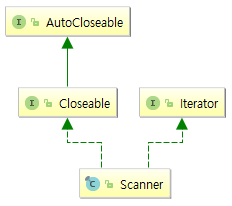

#### 1. 객체를 어떤 방법으로 측정하는 double getMeasure() 메서드를 갖는 Measurable 인터페이스를 만든다. 그런 다음 Employee가 Measurable을 구현하게 한다. 마지막으로 평균 측정치를 계산하는 double average(Measurable[] objects) 메서드를 만들어서 직원 배열의 평균 급여를 계산하는 데 사용하라.

```java
package ch03.ex01;

public interface Measurable {

    public static double average(Measurable[] objects) {
        double sum = 0;
        for (Measurable o : objects) {
            sum += o.getMeasure();
        }

        double avg = sum / objects.length;
        return avg;
    }

    /**
     * 객체를 어떤 방법으로 측정
     *
     * @return
     */
    double getMeasure();
}
```

```java
package ch03.ex01;

public class Employee implements Measurable {
    private String name;

    // ...

    @Override
    public double getMeasure() {
        return name.length();
    }

}
```

#### 2. 연습문제 1번에 이어스 Measurable largest(Measurable[] objects) 메서드를 만든다. 이 메서드를 사용해서 급여가 가장 높은 직원의 이름을 구하라. 이 때 타입 변환이 필요한 이유는 무엇인가?

직원(Employee)의 급여(salary)는 Measurable 엔터페이스에서 제공하지 않는다. 급여를 가져 오기 위해서 Employee 클래스로 변환해야 한다.

```java
package ch03.ex02;

public class Employee implements Measurable {
    private String name;
    private double salary;

    // ...

    @Override
    public double getMeasure() {
        return name.length();
    }

}
```

```java
package ch03.ex02;

public interface Measurable {

    /**
     * 급여가 가장 높은 직원을 구한다.
     *
     * @param objects 측정되는 배열
     * @return
     */
    public static Measurable largest(Measurable[] objects) {
        Employee top = null;
        for(Measurable o : objects) {
            if (top == null) {
                top = (Employee) o;
                continue;
            }

            Employee e = (Employee) o;
            if (e.getSalary() > top.getSalary()) {
                top = e;
            }
        }

        return top;
    }

    /**
     * 객체를 어떤 방법으로 측정
     *
     * @return
     */
    double getMeasure();
}
```

#### 3. String, Scanner, ImageOutputStream의 슈퍼타입들을 모두 나열하라. 각 타입은 그 자신의 수퍼타입이라는 점을 유의한다. 슈퍼타입을 선언하지 않는 클래스 또는 인터페이스는 Object를 슈퍼타입으로 둔다.

* java.lang.String


* java.util.Scanner



* javax.imageio.stream.ImageOutputStream


#### 4. 인자들로 구성된 시퀀스를 돌려주는 IntSequence 클래스의 정적 메서드 of를 구현하라. 예를 들어 IntSequence.of(3, 1, 4, 1, 5, 9)는 값 여섯 개로 구성된 시퀀스를 돌려준다.

```java
package ch03.ex04;

public interface IntSequence {
    boolean hasNext();

    int next();

    public static IntSequence of(int... args) {
        return new IntSequence() {
            int pos = 0;

            @Override
            public boolean hasNext() {
                return pos < args.length;
            }

            @Override
            public int next() {
                return args[pos++];
            }
        };
    }
}
```

#### 5. 무한 상수 시퀀스를 돌려주는 IntSequence 클래스의 정적 메서드 constant를 구현하라. 예를 들어 IntSequence.constant(1)은 값 1 1 1...을 도려준다.

```java
package ch03.ex05;

public interface IntSequence {
    boolean hasNext();
    
    int next();

    public static IntSequence constant(int n) {
        return new IntSequence() {
                @Override
            public boolean hasNext() {
                return true;
            }

            @Override
            public int next() {
                return n;
            }
        };
    }
}
```

#### 6. 직접해보지는 않고 추측만 해봄.... -_-v

forEachRemaining 메서드가 기본 메서드(default)로 작성되어 있기 때문에 정상적으로 작동된다.

1.7에서 컴파일한 DigitSequence가 오버라이드한 remove 메서드가 실행된다. 

```java
package ch03.ex06;

import java.util.Iterator;

public class DigitSequence implements Iterator<Integer> {
    private int number;

    public DigitSequence(int n) {
        number = n;
    }

    @Override
    public boolean hasNext() {
        return number != 0;
    }

    @Override
    public Integer next() {
        int result = number % 10;
        number /= 10;
        return result;
    }

    @Override
    public void remove() {
        // do noting
    }
}
```

* java 1.7
```java
package java.util;

public interface Iterator<E> {

    boolean hasNext();

    E next();

    /**
     * Removes from the underlying collection the last element returned
     * by this iterator (optional operation).  This method can be called
     * only once per call to {@link #next}.  The behavior of an iterator
     * is unspecified if the underlying collection is modified while the
     * iteration is in progress in any way other than by calling this
     * method.
     *
     * @throws UnsupportedOperationException if the {@code remove}
     *         operation is not supported by this iterator
     *
     * @throws IllegalStateException if the {@code next} method has not
     *         yet been called, or the {@code remove} method has already
     *         been called after the last call to the {@code next}
     *         method
     */
    void remove();
}
```

* Java 1.8
```java
package java.util;

import java.util.function.Consumer;

/**
 * An iterator over a collection.  {@code Iterator} takes the place of
 * {@link Enumeration} in the Java Collections Framework.  Iterators
 * differ from enumerations in two ways:
 *
 * <ul>
 *      <li> Iterators allow the caller to remove elements from the
 *           underlying collection during the iteration with well-defined
 *           semantics.
 *      <li> Method names have been improved.
 * </ul>
 *
 * <p>This interface is a member of the
 * <a href="{@docRoot}/../technotes/guides/collections/index.html">
 * Java Collections Framework</a>.
 *
 * @param <E> the type of elements returned by this iterator
 *
 * @author  Josh Bloch
 * @see Collection
 * @see ListIterator
 * @see Iterable
 * @since 1.2
 */
public interface Iterator<E> {

    boolean hasNext();

    E next();

    /**
     * Removes from the underlying collection the last element returned
     * by this iterator (optional operation).  This method can be called
     * only once per call to {@link #next}.  The behavior of an iterator
     * is unspecified if the underlying collection is modified while the
     * iteration is in progress in any way other than by calling this
     * method.
     *
     * @implSpec
     * The default implementation throws an instance of
     * {@link UnsupportedOperationException} and performs no other action.
     *
     * @throws UnsupportedOperationException if the {@code remove}
     *         operation is not supported by this iterator
     *
     * @throws IllegalStateException if the {@code next} method has not
     *         yet been called, or the {@code remove} method has already
     *         been called after the last call to the {@code next}
     *         method
     */
    default void remove() {
        throw new UnsupportedOperationException("remove");
    }
    
    /**
     * Performs the given action for each remaining element until all elements
     * have been processed or the action throws an exception.  Actions are
     * performed in the order of iteration, if that order is specified.
     * Exceptions thrown by the action are relayed to the caller.
     *
     * @implSpec
     * <p>The default implementation behaves as if:
     * <pre>{@code
     *     while (hasNext())
     *         action.accept(next());
     * }</pre>
     *
     * @param action The action to be performed for each element
     * @throws NullPointerException if the specified action is null
     * @since 1.8
     */
    default void forEachRemaining(Consumer<? super E> action) {
        Objects.requireNonNull(action);
        while (hasNext())
            action.accept(next());
    }
}
```

#### 7. 비교자로 판단할 경우 요소들이 오름차순으로 정렬될 때가지 배열 리스트에 Collections.shuffle을 계속 호출하는 void luckySort(ArrayList&lt;String&gt; strings, Comparator&lt;String&gt; comp) 메서드를 구현하라.

```java
package ch03.ex07;

import java.util.ArrayList;
import java.util.Collections;
import java.util.Comparator;

public class Sorter {

    public static void luckySort(ArrayList<String> strings, Comparator<String> comp) {
        shuffle:
        while (true) {
            // shuffle
            Collections.shuffle(strings);
            // validate
            validate:
            {
                for (int i = 1; i < strings.size(); i++) {
                    String s1 = strings.get(i - 1);
                    String s2 = strings.get(i);

                    if (comp.compare(s1, s2) > 0) {
                        // s1과 s2가 오름차순이 되지 않았으면 false
                        break validate;
                    }

                }

                break shuffle;
            }

        }
    }
    
}
```

#### 8. Runnable을 구현하는 Greeter 클래스를 구현하라. 이 클래스의 run 메서드는 "Hello, " + target을 n번 출력해야 한다. 여기서 n과 target은 생성자에서 설정한다. 각기 다른 메시지로 인스턴스 두 개를 생성해서 두 스레드에서 동시에 실행하라.

```java
package ch03.ex08;

public class Greeter implements Runnable {

    private String target;
    private int n;

    public Greeter(String target, int n) {
        this.target = target;
        this.n = n;
    }

    @Override
    public void run() {
        for (int i = 0 ; i < n ; i++) {
            System.out.println("Hello, " + target);
        }
    }

}
```

#### 9. 다음 메서드를 구현하라

public static void runTogether(Runnable... tasks)<br/>
public static void runInOrder(Runnable... tasks)

첫 번째 메서드는 각 태스크를 별도의 스레드에서 실행한 후 반환해야 한다. 두 번째 메서드는 모든 태스크를 현재 스레드에서 실행하고 마지막 태스크가 완료될 때 반환해야 한다.

```java
package ch03.ex09;

public class Runner {

    public static void runTogether(Runnable... tasks) {
        for (Runnable task : tasks) {
            new Thread(task).start();
        }
    }

    public static void runInOrder(Runnable... tasks) {
        Thread t = null;

        for (Runnable task : tasks) {
            task.run();
        }
    }

}
```

#### 10. java.io.File 클래스의 listFiles(FileFilter)와 isDirectory 메서드를 사용해서 주어진 디렉터리의 모든 서브 디렉터리를 반환하는 메서드를 작성하라. FileFilter 객체 대신 람다 표현식을 사용한다. 메서드 표현식과 익명 내부 클래스로 같은 작업을 반복하라.

```java
package ch03.ex10;

import java.io.File;

public class FileFilterDemo {

    public static void main(String[] args) {
        File directory = new File("C:\\Program Files");
        printDirectories(directory);
    }

    public static void printDirectories(File directory) {
        if (!directory.isDirectory()) {
            return;
        }

        File[] directories = directory.listFiles(pathname -> pathname.isDirectory());
        if (directories == null) { // 윈도우의 경우 엑세스 거부는 null이다.
            return;
        }

        for (File d : directories) {
            System.out.println(d);
            printDirectories(d);
        }
    }

}
```

#### 11. java.io.File 클래스의 list(FilenameFilter) 메서드를 사용해 지정된 디렉터리에서 지정된 확장자에 해당하는 모든 파일을 반환하는 메서드를 작성하라. FilenameFilter를 사용하지 말고 람다 표현식을 사용하라. 감싸고 있는 유효 범위에 속한 변수 중 어느 것을 캡처하는가? 

캡처하는 변수는 찾아야할 확장자를 가지고 있는 변수(ext)이다.

```java
package ch03.ex10;

import java.io.File;

public class FilenameFilterDemo {

    public static void main(String[] args) {
        String ext = "exe";
        File directory = new File("C:\\Windows");
        printFiles(directory, ext);
    }

    public static void printFiles(File directory, String ext) {
        File[] files = directory.listFiles((dir, name) -> name.endsWith("." + ext));

        for (File file : files) {
            System.out.println(file);
        }
    }
}
```

#### 12. File 객체의 배열을 받아서 디렉터리가 파일 앞에 나타나도록 정렬하라. 그리고 각 그룹 안에서는 요소들을 경로명으로 정렬한다. Comparator를 지정하는 데는 람다 표현식을 사용하라.

```java
package ch03.ex12;

import java.io.File;
import java.util.Arrays;
import java.util.Collections;
import java.util.List;

public class FileSortDemo {

    public static void main(String[] args) {
        // listFiles() 를 하면 이미 제대로 정렬이 다 되서 나오기 때문에 한번 섞어줬다.
        List<File> fileList = Arrays.asList(new File("C:\\Windows").listFiles());
        Collections.shuffle(fileList);
        // input
        File[] files = fileList.toArray(new File[fileList.size()]);

        Arrays.sort(employees,
                Comparator.comparing(Employee::getSalary, (o1, o2) -> (int) (o2 - o1))
                        .thenComparing(Employee::getName, (o1, o2) -> o1.compareToIgnoreCase(o2))
        );

        for(File file : files) {
            System.out.println(file);
        }
    }
    
}
```

#### 13. Runnable 인스턴스의 배열을 받고, run 메서드에서 이 인스턴스들을 차례로 실행하는 Runnalbe을 반환하는 메서드를 작성하라. 람다 표현식을 반환하라.

```java
package ch03.ex13;

public class RunnableDemo {

    public static Runnable getOrdredRunnable(Runnable[] tasks) {
        return () -> {
            for (Runnable task : tasks) {
                task.run();
            }
        };
    }
}
```

#### 14. 직원을 급여에 따라 정렬하는 Arrays.sort 호출을 작성하라. 순위가 같으면 이름으로 정렬한다. Comparator.thenComparing을 사용한다. 그런 다음 이작업을 역순으로 수행한다.

```java
package ch03.ex14;

import java.util.Arrays;

public class EmployeeSort {

    public static void main(String[] args) {
        Employee[] employees = new Employee[]{
                new Employee("Qadira", 1500),
                new Employee("Jack", 1000),
                new Employee("Adolf", 1500),
                new Employee("Adolf", 5000),
                new Employee("Hades", 3000),
                new Employee("Wade", 3700),
                new Employee("Kaapo", 2400),
                new Employee("Da", 6400)
        };

        Arrays.sort(employees,
                Comparator.comparing(Employee::getSalary, (o1, o2) -> (int) (o2 - o1))
                        .thenComparing(Employee::getName, (o1, o2) -> o1.compareToIgnoreCase(o2))
        );

        for (Employee e : employees) {
            System.out.println("salary=" + e.getSalary() + ", name=" + e.getName());
        }
    }

}
```

#### 15. 3.9.1 지역 클래스에서 나온 RandomSequence를 randomInsts 메서드 외부에 있는 중첩 클래스로 구현하라.

```java
package ch03.ex15;

import java.util.Random;

public interface IntSequence {
    boolean hasNext();
    int next();

    public static IntSequence randomInts(int low, int high) {
        return new RandomSequence(low, high);
    }

    public static class RandomSequence implements IntSequence {
        private final Random generator = new Random();
        private int low;
        private int high;

        private RandomSequence(int low, int high) {
            this.low = low;
            this.high = high;
        }

        @Override
        public boolean hasNext() {
            return true;
        }

        @Override
        public int next() {
            return low + generator.nextInt(high - low + 1);
        }
    }

}
```