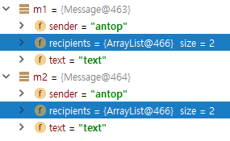
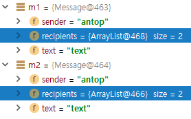

# 4장 상속과 리플렉션

## 4.1 클래스 확장하기

### 4.1.1 슈퍼클래스와 서브클래스

Employee 클래스의 몇 가지 기능을 보유하면서 관리자가 직원과 어떻게 다른지 명시하는 Manager 클래스를 정의해보자

```java
package ch04.sec01;

public class Employee {
    private String name;
    private double salary;

    public Employee(String name, double salary) {
        this.name = name;
        this.salary = salary;
    }

    public void raiseSalary(double byPercent) {
        double raise = salary * byPercent / 100;
        salary += raise;
    }

    public final String getName() {
        return name;
    }

    public double getSalary() {
        return salary;
    }
}
```

extends 키워드는 기존 클래스에서 파생한 새로운 클래스를 만든다.

이 때 기존 클래스를 슈퍼클래스(상위/부모/기반 클래스), 새로운 클래스를 서브클래스(하위/자식/파생 클래스)라고 한다.

### 4.1.2 서브 클래스 메서드 정의와 상속

```java
public class Manager extends Employee {
    // 추가된 필드
    private double bouns;
    // 추가된 메서드
    public void setBonus(double bonus) {
        this.bouns = bonus;
    }
}
```

```java
Manager boss = new Manager(...);
// 서브 클래스에 정의되어 있다.
boss.setBonus(10000);
// 슈퍼 클래스에서 상속 받았다.
boss.raiseSalary(5)
```

### 4.1.3 메서드 오버라이딩

```java
package ch04.sec01;

public class Manager extends Employee {
    private double bonus;

    public void setBonus(double bonus) {
        this.bonus = bonus;
    }
    
    // 슈퍼 클래스의 메서드를 오버라이드 한다.
    public double getSalary() {
        // return salary + bonus;
        return super.getSalary() + bonus;
    }
}
```

서브 클래스 메서드는 슈퍼 클래스의 비공개 인스턴스 변수에 직접 접근할 수 없다. 이 때문에 Manager.getSalary() 메서드에서 공개 메서드인 Employee.getSalary() 했다. **슈퍼클래스 메서드를 호출할 때는 super 키워드를 사용한다**.

메서드를 오버라이드할 때는 파라미터 타입이 정확하게 일치해야 한다. 실수를 방지하려면 서브 클래스의 메서드에 @Override 애너테이션을 붙인다.

이렇게 하면 실수로 오버라이드하지 않고 새로운 메서드를 정의했을 떄 컴파일러가 오류를 보고한다.

```java
public class Manager extends Employee {
    // ...
    
    @Override
    public double getSalary() {
        return super.getSalary() + bonus;
    }
}
```

메서드를 오버라이드 할 때 반환 타입을 서브타입(하위 타입)으로 변경할 수 있다([공변 반환 타입](https://en.wikipedia.org/wiki/Covariant_return_type)).

```java
// 슈퍼 클래스의 메서드
public Employee getSupervisor();
// 상속 받은 서브 클래스의 메서드
@Override
public Manager getSupervisor();
```

### 4.1.4 서브클래스 생성

서브 클래스의 생성자에서 슈퍼 클래스 생성자를 호출하려면 반드시 첫 번째 문장에서 해야 한다.

슈퍼 클래스 생성자 호출을 생략할 때는 인자 없는 생성자를 반드시 포함해야한다. 인자 없는 생성자를 포함하면 슈퍼클래스가 암시적으로 호출된다.

```java
package ch04.sec01;

public class Manager extends Employee {
    private double bonus;

    public Manager(String name, double salary) {
        super(name, salary);
        bonus = 0;
    }

    // ...
}
```

### 4.1.5 슈퍼클래스 할당

서브 클래스의 객체를 슈퍼 클래스 타입 변수에 할당할 수 있다.

```java
Manager boss = new Manager(...);
// 슈퍼 클래스 변수에 할당해도 된다.
Employee emp = boss;
```

메서드가 호출될 때 가상 머신은 객체의 실제 클래스를 살펴보고 해당 클래스에 맞는 메서드 버전을 찾아 실행한다. 이 과정을 **동적 메서드 조회**라고 한다.

### 4.1.6 타입 변환

인터페이스와 마찬가지로 instanceof 연산자와 타입 변환 연산자를 사용해서 슈퍼 클래스 참조를 서브 클래스로 바꿀 수 있다.

```java
if (emp instanceof Manager) {
    Manager mgr = (Manager) emp;
    mgr.setBonus(10000);
}
```

### 4.1.7 최종 메서드와 최종 클래스

메서드를 final 로 선언하면 어느 서브클래스도 해당 메서드를 오버라이드할 수 없다.

```java
public class Employee {
    // 오버라이드 불가능
    public final String getName() {
        return name;
    }
}
```

```java
// 상속 불가능
public final class Executive extends Manager {
    
}
```

### 4.1.8 추상 메서드와 추상 클래스

클래스는 구현이 없는 메서드를 정의해서 서브클래스가 해당 메서드를 구현하도록 강제할 수 있다.

추상 메서드와 추상 클래스에는 abstract 제어자를 붙여야한다.

```java
public abstract class Person {
    private String name;
    
    public Person(String name) {
        this.name = name;
    }
    // 추상 메서드
    public abstract int getId();    
}
```

추상 클래스는 인스턴스를 생성할 수 없다.

```java
Person p = new Person("Fred"); // 오류
```

서브 클래스에서 구현해서 사용한다.

```java
public class Student extends Person {
    private int id;
    
    public Student(String name, int id) {
        super(name);
        this.id = id;
    }
    // 추상 메서드 구현
    public int getId() {
        return id;
    }    
}
```

### 4.1.9 보호 접근

때로는 메서드를 서브클래스 전용으로 제한하고 싶거나, 서브클래스 메서드에서 슈퍼클래스의 인스턴스 변수에 접근하고 싶을 때가 있다. 그럴 때는 클래스의 해당 기능을 **protected**로 선언하면 된다.

```java
package com.horstmann.employees;

public class Employee {
    // ...
    
    // protected
    protected double salary;

    public double getSalary() {
        return salary;
    }
}
```

```java
package com.horstmann.managers;

import com.horstmann.employees.Employee;

public class Manager extends Employee {
    // ...

    @Override
    public double getSalary() {
        // protected 변수인 salary와 접근할 수 있다.
        return salary + bonus;
    }
}
```

Manager 클래스의 메서드는 Manager 객체의 salary 변수만 볼 수 있고, 다른 Employee 객체의 salary 변수는 볼 수 없다. 이 제한은 보호된 기능에 접근할 목적으로 서브클래스를 만들어 보호 메커니즘을 속이는 일을 방지한다.

### 4.1.10 익명 서브클래스

인터페이스를 구현하는 익명 클래스를 만들 수 있는 것처럼 슈퍼클래스를 확장하는 익명 클래스도 만들 수 있다. 익명 서브클래스는 디버깅에 유용하다.

```java
ArrayList<String> names = new ArrayList<>() {
    @Override
    public void add(int index, Object element) {
        super.add(index, element);
        System.out.printf("Adding %s at %d\n", element, index);
    }
};
```

이중 중괄후 초기화라는 기교는 내부 클래스 문법을 약간 특이하게 사용한다.

```java
ArrayList<String> friends = new ArrayList<>();
friends.add("Harry");
friends.add("Sally");

invite(friends);
```

바깥쪽 중괄호는 ArrayList의 익명 서브클래스를 만들고, 안쪽 중괄호는 초기화 블록이다(2장 객체 지향 프로그래밍).

```java
invite(new ArrayList<String>() { // 익명 서브 클래스
    { // 초기화 블록
        add("Harry");
        add("Sally");
    }
});
```

### 4.1.11 상속과 기본 메서드

클래스를 확장하고 인터페이스를 구현하는 클래스가 있는데 메서드의 이름이 같은 경우 **인터페이스 구현보다 슈퍼클래스 구현이 우선**한다.

```java
public interface Named {
    default String getName() {
        return "";
    }
}
```

```java
public class Person {
    public String getName() {
        return name;
    }
}
```

```java
public class Student extends Person implements Named {
    // Person.getName 메서드가 우선한다.
}
```

'클래스 우선' 규칙은 자바 7과 호환성을 보장한다. 따라서 인터페이스에서 기본 메서드를 추가해도 기본 메서드가 생기기 전부터 동작하던 코드에는 영향을 주지 않는다.

### 4.1.12 super를 이용한 메서드 표현식

run 메서드에서 슈퍼클래스의 work 메서드를 호출하는 Runnale로 스레드를 생성한다.

```java
public class Worker {
    public void work() {
        for (int i = 0; i < 100; i++) {
            System.out.println("Working");
        }
    }
}
```

```java
public class ConcurrentWorker extends Woker {
    public void work() {
        Thread t = new Thread(super::work);
        t.start();
    }
}
```

## 4.2 Object: 보편적 슈퍼클래스

Object 클래스는 모든 자바 객체에 적용할 수 있는 메서드를 정의한다.

```java
package java.lang;

/**
 * Class {@code Object} is the root of the class hierarchy.
 * Every class has {@code Object} as a superclass. All objects,
 * including arrays, implement the methods of this class.
 *
 * @author  unascribed
 * @see     java.lang.Class
 * @since   JDK1.0
 */
public class Object {
    
}
```

### 4.2.1 toString 메서드

Object 클래스의 중요한 메서드 하나는 객체의 문자열 표현을 반환하는 toString 메서드다.

```java
package java.lang;

public class Object {
    /**
     * Returns a string representation of the object. In general, the
     * {@code toString} method returns a string that
     * "textually represents" this object. The result should
     * be a concise but informative representation that is easy for a
     * person to read.
     * It is recommended that all subclasses override this method.
     * <p>
     * The {@code toString} method for class {@code Object}
     * returns a string consisting of the name of the class of which the
     * object is an instance, the at-sign character `{@code @}', and
     * the unsigned hexadecimal representation of the hash code of the
     * object. In other words, this method returns a string equal to the
     * value of:
     * <blockquote>
     * <pre>
     * getClass().getName() + '@' + Integer.toHexString(hashCode())
     * </pre></blockquote>
     *
     * @return  a string representation of the object.
     */
    public String toString() {
        return getClass().getName() + "@" + Integer.toHexString(hashCode());
    }
}
```

객체를 문자열과 연결하면 자바 컴파일러가 해당 객체의 toString 메서드를 자동으로 호출한다.

```java
System.out.println("" + object);
// System.out.println("" + object.toString());
```

### 4.2.2 equals 메서드

equals 메서드는 한 객체를 다른 객체와 같은지 검사한다.

```java
package java.lang;

public class Object {
    /**
     * Indicates whether some other object is "equal to" this one.
     * <p>
     * The {@code equals} method implements an equivalence relation
     * on non-null object references:
     * <ul>
     * <li>It is <i>reflexive</i>: for any non-null reference value
     *     {@code x}, {@code x.equals(x)} should return
     *     {@code true}.
     * <li>It is <i>symmetric</i>: for any non-null reference values
     *     {@code x} and {@code y}, {@code x.equals(y)}
     *     should return {@code true} if and only if
     *     {@code y.equals(x)} returns {@code true}.
     * <li>It is <i>transitive</i>: for any non-null reference values
     *     {@code x}, {@code y}, and {@code z}, if
     *     {@code x.equals(y)} returns {@code true} and
     *     {@code y.equals(z)} returns {@code true}, then
     *     {@code x.equals(z)} should return {@code true}.
     * <li>It is <i>consistent</i>: for any non-null reference values
     *     {@code x} and {@code y}, multiple invocations of
     *     {@code x.equals(y)} consistently return {@code true}
     *     or consistently return {@code false}, provided no
     *     information used in {@code equals} comparisons on the
     *     objects is modified.
     * <li>For any non-null reference value {@code x},
     *     {@code x.equals(null)} should return {@code false}.
     * </ul>
     * <p>
     * The {@code equals} method for class {@code Object} implements
     * the most discriminating possible equivalence relation on objects;
     * that is, for any non-null reference values {@code x} and
     * {@code y}, this method returns {@code true} if and only
     * if {@code x} and {@code y} refer to the same object
     * ({@code x == y} has the value {@code true}).
     * <p>
     * Note that it is generally necessary to override the {@code hashCode}
     * method whenever this method is overridden, so as to maintain the
     * general contract for the {@code hashCode} method, which states
     * that equal objects must have equal hash codes.
     *
     * @param   obj   the reference object with which to compare.
     * @return  {@code true} if this object is the same as the obj
     *          argument; {@code false} otherwise.
     * @see     #hashCode()
     * @see     java.util.HashMap
     */
    public boolean equals(Object obj) {
        return (this == obj);
    }
}
```

두 객체가 같은 내용을 담고 있을 때 같다고 보는 상태 기반 동등성 검사가 필요한 경우에만 equals 메서드를 오버라이드한다.

서브클래스용 equals 메서드를 정의할 때는 먼저 슈퍼 클래스의 equals를 호출한다. 이 검사에 실패했다면 객체는 같지 않다. 

```java
package ch04.sec02;

import java.util.Objects;

public class Item {
    private String description;
    private double price;

    public boolean equals(Object otherObject) {
        // A quick test to see if the objects are identical
        if (this == otherObject) return true;
        // Must return false if the explicit parameter is null
        if (otherObject == null) return false;
        // Check that otherObject is a Item
        if (getClass() != otherObject.getClass()) return false;
        // Test whether the instance variables have identical values
        Item other = (Item) otherObject;
        return Objects.equals(description, other.description)
            && price == other.price;
    }
}
```

```java
package ch04.sec02;

import java.util.Objects;

public class DiscountedItem extends Item {
    private double discount;

    public boolean equals(Object otherObject) {
        if (!super.equals(otherObject)) return false;
        DiscountedItem other = (DiscountedItem) otherObject;
        return discount == other.discount;
    }

}
```

서로 다른 클래스에 속하는 값들을 비교할 때는 equals 메서드가 어떻게 동작해야 할까? [p180]

equals 메서드는 대칭으로 동작해야 한다. 다시 말해서 널이 아닌 x와 y가 있을 때는 x.equals(y)와 y.equals(x)가 같은 값을 반환해야 한다.

instanceof 검사가 적절한 상황이 있다. 바로 동등성이라는 개념이 슈퍼클래스에 고정되어 있고 서브클래스에서 변하지 않을 때다. [p181]

### 4.2.3 hashCode 메서드

해시 코드는 객체에서 파생되는 정숫값이다. 해시 코드는 값이 중복될 수 있다.

hashCode와 equas 메서드는 반드시 호환되어야 한다. x.equals(y) 면 x.hashCode() == y.hashCode() 여야 한다.

```java
package java.lang;

public class Object {
    /**
     * Returns a hash code value for the object. This method is
     * supported for the benefit of hash tables such as those provided by
     * {@link java.util.HashMap}.
     * <p>
     * The general contract of {@code hashCode} is:
     * <ul>
     * <li>Whenever it is invoked on the same object more than once during
     *     an execution of a Java application, the {@code hashCode} method
     *     must consistently return the same integer, provided no information
     *     used in {@code equals} comparisons on the object is modified.
     *     This integer need not remain consistent from one execution of an
     *     application to another execution of the same application.
     * <li>If two objects are equal according to the {@code equals(Object)}
     *     method, then calling the {@code hashCode} method on each of
     *     the two objects must produce the same integer result.
     * <li>It is <em>not</em> required that if two objects are unequal
     *     according to the {@link java.lang.Object#equals(java.lang.Object)}
     *     method, then calling the {@code hashCode} method on each of the
     *     two objects must produce distinct integer results.  However, the
     *     programmer should be aware that producing distinct integer results
     *     for unequal objects may improve the performance of hash tables.
     * </ul>
     * <p>
     * As much as is reasonably practical, the hashCode method defined by
     * class {@code Object} does return distinct integers for distinct
     * objects. (This is typically implemented by converting the internal
     * address of the object into an integer, but this implementation
     * technique is not required by the
     * Java&trade; programming language.)
     *
     * @return  a hash code value for this object.
     * @see     java.lang.Object#equals(java.lang.Object)
     * @see     java.lang.System#identityHashCode
     */
    public native int hashCode();
}
```

equals 메서드를 재정의할 때는 hashCode 메서드도 재정의해서 equals와 호환되게 만들어야 한다. 이렇게 하지 않으면 클래스의 사용자가 해시 집합이나 해시 맵에 객체를 넣다가 객체를 잃게 될 수도 있다.

가변인자 메서드 Objects.hash는 인자들의 해시 코드를 계산하고 결합한다. 그리고 null에 안전하다.

### 4.2.4 객체 복제하기

clone 메서드의 목적은 객체의 복제본, 즉 원본과 상태가 같은 객체를 만드는 것이다. 두 객체 중 하나의 상태를 변경해도 나머지 하나는 변하지 않는다.

```java
package java.lang;

public class Object {
    /**
     * Creates and returns a copy of this object.  The precise meaning
     * of "copy" may depend on the class of the object. The general
     * intent is that, for any object {@code x}, the expression:
     * <blockquote>
     * <pre>
     * x.clone() != x</pre></blockquote>
     * will be true, and that the expression:
     * <blockquote>
     * <pre>
     * x.clone().getClass() == x.getClass()</pre></blockquote>
     * will be {@code true}, but these are not absolute requirements.
     * While it is typically the case that:
     * <blockquote>
     * <pre>
     * x.clone().equals(x)</pre></blockquote>
     * will be {@code true}, this is not an absolute requirement.
     * <p>
     * By convention, the returned object should be obtained by calling
     * {@code super.clone}.  If a class and all of its superclasses (except
     * {@code Object}) obey this convention, it will be the case that
     * {@code x.clone().getClass() == x.getClass()}.
     * <p>
     * By convention, the object returned by this method should be independent
     * of this object (which is being cloned).  To achieve this independence,
     * it may be necessary to modify one or more fields of the object returned
     * by {@code super.clone} before returning it.  Typically, this means
     * copying any mutable objects that comprise the internal "deep structure"
     * of the object being cloned and replacing the references to these
     * objects with references to the copies.  If a class contains only
     * primitive fields or references to immutable objects, then it is usually
     * the case that no fields in the object returned by {@code super.clone}
     * need to be modified.
     * <p>
     * The method {@code clone} for class {@code Object} performs a
     * specific cloning operation. First, if the class of this object does
     * not implement the interface {@code Cloneable}, then a
     * {@code CloneNotSupportedException} is thrown. Note that all arrays
     * are considered to implement the interface {@code Cloneable} and that
     * the return type of the {@code clone} method of an array type {@code T[]}
     * is {@code T[]} where T is any reference or primitive type.
     * Otherwise, this method creates a new instance of the class of this
     * object and initializes all its fields with exactly the contents of
     * the corresponding fields of this object, as if by assignment; the
     * contents of the fields are not themselves cloned. Thus, this method
     * performs a "shallow copy" of this object, not a "deep copy" operation.
     * <p>
     * The class {@code Object} does not itself implement the interface
     * {@code Cloneable}, so calling the {@code clone} method on an object
     * whose class is {@code Object} will result in throwing an
     * exception at run time.
     *
     * @return     a clone of this instance.
     * @throws  CloneNotSupportedException  if the object's class does not
     *               support the {@code Cloneable} interface. Subclasses
     *               that override the {@code clone} method can also
     *               throw this exception to indicate that an instance cannot
     *               be cloned.
     * @see java.lang.Cloneable
     */
    protected native Object clone() throws CloneNotSupportedException;
}
```

Object.clone 메서드는 **얕은 복사(shallow copy)**를 수행한다. 인스턴스 변수가 기본 타입이거나 불변 객체일 때는 얕은 복사로도 충분하다. 하지만 그렇지 않을 때는 원본과 복제본이 변경 가능한 상태를 공유하므로 문제가 될 수 있다.

```java
public final class Message {
    private String sender;
    // 공유되는 클래스
    private ArrayList<String> recipients;
    private String text;
}
```

만일 두 객체 중 하나에서 수신자 목록을 변경하면 이 변경이 다른 객체에도 반영된다. 그러므로 Message 클래스는 clone 메서드를 오버라이드해서 **깊은 복사**를 수행해야한다.

```java
Message m1 = new Message("antop", "text");
m1.addRecipient("jack");
m1.addRecipient("bill");

Message m2 = m1.clone(); // clone
m1.addRecipient("apple");

System.out.println(m1 == m2); // false
System.out.println(m1.getRecipients()); // [jack, bill, apple]
System.out.println(m2.getRecipients()); // [jack, bill, apple] ?!
```



일반적으로 클래스를 구현할 때는 다음 상황을 판단해야 한다.
1. clone 메서드를 구현하지 않아도 되는가?
* 아무 일도 안하면 된다.

2. 구현해야 한다면 상속받은 clone 메서드를 사용해도 되는가? (얕은 복사)

* 반드시 Cloneable 인터페이스(태깅/마커 인터페이스)를 구현해야 한다.
* clone의 유효 범위를 protected에서 public으로 올리고 반환 타입을 변경한다.
* CloneNotSupportedException을 처리해야 한다. 

```java
public class Employee implements Cloneable {
    // protected -> public
    // Object cast to Employee
    public Employee clone() throws CloneNotSupportedException {
        return (Employee) super.clone();
    }
}
```

3. 그렇지 않으면 clone 메서드에서 깊은 복사를 수행해야 하는가?

* clonse 메서드를 직접 구현한다.

```java
package ch04.sec02;

import java.util.ArrayList;

public final class Message implements Cloneable {
    @Override
    public Message clone() {
        Message cloned = new Message(sender, text);
        cloned.recipients = new ArrayList<>(recipients);
        return cloned;
    }
}
```




## 4.3 열거 (enumeration)

[The Java™ Tutorials: Enum Types](https://docs.oracle.com/javase/tutorial/java/javaOO/enum.html)

```java
public enum Size {
    SMALL, MEDIUM, LARGE, EXTRA_LARGE
}
```

### 4.3.1 열거의 메서드

열거 타입은 인스턴스들이 고정되어 있으므로 equals 메서드를 사용할 필요가 전혀 없다. 열거 타입 값을 비교할 때는 간단히 ==를 사용하면 된다.

```java
Size size = Size.valueOf("MEDIUM");
if (size == Size.MEDIUM) {
    
}
```

표 4-2 java.lang.Enum<E> 클래스의 메서드

|메서드|설명|
|---|---|
|String toString()<br/>String name()|enum 선언에서 지정한 인스턴스의 이름을 반환한다.<br>name 메서드는 final이다.|
|int ordinal()|enum 선언에서 인스턴스의 위치를 반환한다.|
|int compareTo(Enum&lt;E&gt; other)|인스턴스와 other를 순서 값으로 비교한다.|
|static T valueOf(Class&lt;T&gt; type, String name)|이름에 해당하는 인스턴스를 반환한다. 대신 열거 타입의 통합된 valueOf 또는 values 메서드를 사용하자.|
|Class&lt;E&gt; getDeclaringClass()|인스턴스를 정의한 클래스를 얻는다(인스턴스에 구현부가 있으면 getClass()와 다른 결과를 반환한다).|
|int hashCode()<br/>protected void finalize()|이들 메서드는 각각 대응하는 object 메서드를 호출하며, final 로 정의되어 있다.|
|protected Object clone()|CloneNotSupportedException을 던진다.|

### 4.3.2 생성자, 메서드, 필드

원한다면 열거 타입에 생성자, 메서드, 필드를 추가할 수 있다.

열거의 생서자는 반드시 비공개여야 한다. private 제어자를 생략할 수도 있다.

```java
package ch04.sec03;

public enum Size {
    SMALL("S"), MEDIUM("M"), LARGE("L"), EXTRA_LARGE("XL");

    private String abbreviation;

    Size(String abbreviation) {
        this.abbreviation = abbreviation;
    }

    public String getAbbreviation() {
        return abbreviation;
    }
}
```

### 4.3.3 인스턴스의 구현부

enum 인스턴스 각각에 메서드를 추가할 수 있지만, 이렇게 하면 열거에 정의된 메서드를 오버라이드해야 한다.

```java
public enum Operation {
    ADD {
        public int eval(int arg1, int arg2) {
            return arg1 + arg2;
        }
    },
    SUBTRACT {
        public int eval(int arg1, int arg2) {
            return arg1 - arg2;
        }
    },
    MULTIPLY {
        public int eval(int arg1, int arg2) {
            return arg1 * arg2;
        }
    },
    DIVIDE {
        public int eval(int arg1, int arg2) {
            return arg1 / arg2;
        }
    };
    
    public abstract int eval(int arg1, int arg2);
}
```

```java
Operation op = Operation.ADD;
int eval = op.eval(1, 2); // 3
```

### 4.3.4 정적 멤버

열거는 정적 멤버를 가질 수 있다. 하지만 생성 순서에 주의해야 한다. 열거 상수가 생성된 다음에 정적 멤버가 생성된다. 그러므로 **열거 생상자에서는 정적 맴버를 참조할 수 없다**.

```java
package ch04.sec03;

public enum Modifier {
    PUBLIC, PRIVATE, PROTECTED, STATIC, FINAL, ABSTRACT;

    private static int maskBit = 1;
    private int mask;

    private Modifier() {
        mask = maskBit; // 오류 - 생성자에서 정적 변수에 접근할 수 없다.
        maskBit *= 2;
    }

}
```

해결 방안은 정적 초기화 블록(static initializer)에서 초기화 하는 것이다.

```java
package ch04.sec03;

public enum Modifier {
    PUBLIC, PRIVATE, PROTECTED, STATIC, FINAL, ABSTRACT;

    private static int maskBit = 1;
    private int mask;

    static {
        int maskBit = 1;
        for (Modifier m : Modifier.values()) {
            m.mask = maskBit;
            maskBit *= 2;
        }
    }
}
```

### 4.3.5 열거를 기준으로 스위치하기

swtich 문에 열거 상수를 사용할 수 있다.

```java
package ch04.sec03;

public enum Operation {
    ADD, SUBTRACT, MULTIPLY, DIVIDE;

    public static int eval(Operation op, int arg1, int arg2) {
        int result = 0;
        switch (op) {
            case ADD: result = arg1 + arg2; break;
            case SUBTRACT: result = arg1 - arg2; break;
            case MULTIPLY: result = arg1 - arg2; break;
            case DIVIDE: result = arg1 - arg2; break;
        }
        return result;
    }
}
```

열거 명세에서는 열거를 이용한 switch 문이 철저하지 않으면 컴파일러가 경고할 것을 권고하고 있다. 즉, 열거 상수를 대응하는 케이스 절에 모두 나열하지 않는 상황에서 default 절도 없으면 컴파일러가 경고할 것을 권장한다.

## 4.4 실행 시간 타입 정보와 리소스

자바에서는 실행 시간에 객체가 어느 클래스에 속하는지 알아낼 수 있다. 이는 때때로 유용하게 사용할 수 있다. 게다가 클래스를 어떻게 로드했는지 알아내어 클래스와 관련된 데이터, 즉 리소스를 로드할 수있다.

### 4.4.1 Class 클래스

[java.lang.Class](https://docs.oracle.com/javase/8/docs/api/)

### 4.4.2 리소스 로드하기

클래스 파일과 같은 디렉터리에 리소스를 넣었을 때 다음과 같이 해당 파일에 대응하는 입력 스트림을 열 수 있다.

```java
InputStream stream = MyClass.class.getResourceAsStream("config.txt");
Scanner in = new Scanner(stream);
```

클래스를 JAR 파일로 패키징할 때 해당 클래스 파일과 리소스를 같이 넣으면 해당 리소스도 찾아올 수 있다.

### 4.4.3 클래스 로더

[Understanding the Java ClassLoader](https://www.ibm.com/developerworks/java/tutorials/j-classloader/j-classloader.html)

[자바 클래스로더 Wiki](https://ko.wikipedia.org/wiki/%EC%9E%90%EB%B0%94_%ED%81%B4%EB%9E%98%EC%8A%A4%EB%A1%9C%EB%8D%94)

자바 프로그램을 실행할 때는 최소 세 가지 클래스 로더가 연관된다.

* 부트스트랩 클래스 로더: <JAVA_HOME>/jre/lib 디렉터리에 위치한 핵심 자바 라이브러리들을 불러들인다. 핵심 JVM의 일부분인 이 클래스 로더는 네이티브 코드로 작성되어 있다. 부트스트랩 클래스 로더에 대응하는 ClassLoader 객체는 없다.
* 확장 클래스 로더: 확장 디렉터리(<JAVA_HOME>/jre/lib/ext[6] 또는 java.ext.dirs 시스템 속성에 지정된 기타 디렉터리)에 코드를 로드한다.
* 시스템 클래스로더: 시스템 클래스 로더는 CLASSPATH 환경 변수에 매핑된다.

### 4.4.4 컨텍스트 클래스 로더

p197

### 4.4.5 서비스 로더

p198

## 4.5 리플렉션

프로그램에서 리플렉션을 이용하면 실행 시간에 객체의 내용을 조사하고, 해당 객체의 메서드를 호출할 수 있다.

### 4.5.1 클래스 맴버 나열하기

p200

### 4.5.2 객체 조사하기

p201

### 4.5.3 메서드 호출하기

p202

### 4.5.4 객체 생성하기

p203

### 4.5.5 자바빈즈

자바빈(JavaBean)은 인자 없는 생성자/ 케터/세터 쌍, 기타 다른 메서드들로 구성된 클래스를 의미한다.

### 4.5.6 배열 다루그

p205

### 4.5.7 프록시

p207