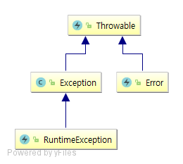
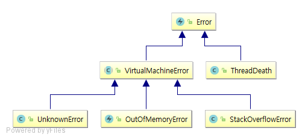
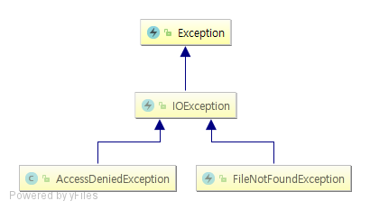
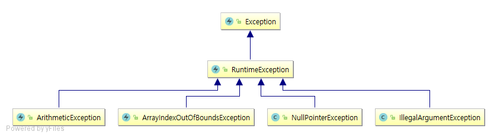
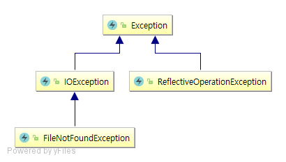
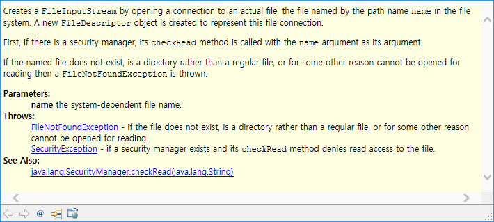

# 5장 예외, 단정, 로깅

[Lesson: Exceptions (The Java™ Tutorials > Essential Classes)](https://docs.oracle.com/javase/tutorial/essential/exceptions/index.html)

## 5.1 예외 처리

자바는 오류 코드를 전파할 때 메서드 호출 연쇄를 사용하지 않는다.

```java
package ch05.sec00;

public class Provider {

    public boolean process() {
        // 처리 결과를 반환
        return false;
    }

}
```

```java
package ch05.sec00;

public class Consumer {

    private Provider provider;

    public void doWork() {
        boolean result = provider.process();
        if (result) {
            // 정상
        } else {
            // 에러
        }
    }

}
```

자바는 예외 처리를 지원한다. 메서드는 예외를 던지는 방법으로 심각한 문제를 알린다. 호출 연쇄(call chain)에 속한 메서드 중 하나는 해당 예외를 잡아서 처리할 책임이 있다.

예외 처리의 장점은 오류를 감지하는 과정과 처리하는 과정을 분리하는 것이다.

### 5.1.1 예외 던지기

메서드가 해야 할 일을 할 수 없는 상황에 빠졌을 때 예외를 던지는 게 최선이다.

```java
package ch05.sec00;

import java.util.Random;

public class RandomNumbers {

    private static Random generator = new Random();

    public static int randInt(int low, int high) {
        if (low > high) {
            throw new IllegalArgumentException(String.format("low should be <= high but low is %d and high is %d", low, high));
        }
        return low + (int) (generator.nextDouble() * (high - low + 1));
    }

}
```

throw 문이 실행되면 정상적인 실행 흐름이 즉시 중단된다. 제어는 예외 핸들러(exception handler)로 전달된다.

### 5.1.2 예외 계층

모든 예외는 java.lang.Throwable 클래스의 서브클래스다.



java.lang.Error 클래스의 서브 클래스는 시스템에 뭔가 비정상적인 상황이 발생했을 경우 사용된다. 이런 상황일 때는 사용자에게 뭔가 크게 잘못되었다는 메세지를 보여주는 것 외에는 프로그램이 할 수 있는 일은 없다.



개발자가 보고하는 예외는 Exception 클래스의 서브 클래스다. 이러한 예외는 두 가지로 나뉜다.

* 비검사 예외(unchecked exception)는 RuntimeException의 서브 클래스다. **컴파일 과정에서 검사를 받지 않는다.**
* 다른 예외는 모두 검사 예외(chekced exception)다.

검사 예외는 실패가 예상되는 상황에 사용한다. 체크 예외가 발생할 수 있는 메서드를 사용할 경우 반드시 예외를 처리하는 코드를 함께 작성해야 한다.



비검사 예외는 개발자가 만든 논리 오류를 나타낸다. 피할 수 있지만 개발자가 부주의해서 발생할 수 있는 경우에 발생하도록 만든 것이다.



자바 API에는 예외 클래스가 많이 있다. 상황에 맞는다면 이러한 예외 클래스를 사용하면 된다. 하지만 목적에 맞는 표준 예외 클래스가 없다면 Exceptiond이나 RuntimeException, 또는 다른 기존 예외 클래스를 확장해서 직접 만들어야 한다.

[Hierarchy For All Packages](https://docs.oracle.com/javase/8/docs/api/overview-tree.html) (java.lang.Throwable 검색)

### 5.1.3 검사 예외 선언하기

검사 예외를 일으킬 수 있는 메서드는 메서드 선언부의 throws 절에 해당 예외를 선언해야 한다.

```java
public void someMethod() throws IOException, ReflectiveOperationException
```

throws 절에서는 예외를 공통 슈퍼클래스로 묶을 수 있다. 공통 슈퍼클래스로 묶는 방법이 좋은지 나쁜지는 던지는 예외에 따라 다르다.

```java
package ch05.sec00;

import java.io.FileNotFoundException;
import java.io.IOException;

public class SuperClass {

    public void someMethod() throws IOException {
        // IOException의 서브클래스를 예외로 던진다.
        throw new FileNotFoundException();
    }

}
```

메서드를 오버라이드할 때 슈퍼클래스 메서드에서 선언한 예외보다 광범위한 검사 예외는 던질 수 없다.

```java
package ch05.sec00;

import java.io.FileNotFoundException;

public class SubClass01 extends SuperClass {

    @Override
    public void someMethod() throws FileNotFoundException { // 범위가 좁은 예외를 던지도록 선언

    }
}
```



메서드에서 검사 예외나 비검사 예외를 던질 때는 자바독 @throws([@exception](http://www.oracle.com/technetwork/java/javase/documentation/index-137868.html#throwstag)) 태그를 사용해서 문서화 한다.

```java
package java.io;

public class FileInputStream extends InputStream {
    /**
         * Creates a <code>FileInputStream</code> by ...
         *
         * @param      name   the system-dependent file name.
         * @exception  FileNotFoundException  if the file does not exist,
         *                   is a directory rather than a regular file,
         *                   or for some other reason cannot be opened for
         *                   reading.
         * @exception  SecurityException      if a security manager exists and its
         *               <code>checkRead</code> method denies read access
         *               to the file.
         * @see        java.lang.SecurityManager#checkRead(java.lang.String)
         */
        public FileInputStream(String name) throws FileNotFoundException {
            this(name != null ? new File(name) : null);
        }
}
```



### 5.1.4 예외 잡기

예외를 잡으려면 try 블록을 사용해야 한다.

```java
try {
    // 문장
} catch {
    // 핸들러
}
```

try 블록에 들어 있는 문장이 실행되다가 지정한 클래스의 예외가 일어나면 제어가 핸들러로 이동한다.

서로 다른 예외 클래스에 대응하는 핸들러를 여러개 두는 방법이 잇다. 위에 있는 catch 절부터 일치 항목을 찾고, 없으면 아래로 내려온다. 이런 구조에서는 가장 상세한 예외 클래스부터 먼저 배치해야 한다.

```java
try {
    // 문장
} catch (예외클래스1 e) {
    // 핸들러1
} catch (예외클래스2 e) {
    // 핸들러2
} catch (예외클래스3 e) {
    // 핸들러3
}
```

핸들러 하나로 여러 예외 클래스를 처리할 수도 있다.

```java
try {
    // 문장
} catch (예외클래스1 | 예외클래스2 | 예외 클래스3) {
    // 핸들러
}
```

### 5.1.5 try-with-resources 문

[The try-with-resources Statement](http://docs.oracle.com/javase/7/docs/technotes/guides/language/try-with-resources.html)

[Catching Multiple Exception Types and Rethrowing Exceptions with Improved Type Checking](http://docs.oracle.com/javase/7/docs/technotes/guides/language/catch-multiple.html)

```java
ArrayList<String> lines = ...;
PrintWriter out = new PrintWriter("output.txt");
for (String line : lines) {
    out.println(line.toLowerCase());
}
out.close(); // 이 문장 전에 예외가 발생하면 리소스 해제가 되지 않는다.
```

예외 처리의 문제점은 리소스 관리다. 리소스를 해제 해줘야 하는 클래스의 경우 특별한 형태의 try 문으로 해결할 수 있다.

정상적으로 try 블록의 끝에 이르러서든 예외가 일어나서든, try 블록이 끝날 때 모든 리소스 객체의 close 메서드가 호출된다.

```java
ArrayList<String> lines = ...;
try (PrintWriter out = new PrintWriter("output.txt");) {
    for (String line : lines) {
        out.println(line.toLowerCase());
    }
} // out 객체는 자동으로 리소스가 해제 된다.
```

**각 리소스는 반드시 AutoCloseable 인터페이스를 구현하는 클래스에 속해야 한다.**

```java
package java.lang;

/**
 * An object that may hold resources (such as file or socket handles)
 * until it is closed. The {@link #close()} method of an {@code AutoCloseable}
 * object is called automatically when exiting a {@code
 * try}-with-resources block for which the object has been declared in
 * the resource specification header. This construction ensures prompt
 * release, avoiding resource exhaustion exceptions and errors that
 * may otherwise occur.
 *
 * @author Josh Bloch
 * @since 1.7
 */
public interface AutoCloseable {
    void close() throws Exception;
}
```

리소스는 초기화 순서의 역순으로 닫힌다.

```java
try (Scanner in = new Scanner(Paths.get("....."));
    PrintWriter out = new PrintWriter("....");) { // in, out

    while (in.hasNext()) {
        out.println(in.next().toLowerCase();
    }
}
// out.close();
// in.close();
```

PrintWriter 생성자에서 예외를 던진다고 해보자. 현재 in은 이미 초기화되었지만 out은 그렇지 않다. try 문은 이 상황을 제대로 처리한다. 즉, **in.close()를 호출하고 나서 일어난 예외를 전파하는 것이다.**

일부 close 메서드는 예외를 던질 수 있다. 정상적으로 try 블록이 끝난 후에 이런 메서드에서 예외가 일어나면 해당 예외를 호출하는 쪽으로 던진다. 하지만 또 다른 예외가 일어나서 리소스들의 close 메서드가 호출되고 그 중 하나가 예외를 던지면 해당 예외는 원래 일어난 예외보다 덜 중요해지기 마련이다.

이런 상황에서는 원래 일어난 예외를 다시 던지고, close를 호출하여 일어난 예외를 잡아 억누른 예외로 첨부한다. 주 예외(primary exception)를 잡아낼 때 getSuppressed 메서드를 호출하면 부 예외(secondary exception)를 추출할 수 있다.

```java
package ch05.sec01;

public class CloseThrowObject implements AutoCloseable {
    @Override
    public void close() throws Exception {
        // 무조건 예외 발생
        throw new Exception(getClass().getCanonicalName() + ".close() exception.");
    }
}
```

```java
package ch05.sec01;

public class SuppressedDemo {

    public static void main(String[] args) throws Exception {
        try (CloseThrowObject o1 = new CloseThrowObject();
             CloseThrowObject o2 = new CloseThrowObject();) {
            int a = 10;
            int b = 0;
            int c = a / b; // java.lang.ArithmeticException: / by zero
        } catch (ArithmeticException e) {
            e.printStackTrace();
        }
    }

}
```

```
java.lang.ArithmeticException: / by zero
	at ch05.sec01.SuppressedDemo.main(SuppressedDemo.java:10)
	Suppressed: java.lang.Exception: ch05.sec01.CloseThrowObject.close() exception.
		at ch05.sec01.CloseThrowObject.close(CloseThrowObject.java:6)
		at ch05.sec01.SuppressedDemo.main(SuppressedDemo.java:11)
	Suppressed: java.lang.Exception: ch05.sec01.CloseThrowObject.close() exception.
		at ch05.sec01.CloseThrowObject.close(CloseThrowObject.java:6)
		at ch05.sec01.SuppressedDemo.main(SuppressedDemo.java:11)
```

### 5.1.6 finally

finally 절은 정상적으로든 예외 때문이든 try 블록이 끝날 때 실행된다.

```java
try {
    // 작업을 수행한다.
} finally {
    // 정리 작업을 한다.
}
```

finally 절에서 예외를 던지는 일은 하지 말아야 한다. try 블록의 구현부가 예외 때문에 종료 되더라도 finally 절에서 일어난 예외로 가려지기 때문이다.

이와 유사한 이유로 finally 절에 return 문을 작성하면 안 된다. try 블록 구현부에 return 문이 있어도 finally 절에 있는 return 문이 반환 값을 교체해 버리기 때문이다.

### 5.1.7 예외 다시 던지기와 예외 연쇄하기

예외가 일어날 때 무슨 일을 해야 하는지는 모르더라도 실패 로그로 기록하고 싶은 수 있따. 이럴 때는 예외를 다시 전져서 적합한 예외 핸들러가 해당 예외를 다룰 수 있게 해야 한다.

```java
try {
    // 작업을 수행한다.
} catch (Excpetion ex) {
    // 로그 기록
    logger.log(level, message, ex);
    // 예외 다시 던지기
    throw ex;
}
```

일어난 예외의 클래스를 변경하고 싶을 때도 있다.

```java
try {
    // 데이터베이스에 접근한다.
} catch (SqlException ex) {
    throw new ServletException("database error", ex");
}
```

```java
try {
    // 데이터베이스에 접근한다.
} catch (SqlException ex) {
    Throwable e = new CruftyOldException("database error");
    e.initCause(ex);
    throw e;
}
```

예외 클래스를 작성한다면 5.1.2 예외 계층에서 설명 했던 두 생성자뿐 아니라 다음과 같은 생성자도 작성해야 한다.

```java
public class FileFormatException extends IOException {
    // ...
    public FileFormatException(Throwable cause) {
        initCause(cause);
    }

    public FileFormatException(String message, Throwable cause) {
        super(message);
        iniCause(cause);
    }
}
```

### 5.1.8 스택 추적

미처리 예외(uncaught exception)가 있으면 스택 추적(stack trace)에 표시된다. 스택 추적은 예외가 던져진 지점에서 대기 중인 모든 메서드 호출의 목록이다. 스택 추적은 오류 메시지용 스트림 System.err로 전달된다.

```java
try {
    Class<?> cl = Class.forName(className);
} catch (ClassNotFoundException ex) {
    ex.printStackTrace();
}
```

### 5.1.9 Objects.requireNonNull 메서드

Objects 클래스에는 편리한 파라미터 널 검사용 메서드가 있다.

```java
package java.util;

import java.util.function.Supplier;

/**
 * This class consists of {@code static} utility methods for operating
 * on objects.  These utilities include {@code null}-safe or {@code
 * null}-tolerant methods for computing the hash code of an object,
 * returning a string for an object, and comparing two objects.
 *
 * @since 1.7
 */
public final class Objects {
    /**
     * Checks that the specified object reference is not {@code null}. This
     * method is designed primarily for doing parameter validation in methods
     * and constructors, as demonstrated below:
     * <blockquote><pre>
     * public Foo(Bar bar) {
     *     this.bar = Objects.requireNonNull(bar);
     * }
     * </pre></blockquote>
     *
     * @param obj the object reference to check for nullity
     * @param <T> the type of the reference
     * @return {@code obj} if not {@code null}
     * @throws NullPointerException if {@code obj} is {@code null}
     */
    public static <T> T requireNonNull(T obj) {
        if (obj == null)
            throw new NullPointerException();
        return obj;
    }

    /**
     * Checks that the specified object reference is not {@code null} and
     * throws a customized {@link NullPointerException} if it is. This method
     * is designed primarily for doing parameter validation in methods and
     * constructors with multiple parameters, as demonstrated below:
     * <blockquote><pre>
     * public Foo(Bar bar, Baz baz) {
     *     this.bar = Objects.requireNonNull(bar, "bar must not be null");
     *     this.baz = Objects.requireNonNull(baz, "baz must not be null");
     * }
     * </pre></blockquote>
     *
     * @param obj     the object reference to check for nullity
     * @param message detail message to be used in the event that a {@code
     *                NullPointerException} is thrown
     * @param <T> the type of the reference
     * @return {@code obj} if not {@code null}
     * @throws NullPointerException if {@code obj} is {@code null}
     */
    public static <T> T requireNonNull(T obj, String message) {
        if (obj == null)
            throw new NullPointerException(message);
        return obj;
    }
}
```

```java
public void process(String directions) {
    this.directions = Objects.requireNonNull(directions);
}
```

directions가 null 이면 NullPointerException이 일어난다. 그래서 처음엔 크게 개선된 것처럼 보이지 않는다. 하지만 스택 추적을 거슬러 올라가서 작업하는 방식을 생각해보면 크게 개선됐다.

## 5.2 단정

단정(assertion)은 일반적으로 사용하는 방어적 프로그래밍 방법이다. 단정 메커니즘을 이용하면 테스트 중에만 검사를 하고, 제품용 코드에서는 자동으로 삭제되게 할 수 있다.

### 5.2.1 단정 사용하기

자바의 단정문 형태는 두 가지가 있따.

```java
assert 조건식;
assert 조건식 : 표현식;
```

assert 문은 조건을 평가해서 거짓이면 java.lang.AssertionError를 던진다.

### 5.2.2 단정 활성화와 비활성화

기본적으로 단정은 비활성화되어 있다. -enableassertions나 -ea 옵션으로 프로그램을 실행하여 단정을 활성화한다.

```
java -ea 클래스
```

단정을 활성화하거나 비활성화하는 일은 클래스 로더에서 처리한다. 클래스 로더는 단정이 비활성화되어 있으면 단정 코드를 제거해서 프로그램실행이 느려지지 않게 한다.

```java
package ch05.sec00;

public class Assertion {

    public void x(int x) {
        assert x >= 0;
    }

    public static void main(String[] args) {
        Assertion a = new Assertion();
        a.x(-1);
    }

}
```

```
Exception in thread "main" java.lang.AssertionError
	at ch05.sec00.Assertion.x(Assertion.java:6)
	at ch05.sec00.Assertion.main(Assertion.java:11)
```

```
assert x >= 0 : x;

Exception in thread "main" java.lang.AssertionError: -1
	at ch05.sec00.Assertion.x(Assertion.java:6)
	at ch05.sec00.Assertion.main(Assertion.java:11)
```

## 5.3 로깅

### 5.3.1 로거 사용

### 5.3.2 로거

### 5.3.3 로깅 레벨

### 5.3.4 기타 로깅 메서드

### 5.3.5 로깅 설정

### 5.3.6 로그 핸들러

### 5.3.7 필터와 서식 지정자

[Java Logging API Enhancements](http://docs.oracle.com/javase/8/docs/technotes/guides/logging/index.html)

[Apache Commons Logging](http://commons.apache.org/proper/commons-logging/)

[Logback](https://logback.qos.ch/)

[Apache Log4j 2](https://logging.apache.org/log4j/2.x/)