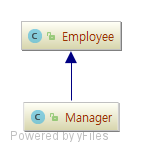

# 6장 제네릭 프로그래밍

다양한 타입에도 동작하는 메서드와 클래스를 구현해야 할 때가 종종 있다. 예를 들어 ArrayList&lt;T&gt;는 임의의 클래스 T를 요소로 저장한다. 여기서 ArrayList 클래스를 제네릭이라고 하며, **T를 타입 파라미터**라고 한다.

자바의 제네릭 프로그래밍은 아주 복잡하다. 자바가 생겨난 지 꽤 지난 시점에서 제네릭을 추가한 데다가 하위 호환성을 유지하도록 설계했기 때문이다. 결과 적으로 부적절한 제약 몇 개가 생겼다. 부적절한 제약 중 일부는 자바 개발자 모두에게 영향을 주며, 일부는 제네릭 클래스 구현자에게만 해당한다.

## 6.1 제네릭 클래스

```java
package ch06.sec01;

public class Entry<K, V> {
    private K key;
    private V value;

    public Entry(K key, V value) {
        this.key = key;
        this.value = value;
    }

    public K getKey() {
        return key;
    }
    public V getValue() {
        return value;
    }
}
```

코드를 보면 클래스 이름 뒤에 오는 꺾쇠 괄호(&lt;&gt;) 안에 타입 파라미터 K와 V를 명시했다. **이들 타입 파라미터는 클래스 맴버를 정의할 때 인스턴스 변수, 메서드 파라미터, 반환 값의 타입으로 사용한다.**

타입 변수를 해당하는 타입으로 교체하여 제네릭 클래스의 인스턴스를 만든다.

```java
Entry<String, Integer> e = new Entry<String, Integer>();
```

```java
public class Entry {
    private String key;
    private Integer value;

    public Entry(String key, Integer value) {
        this.key = key;
        this.value = value;
    }

    public String getKey() {
        return key;
    }
    public Integer getValue() {
        return value;
    }
}
```

타입 파라미터의 인스턴스는 기본 타입으로 만들 수 없다.

```java
Entry<String, int> e = new Entry<>(); // error
```

제네릭 클래스의 객체를 생성할 때 생성자에서 타입 파라미터를 생략할 수 있다.

```java
Entry<String, Integer> e = new Entry<>();
```

이 빈 꺽쇠 괄호 쌍(&lt;&gt;)을 다이아몬드라고도 합니다. 다이아몬드 문법을 사용하면 생성자의 타입 파라미터를 **추론**할 수 있다.

([Type Inference for Generic Instance Creation](http://docs.oracle.com/javase/8/docs/technotes/guides/language/type-inference-generic-instance-creation.html))

## 6.2 제네릭 메서드

타입 파라미터를 받는 메서드다. 제네릭 메서드는 일반 클래스나 제네릭 클래스의 메서드가 될 수 있다.

```java
package ch06.sec02;

public class Arrays {
    public static <T> void swap(T[] array, int i, int j) {
        T temp = array[i];
        array[i] = array[j];
        array[j] = temp;
    }
}
```

제네릭 메서드를 선언할 때는 타입 파라미터를 제어자와 반환 타입 사이에 둔다.

```java
// public <T> void
public static <T> void swap(T[] array, int i, int j)
```

제네릭 메서드를 호출할 때는 타입 파라미터를 명시하지 않아도 된다. **컴파일러가 메서드 파라미터와 반환 타입에서 타입 파라미터를 추론**할 수 있기 때문이다.

원한다면 메서드 이름 앞에 타입을 명시적으로 지정할 수 있다.

```java
String[] friends = ...;
Arrays.<String>swap(friends, 0, 1);
```

타입을 명시적으로 지정하면 문제가 발생했을 때 더 자세한 오류 메시지를 얻을 수 있다.

## 6.3 타입 경계

제네릭 클래스나 제네릭 메서드가 받는 **타입 파라미터의 타입을 제한**해야 할 때가 있다.

```java
package ch06.sec03;

import java.util.ArrayList;

public class Closeables {
    public static <T extends AutoCloseable> void closeAll(ArrayList<T> elems) throws Exception {
        for (T elem : elems) elem.close();
    }
}
```

타입 경계 extends AutoCloseable은 요소 타입이 **AutoCloseable의 서브타입임을 보장**한다.

타입 경계에서 extends 키워드는 '서브타입'을 의미하는데 이 점을 유의해야 한다(자바 설계자들은 다른 키워드나 기호를 도입하지 않고 기존에 사용하던 extends 키워드를 사용했다.)

다음과 같이 타입 파라미터에 다중 경계를 지정할 수도 있다.

```java
T extends Runnable & AutoCloseable
```

인터페이스 경계는 원하는 만큼 지정할 수 있지만, 클래스 경계는 하나만 지정할 수 있다. 클래스를 경계로 지정할 때는 경계 목록에서 첫 번째 항목으로 둬야 한다.

## 6.4 타입 가변성과 와일드카드



```java
public static void process(Employee staff) { ... }
```

Manager가 Employee의 서브클래스면 Manager[]도 Employee[]의 서브타입이므로 Manager[] 배열을 이 메서드에 전달 할 수 있다. 이런 동작을 공변셩(convariance)이라고 한다. 즉, 배열은 요소 타입과 같은 방식으로 변한다.

배열 리스트로 할 경우 ArrayList&lt;Manager&gt;는 ArrayList&lt;Employee&gt;의 서브타입이 아니다.

이런 제약에는 이유가 있다. ArrayList&lt;Manager&gt;를 ArrayList&lt;Employee&gt; 타입 변수에 할당할 수 있게 하면, 관리자가 아닌 직원을 저장할 때 배열 리스트에 손상을 줄 수 있다.

```java
ArrayList<Manager> bosses = new ArrayList<>();
ArrayList<Employee> empls = bosses; // 규칙에 어긋나지만, 일단은 올바른 문장이라고 해두자
empls.add(new Employee(...)); // bosses에 관리자가 아닌 직원을 집어넣는다!
```

자바에서는 와일드카드로 메서드의 파라미터와 반환 타입이 변하는 방식을 지정한다. 이 메커니즘을 사용처 공변셩(use-site variance)이라고도 한다.

### 6.4.1 서브타입 와일드카드

서로 다른 배열 리스트 사이를 변환하는 일은 대부분 안전하다. 메서드에서 배열 리스트에 쓰기를 전혀 수행하지 않아서 인자로 받는 배열 리스트를 전혀 바꾸지 않는다고 해보자. 다음과 같이 와일드카드로 이런 사실을 나타낼 수있다.

```java
public static void printNames(ArrayList<? extends Employee> staff) {
    for (int i = 0; i < staff.size(); i++) {
        Employee e = staff.get(i);
        System.out.println(e.getName());
    }
}
```

와일드카드 타입 ? extends Employee는 미지의 Employee 서브타입을 가리킨다.

? extends Employee를 Employee 로 변환할 수 있지만, 어떤 것도 절대 ? extends Employee로는 변환할 수 없다. 바로 이 점이 ArrayList&lt;? extends Employee&gt;에서 **읽을 수 있는지만 쓸 수는 없는 이유**다.

```java
List<? extends Employee> list = new ArrayList<>();
Employee e = new Employee("antop", 12.6);
list.add(e); // error!
```

### 6.4.2 슈퍼타입 와일드카드 (p246)

와일드카드 타입 ? extneds Employee는 Employee의 서브타입을 나타낸다. 그 역은 Employee의 슈퍼타입을 나타내는 와일드 카드 타입인 ? super Employee다. **슈퍼타입 와일드카드는 보통 함수형 객체의 파라미터로 유용하다.**

### 6.4.3 타입 변수와 함께 사용하는 와일드카드


### 6.4.4 경계 없는 와일드카드

아주 일반적인 작업만 수행하는 상황에서는 경계 없는 와일드카드를 사용할 수 있다.

```java
public static boolean hasNulls(List<?> elements) {
    for (Object e : elements) {
        if (e == null) return true;
    }
    return false;
}
```

여기서 ArrayList의 타입 파라미터는 중요하지 않으므로 ArrayList&lt;?&gt;를 사용하는 것이 타당하다.


### 6.4.5 와일드카드 캡처

```java
public static void swap(List<?> elements, int i, int j) {
    ? temp = elements.get(i); // 에러
    elements.set(i, elements.get(j));
    elements.set(j, temp);
}
```

위와 같이 작성하면 동작하지 않는다. ?를 타입 인자로 사용할 수 있지만, 타입으로는 사용할 수 없다.

하지만 이 문제를 오회해서 해결하는 방법이 있다. 다음과 같이 헬퍼 메서드를 추가하면 된다.

```java
public static void swap(List<?> elements, int i, int j) {
    swapHelper(elements, i, j);
}

private static <T> void swapHelper(List<T> elements, int i, int j) {
    T temp = elements.get(i);
    elements.set(i, elements.get(j));
    elements.set(j, temp);
}
```

와일드 카드 캡처라는 특별한 규칙 덕분에 swapHelper 호출은 유효하다. **컴파일러는 ?가 무엇인지 모르지만, ?는 어떤 타입을 나타내므로 제네릭 메서드를 호출해도 된다.** swapHelper 메서드의 타입 파라미터 T는 와일드카드 타입을 '캡처(capture)'한다.

이점은 API 사용자가 제네릭 메서드 대신 이해하기 쉬운 ArrayList&lt;?&gt;를 볼 수 있다는 것이다.

## 6.5 자바 가상 머신에서의 제네릭

자바 설계자들이 자바에 제네릭 타입과 메서드를 추가하던 당시로 거슬러 올라가보자. 그때 설계자들은 클래스이 제네릭 형태가 기존 버전 클래스와 호환되게 하려고 했다. 그래서 설계자들은 가상 머신에서 타입을 지우는 구현 방식으로 기존 버전 클래스와 호환되게 했다.

### 6.5.1 타입 소거

제네릭 타입을 정의하면 해당 타입은 로(raw) 타입으로 컴파일 된다.

```java
public class Entry<K, V> {
    private K key;
    private V value;

    public Entry(K key, V value) {
        this.key = key;
        this.value = value;
    }

    public K getKey() { return key; }
    public V getValue() { return value; }
}
```

위 Entry&lt;K, V&gt; 클래스는 다음과 같이 변환된다. K와 V가 모두 Object로 교체 되었다.

```java
public class Entry {
    private Object key;
    private Object value;

    public Entry(Object key, Object value) {
        this.key = key;
        this.value = value;
    }

    public Object getKey() { return key; }
    public Object getValue() { return value; }
}
```

타입 변수에 경계가 있으면 첫 번째 경계로 교체된다.

```java
public class Entry<K extends comparable<? super K> & Serializable, V extends Serializable>
```

그러면 다음과 같은 클래스로 교체된다.

```java
public class Entry {
    private Comparable key;
    private Serializable value;
}
```

### 6.5.2 타입 변환 연산자 삽입

타입 소거는 약간 위험해 보이지만 실제로는 아주 안전하다. 예를 들어 Entry&lt;String, Integer&gt; 객체를 사용했다고 해보자. 이 객체를 생성할 때는 반드시 String 타입 키와 Integer 타입 값을 전달해야 한다.

히자만 타입 변환 연산자난 제네릭과 로(raw) 타입을 섞어서 사용하여 프로그램이 '비검사(unchecked)' 경고 옵션으로 컴파일됐다고 해보자. 그러면 Entry&lt;String, Integer&gt;에 서로 다른 타입으로 된 키가 포함될 수도 있다.

따라서 실행 시간에 안전성 검사를 해야 한다. 컴파일러는 소거된 타입이 있는 표현식을 읽어올 때마다 타입 변환 연산자를 삽입한다. 예로 다음 코드를 보자.

```java
Entry<String, Integer> entry = ...;
String key = entry.getKey();
```

타입이 소거된 getKey 메서드는 Object를 반환하므로 컴파일러는 다음과 같은 코드를 만들어낸다.

```java
String key = (String) entry.getKey();
```

### 6.5.3 브릿지 메서드 (p253)

메서드 파라미터와 반환 타입을 소거할 때는 때때로 컴파일러가 브릿지 메서드를 만들어내야 한다. 그런데 이는 구현의 세부 사항이다. 스택 추적에 이런 메서드가 나타나는 이유나 좀 더 이해하기 어려운 자바 제네릭의 제약에 관한 설명이 필요 없다면 꼭 알아두지 않아도 된다.

## 6.6 제네릭의 제약

자바에서 제네릭 타입과 메서드를 사용할 때는 몇 가지 제약이 있다. 대두분은 타입 소거 때문에 생기는 제약이다.

### 6.6.1 기본 타입 인자가 없다

타입 파라미터는 절대로 기본 타입이 될 수 없다.

### 6.6.2 실행 시간에는 모든 타입이 로 형태다

가상 머신에는 오직 로 타입(raw type)만 있다. 그래서 실행 시간에 ArrayList가 String 객체를 담고 잇는지 알아낼 수 없다.

```java
if (a instanceof ArrayList<String>)
```

이와 같은 조건은 절대로 검사할 수 없으므로 컴파일 시간 오류(compile-time error)를 일으킨다.

제네릭 타입의 인스턴스를 타입으로 변환하는 일도 마찬가지로 비효율적이지만 합법적인 방법이다.

```java
Object result = ,,,;
// 경고 - result가 ArrayList인지만 검사한다.
ArrayList<String> list = (ArrayList<String>) result;
```

타입 변환을 피할 방법이 없을 때도 있으므로 이런 타입 변환이 허용된다.

경고가 사라지게 하려면 다음과 같이 해당 변수에 애너테이션을 붙여야한다.

```java
@SuppressWarnings("unchecked")
ArrayList<String> list = (ArrayList<String>) result;
```

getClass 메서드는 항상 로 타입을 반환한다. 예를 들어 list가 ArrayList&lt;String&gt; 이라면 list.getClass()는 ArrayList.class를 반환한다. ArrayList&lt;String&gt;.class 는 없는 클래스이므로 이런 클래스 리터럴을 사용하면 문법 오류가 일어난다.

또한, 클래스 리터럴에서는 타입 변수를 사용할 수 없다. 즉, T.class, T[].class, ArrayList<T>.class는 존재하지 않는다.

### 6.6.3 타입 변수의 인스턴스를 만들 수 없다 (p256)

타입 변수는 T(...) 또는 new T[...] 같은 표현식에서 사용할 수 없다. 이런 현태는 T가 지워지면 개발자가 의도한 대로 동작하지 않는다. 그래서 사용이 금지되어 있다.

### 6.6.4 파라미터화된 타입의 배열을 생성할 수 없다 (p258)

### 6.6.5 정적 컨텍스트에서는 클래스 타입 변수가 유효하지 않다

정적 변수나 메서드에서는 타입 변수를 사용할 수 없다.

```java
public class Entry<K, V> {
    // 오류 - 정적 컨텍스트에서 V를 사용했다.
    private static V defaultValue;
    // 오류 - 정적 컨텍스트에서 V를 사용했다.
    public static void setDefault(V value) {
        default = value;
    }
}
```

### 6.6.6 메서드가 소거 후 충돌하지 않을 수도 있다 (p260)

### 6.6.7 예외와 제네릭

제네릭 클래스의 객체는 예외로 던지거나 잡아낼 수 없다. 사실은 Throwable의 제네릭 서브클래스조차 만들 수 없다.

## 6.7 리플렉션과 제네릭

### 6.7.1 Class&lt;T&gt; 클래스

Class 클래스는 Class 객체가 기술하는 클래스를 타입 파라미터로 받는다.

타입 파라미터는 인스턴스를 생성하는 데 필요하다. newInstance 메서드는 다음과 같이 선언되어 있다.

```java
public final class Class<T> implements java.io.Serializable, GenericDeclaration, Type, AnnotatedElement {
    @CallerSensitive
    public T newInstance() throws InstantiationException, IllegalAccessException {
        ...
    }
}
```

### 6.7.2 가상 머신에서 제네릭 타입 정보 (p264)

소거는 오직 인스턴스화된 타입 파라미터에만 영향을 준다. 제네릭 클래스와 메서드의 선언에 관한 완전한 정보는 실행 시간에 얻을 수 있다.

java.lang.reflect 패키지에 들어 있는 Type 인터페이스는 제네릭 타입 선언을 나타낸다. Type 인터페이스의 서브타입은 다음과 같다.

1. 구체적인 타입을 기술하는 Class 클래스
2. (T extends Comparable&lt;? super T&gt; 같은) 타입 변수를 나타내는 TypeVariable 인터페이스
3. (? super T 같은) 와일트카드를 나타내는 WildcardType 인터페이스
4. (Comparable&lt; super T&gt; 같은) 네네릭 인터페이스를 나타내는 ParameterizedType 인터페이스
5. (T[] 같은) 제네릭 배열을 나타내는 GenericArrayType 인터페이스