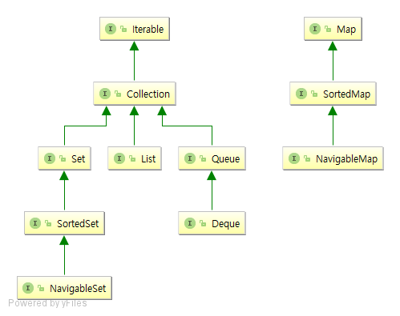
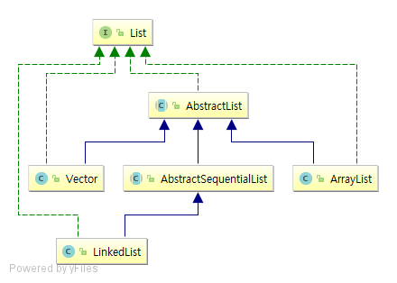
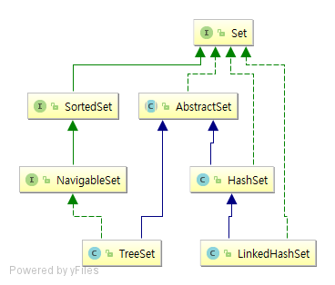
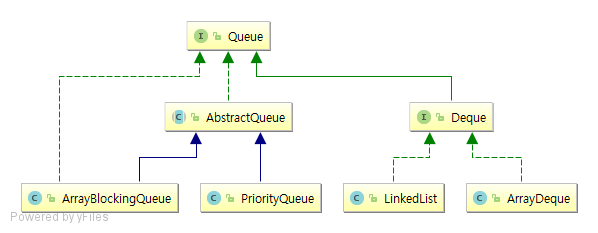
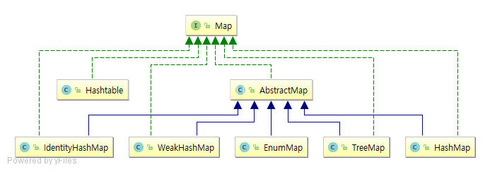

# 7장 컬렉션

[Trail: Collections (The Java™ Tutorials)](https://docs.oracle.com/javase/tutorial/collections/)

지금까지 많은 자료 구조가 개발됐다. 자료 구조는 개발자가 값을 효율적으로 저장하고 꺼내올 수 있게 한다. 자바 API는 자료 구조와 알고리즘 구현은 물론, 이들을 조직화하는 프레임워크가 있다.

## 7.1 컬렉션 프레임워크 개요

컬렉션 프레임워크에는 자료 구조의 구현체가 있다. 선택한 자료 구조에 독립적인 코드를 쉽게 작성할 수 있게 하기 위해 컬렉션 프레임워크는 공통 인터페이스를 제공한다. 기본 인터페이스는 [java.util.Collection](https://docs.oracle.com/javase/8/docs/api/java/util/Collection.html)이다.



[java.util.List](https://docs.oracle.com/javase/8/docs/api/java/util/List.html)는 순차 컬렉션이다(요소의 위치가 0, 1, 2 등이다).



[java.util.Set](https://docs.oracle.com/javase/8/docs/api/java/util/Set.html)은 요소를 특정 위치에 삽입하지 않으며, 중복 요소를 허용하지 않는다.



[java.util.Queue](https://docs.oracle.com/javase/8/docs/api/java/util/Queue.html)는 삽입 순서를 유지하지만, 사람들이 줄지어 있는 것처럼 요소를 뒤(tail)에서만 삽입하고, 앞(head)에서만 제거할 수 있다.

[java.util.Deque](https://docs.oracle.com/javase/8/docs/api/java/util/Deque.html)은 엔디드 큐(double-ended queue)로, 양쪽 끝에서 삽입과 제거를 할 수 있다.



컬렉션 인터페이스는 모두 제네릭이며 요소 타입에 대응하는 타입 파라미터를 받는다.

컬렉션을 처리하는 메서드를 구현할 때는 가정 덜 제한적인 인터페이스를 파라미터 타입으로 사용하기 바란다. 보통은 Collection, List, Map이면 충분하다.

컬렉션 프레임워크의 장점은 일반적인 알고리즘에 관해서는 ['바퀴를 재발명'](https://zetawiki.com/wiki/%EB%B0%94%ED%80%B4%EC%9D%98_%EC%9E%AC%EB%B0%9C%EB%AA%85)할 필요가 없다는 것이다.

## 7.2 반복자

각 컬렉션에는 어떤 순서로 요소를 순회하는 메서드가 있다. java.util.Collection의 슈퍼 인터페이스 [java.util.Iterable&gt;T&gt;](https://docs.oracle.com/javase/8/docs/api/java/lang/Iterable.html)는 다음과 같은 메서드를 정의한다.

```java
Iterator<T> iterator()
```

이 메서드는 모든 요소를 방문 하는데 사용할 수 있는 반복자를 돌려준다.

```java
Collection<String> coll = ...;
Iterator<String> iter = coll.iterator();
while (iter.hasNex()) {
    String element = iter.next();
    // do work element
}
```

간단하게 향상된 for 루프를 사용해도 된다.

```java
for (String element : coll) {
    // do work element
}
```

## 7.3 집합


집합(set)은 어떤 값이 요소인지 효율적으로 테스트할 수 있지만, 그 대가로 포기해야 하는 게 있다. 이를테면 **집합은 요소를 추가한 순서는 기억하지 않는다**. 그래서 집합은 **순서가 중요하지 않을 때 유용**하다.

정렬된 순서로 집합을 순회하려면 [java.util.TreeSet](https://docs.oracle.com/javase/8/docs/api/java/util/TreeSet.html)을 사용하면 된다. TreeSet을 사용하는 집합의 요소 타입은 **반드시 Comparable 인터페이스를 구현**해야한다. Comparable 인터페이스를 구현하지 않을 때는 생성자에 Comparator를 전달해주어야 한다.

## 7.4 맵



맵(map)은 연관된 키(key)와 값(value)을 저장한다.

## 7.5 기타 컬렉션

### 7.5.1 프로퍼티

[java.util.Properties](https://docs.oracle.com/javase/8/docs/api/java/util/Properties.html) 클래스는 텍스트 형식으로 쉽게 저장하고 불러올 수 있는 맵을 구현한다. 이런 맵은 **주로 프로그램의 설정 옵션을 저장하는 용도로 사용**한다.

프로퍼티 파일은 UTF-8이 아니라 **아스키(ASCII)로 인코드**된다.

```
The loadFromXML(InputStream) and storeToXML(OutputStream, String, String) methods load and store properties in a simple XML format. By default the UTF-8 character encoding is used, however a specific encoding may be specified if required. Implementations are required to support UTF-8 and UTF-16 and may support other encodings.
```

[System.getProperties 메서드](https://docs.oracle.com/javase/8/docs/api/java/lang/System.html#getProperties--)는 시스템 프로퍼티(system property)가 담긴 Properties 객체를 돌려준다.

|프로퍼티 키|설명|
|:--|:--|
|java.io.tmpdir|임시 파일 저장에 적합한 디렉터리|
|file.separator|파일 구분자 (유닉스는 &#47;이고 윈도우는 &#92;)|
|path.separator|경로 구분자 (유닉스는 &#58;이고 윈도우는 &#59;)|
|line.separator|줄 넘김 구분자(유닉스는 &#92;n이고 윈도우는 &#92;r&#92;n)|

### 7.5.2 비트 집합

[java.util.BitSet](https://docs.oracle.com/javase/8/docs/api/java/util/BitSet.html) 클래스는 비트 시퀀스를 저장한다. 비트 집합(bit set)은 비트를 long 값의 배열로 패킹하므로 boolean 값의 배열을 이용할 때보다 효율적이다. 또한, 비트 집합은 플래그 비트(flag bit) 시퀀스나 양의 정수 집합을 표현하는 데 유용하다.

### 7.5.3 열거 집합과 열거 맵

열거 값의 집합을 모으려면 BitSet 대신 [java.util.EnumSet](https://docs.oracle.com/javase/8/docs/api/java/util/EnumSet.html) 클래스를 사용해야 한다.

```java
package ch07.sec05;

import java.util.EnumMap;
import java.util.EnumSet;
import java.util.Set;

public class EnumSetDemo {
    enum Weekday {
        MONDAY, TUESDAY, WEDNESDAY, THURSDAY, FRIDAY, SATURDAY, SUNDAY
    };

    public static void main(String[] args) {
        Set<Weekday> always = EnumSet.allOf(Weekday.class);
        Set<Weekday> never = EnumSet.noneOf(Weekday.class);
        Set<Weekday> workday = EnumSet.range(Weekday.MONDAY, Weekday.FRIDAY);
        Set<Weekday> mwf = EnumSet.of(Weekday.MONDAY, Weekday.WEDNESDAY, Weekday.FRIDAY);
        System.out.println(always); // [MONDAY, TUESDAY, WEDNESDAY, THURSDAY, FRIDAY, SATURDAY, SUNDAY]
        System.out.println(never); // []
        System.out.println(workday); // [MONDAY, TUESDAY, WEDNESDAY, THURSDAY, FRIDAY]
        System.out.println(mwf); // [MONDAY, WEDNESDAY, FRIDAY]

        EnumMap<Weekday, String> personInCharge = new EnumMap<>(Weekday.class);
        personInCharge.put(Weekday.MONDAY, "Fred");
        System.out.println(personInCharge); // {MONDAY=Fred}
    }
}
```

[HashMap vs EnumMap](http://www.code2succeed.com/hashmap-vs-enummap/)

```java
// enum set
Map<Weekday, String> m1 = new EnumMap<>(Weekday.class);
// hash set
Map<Weekday, String> m2 = new HashMap<>();
```

### 7.5.4 스택, 큐, 덱, 우선순위 큐


|자료 구조|설명|비고|
|:--|:--|:--|
|스택(stack)|한쪽 끝(스택의 꼭대기인 top)에서 요소를 추가하고 제거하|후입선출, LIFO(last-in, first-out)|
|큐(queue)|요소를 효율적으로 한쪽 끝(뒤쪽인 tail)에서 추가하고, 다른쪽 끝(앞쪽 head) 에서 제거|선입선출, FIFO(first-in, first-out)|
|덱(deque)|양끝에서 삽입과 제거를 둘 다 할 수 있다||

스택/규/덱 모두 **중간에 요소를 추가하는 기능은 지원하지 않는다**.

스택을 이용할 때는 push와 pop 메서드를 사용한다. 큐를 이용할 때는 add와 remove를 사용한다.

우선순위 큐([java.util.PriorityQueue](https://docs.oracle.com/javase/8/docs/api/java/util/PriorityQueue.html))는 요소를 무작위로 삽입해도 정렬된 순서로 꺼낸다. 즉, remove 메서드를 호출할 때마다 우선순위 큐에서 현재 가장 작은 요소를 얻는다.

우선순위 큐는 Comparable 인터페이스를 구현하는 클래스의 요소를 저장할 수 있다. 또는 생성자에 Comparator를 전달할 수 있다.

```java
package ch07.sec05;

public class Job implements Comparable<Job> {
    private int priority;
    // ...

    @Override
    public int compareTo(Job other) {
        return priority - other.priority;
    }

}
```

```java
PriorityQueue<Job> jobs = new PriorityQueue<>();
jobs.add(new Job(4, "Collect garbage"));
jobs.add(new Job(9, "Match braces"));
jobs.add(new Job(1, "Fix memory leak"));

while (jobs.size() > 0) {
    Job job = jobs.remove(); // The most urgent jobs are removed first
    execute(job);
}
```

### 7.5.5 약한 해시 맵

가비지 컬렉터는 살아 있는 객체를 추적한다. 맵 객체가 살아 있는 한 그 안에 있는 모든 엔트리가 살아 있으므로 회수되지 않는다.

이런 문제는 [java.util.WeakHashMap](https://docs.oracle.com/javase/8/docs/api/java/util/WeakHashMap.html) 클래스로 해결할 수 있다. 이 자료 구조는 가비지 컬렉터와 협동해서 **키의 유일한 참조가 해시 테이블의 엔트리라면 키/값 쌍을 제거**한다.

## 7.6 뷰

컬렉션 뷰는 컬렉션 인터페이스를 구현하는 경량 객체다. 하지만 요소를 저장하지는 않는다.

|Class|Modifier and Type|Method and Description|
|:--|:--|:--|
|[java.util.Map](https://docs.oracle.com/javase/8/docs/api/java/util/Map.html)|Set&lt;Map.Entry&lt;K,V&gt;&gt;|[entrySet](https://docs.oracle.com/javase/8/docs/api/java/util/Map.html#entrySet--)()<br/>Returns a **Set view** of the mappings contained in this map.|
|[java.util.Map](https://docs.oracle.com/javase/8/docs/api/java/util/Map.html)|Set&lt;K&gt;|[keySet](https://docs.oracle.com/javase/8/docs/api/java/util/Map.html#keySet--)()<br/>Returns a **Set view** of the keys contained in this map.|
|[java.util.Map](https://docs.oracle.com/javase/8/docs/api/java/util/Map.html)|Collection&lt;V&gt;|[values](https://docs.oracle.com/javase/8/docs/api/java/util/Map.html#values--)()<br/>Returns a **Collection view** of the values contained in this map.
|[java.util.List](https://docs.oracle.com/javase/8/docs/api/java/util/List.html)|List&lt;E&gt;|[subList](https://docs.oracle.com/javase/8/docs/api/java/util/List.html#subList-int-int-)(int fromIndex, int toIndex)<br/>Returns a **view** of the portion of this list between the specified fromIndex, inclusive, and toIndex, exclusive.|

보통 뷰는 자신이 구현한 인터페이스의 모든 연산을 지원하지 않는다. 이를테면 맵의 키 집합(key set)이나 Arrays.asList가 반환한 리스트에 add를 호출하는건 의미 없는 일이다.

```java
Map<String, String> map = new HashMap<>();

Set<String> keySet = map.keySet();
keySet.add("key");
```

```
Exception in thread "main" java.lang.UnsupportedOperationException
	at java.util.AbstractCollection.add(AbstractCollection.java:262)
```

### 7.6.1 범위 &#91;p290&#93;


### 7.6.2 빈 뷰와 싱글톤 뷰

[java.util.Collections](https://docs.oracle.com/javase/8/docs/api/java/util/Collections.html) 클래스에는 비어 있는 불변 리스트, 집합, 정렬 징합, 검색 가능 집합, 맵, 정렬 맵, 검색 가능 맵, 반복자, 리스트 반복자, 열거를 돌려주는 정적 메서드가 있다.

|Modifier and Type|Method and Description|
|:--|:--|
|static &lt;T&gt; Enumeration&lt;T&gt;|[emptyEnumeration](https://docs.oracle.com/javase/8/docs/api/java/util/Collections.html#emptyEnumeration--)()<br/>Returns an enumeration that has no elements.|
|static &lt;T&gt; Iterator&lt;T&gt;|[emptyIterator](https://docs.oracle.com/javase/8/docs/api/java/util/Collections.html#emptyIterator--)()<br/>Returns an iterator that has no elements.|
|static &lt;T&gt; List&lt;T&gt;|[emptyList](https://docs.oracle.com/javase/8/docs/api/java/util/Collections.html#emptyList--)()<br/>Returns an empty list (immutable).|
|static &lt;T&gt; ListIterator&lt;T&gt;|[emptyListIterator](https://docs.oracle.com/javase/8/docs/api/java/util/Collections.html#emptyListIterator--)()<br/>Returns a list iterator that has no elements.|
|static &lt;K,V&gt; Map<K,V&gt;|[emptyMap](https://docs.oracle.com/javase/8/docs/api/java/util/Collections.html#emptyMap--)()<br/>Returns an empty map (immutable).|
|static &lt;K,V&gt; NavigableMap&lt;K,V&gt;|[emptyNavigableMap](https://docs.oracle.com/javase/8/docs/api/java/util/Collections.html#emptyNavigableMap--)()<br/>Returns an empty navigable map (immutable).|
|static &lt;E&gt; NavigableSet&lt;E&gt;|[emptyNavigableSet](https://docs.oracle.com/javase/8/docs/api/java/util/Collections.html#emptyNavigableSet--)()<br/>Returns an empty navigable set (immutable).|
|static &lt;T&gt; Set&lt;T&gt;|[emptySet](https://docs.oracle.com/javase/8/docs/api/java/util/Collections.html#emptySet--)()<br/>Returns an empty set (immutable).|
|static &lt;K,V&gt; SortedMap&lt;K,V&gt;|[emptySortedMap](https://docs.oracle.com/javase/8/docs/api/java/util/Collections.html#emptySortedMap--)()<br/>Returns an empty sorted map (immutable).|
|static &lt;E&gt; SortedSet&lt;E&gt;|[emptySortedSet](https://docs.oracle.com/javase/8/docs/api/java/util/Collections.html#emptySortedSet--)()<br/>Returns an empty sorted set (immutable).|

비슷하게는 단일 요소가 담긴 집합 또는 리스트와 단일 키/값 쌍이 담긴 맵을 돌려주는 정적 메서드도 있다.

|Modifier and Type|Method and Description|
|:--|:--|
|static &lt;T&gt; Set&lt;T&gt;|[singleton](https://docs.oracle.com/javase/8/docs/api/java/util/Collections.html#singleton-T-)(T o)<br/>Returns an immutable set containing only the specified object.|
|static &lt;T&gt; List&lt;T&gt;|[singletonList](https://docs.oracle.com/javase/8/docs/api/java/util/Collections.html#singletonList-T-)(T o)<br/>Returns an immutable list containing only the specified object.|
|static &lt;K,V&gt; Map&lt;K,V&gt;|[singletonMap](https://docs.oracle.com/javase/8/docs/api/java/util/Collections.html#singletonMap-K-V-)(K key, V value)<br/>Returns an immutable map, mapping only the specified key to the specified value.|

### 7.6.3 수정 불가 뷰

컬렉션의 콘텐츠를 공유하고 싶지만, 수정되는 건 원하지 않을 때도 있다. 새로운 컬렉션으로 값을 복사해 넣어도 되지만, 비용이 많이 든다. 이럴 때는 수정 부가 뷰(unmodifiable view)를 사용하는게 더 좋다.

|Modifier and Type|Method and Description|
|:--|:--|
|static &lt;T&gt; Collection&lt;T&gt;|[unmodifiableCollection](https://docs.oracle.com/javase/8/docs/api/java/util/Collections.html#unmodifiableCollection-java.util.Collection-)(Collection&lt;? extends T&gt; c)<br/>Returns an unmodifiable view of the specified collection.|
|static &lt;T&gt; List&lt;T&gt;|[unmodifiableList](https://docs.oracle.com/javase/8/docs/api/java/util/Collections.html#unmodifiableList-java.util.List-)(List&lt;? extends T&gt; list)<br/>Returns an unmodifiable view of the specified list.|
|static &lt;K,V&gt; Map&lt;K,V&gt;|[unmodifiableMap](https://docs.oracle.com/javase/8/docs/api/java/util/Collections.html#unmodifiableMap-java.util.Map-)(Map&lt;? extends K,? extends V&gt; m)<br/>Returns an unmodifiable view of the specified map.|
|static &lt;K,V&gt; NavigableMap&lt;K,V&gt;|[unmodifiableNavigableMap](https://docs.oracle.com/javase/8/docs/api/java/util/Collections.html#unmodifiableNavigableMap-java.util.NavigableMap-)(NavigableMap&lt;K,? extends V&gt; m)<br/>Returns an unmodifiable view of the specified navigable map.|
|static &lt;T&gt; NavigableSet&lt;T&gt;|[unmodifiableNavigableSet](https://docs.oracle.com/javase/8/docs/api/java/util/Collections.html#unmodifiableNavigableSet-java.util.NavigableSet-)(NavigableSet&lt;T&gt; s)<br/>Returns an unmodifiable view of the specified navigable set.|
|static &lt;T&gt; Set&lt;T&gt;|[unmodifiableSet](https://docs.oracle.com/javase/8/docs/api/java/util/Collections.html#unmodifiableSet-java.util.Set-)(Set&lt;? extends T&gt; s)<br/>Returns an unmodifiable view of the specified set.|
|static &lt;K,V&gt; SortedMap&lt;K,V&gt;|[unmodifiableSortedMap](https://docs.oracle.com/javase/8/docs/api/java/util/Collections.html#unmodifiableSortedMap-java.util.SortedMap-)(SortedMap&lt;K,? extends V&gt; m)<br/>Returns an unmodifiable view of the specified sorted map.|
|static &lt;T&gt; SortedSet&lt;T&gt;|[unmodifiableSortedSet](https://docs.oracle.com/javase/8/docs/api/java/util/Collections.html#unmodifiableSortedSet-java.util.SortedSet-)(SortedSet&lt;T&gt; s)<br/>Returns an unmodifiable view of the specified sorted set.|

모든 변경자 메서드는 수정 불가 뷰에 호출했을 때 예외를 던진다.

```java
List<String> list = new ArrayList<>();
List<String> unmodifiableList = Collections.unmodifiableList(list);
unmodifiableList.add("1");
```

```
Exception in thread "main" java.lang.UnsupportedOperationException
	at java.util.Collections$UnmodifiableCollection.add(Collections.java:1055)
```