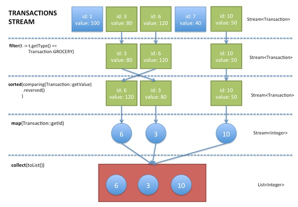
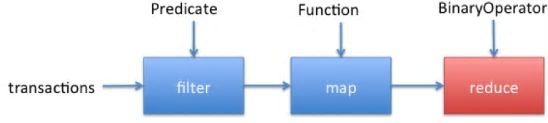

# 8장 스트림


스트림(stream)은 컬렉션보다 개념적으로 높은 수준의 데이터 뷰 역할을 하며, 이를 이용하면 좀 더 직관적으로 계산을 명시할 수 있다. 스트림을 이용할 때는 일을 수행하는 방법이 아니라 하고 싶은 일을 명시한다.

[Java Streams, Part 1: An introduction to the java.util.stream library](https://www.ibm.com/developerworks/java/library/j-java-streams-1-brian-goetz/index.html)

[Java Streams, Part 2: Aggregating with Streams](http://www.ibm.com/developerworks/java/library/j-java-streams-2-brian-goetz/index.html)

[Java Streams, Part 3: Streams under the hood](http://www.ibm.com/developerworks/java/library/j-java-streams-3-brian-goetz/index.html)

[Java Streams, Part 4: From concurrent to parallel](http://www.ibm.com/developerworks/java/library/j-java-streams-4-brian-goetz/index.html)

[Java Streams, Part 5: Parallel stream performance](http://www.ibm.com/developerworks/java/library/j-java-streams-5-brian-goetz/index.html)

[Processing Data with Java SE 8 Streams, Part 1](http://www.oracle.com/technetwork/articles/java/ma14-java-se-8-streams-2177646.html)

[Processing Data with Java SE 8 Streams, Part 2](http://www.oracle.com/technetwork/articles/java/architect-streams-pt2-2227132.html)

## 8.1 반복에서 스트림 연산으로 전환하기

컬렉션을 처리할 때 보통은 요소를 순회하면서 각 요소를 이용해 원하는 작업을 수행한다.

```java
int count = 0 ;
for (String w : words) {
    if (w.length() > 12) count++;
}
```

스트림을 이용하면 같은 연산을 다음과 같이 할 수 있다.

```java
long count = words.stream().filter(w -> w.length() > 12).count();
```

스트림을 이용하면 필터링과 타운팅을 증명하기 위해 루프를 살펴볼 필요가 없다. 메서드 이름을 보면 코드가 무엇을 의도하는지 바로 알 수 있다.

게다가 루프에서는 연산 순서를 자세히 작성해야 하지만, 스트림을 결과만 맞으면 원하는 방식으로 연산을 스케줄링할 수 있다.

단순히 stream만 parallelStream으로 바꿔주면 스트림 라이브러리에서 필터링과 카운팅을 병렬로 수행한다.

```java
long count = words.parallelStream().filter(w -> w.length() > 12).count();
```

스트림은 '어떻게가 아니라 무엇을'이라는 원칙을 따른다.

스트림은 컬렉션과 큰 차이점이 있다.

1. 스트림은 요소를 저장하지 않는다.

2. 스트림 연산은 원본을 변경하지 않는다.

3. 스트림 연산은 가능하면 지연시켜 둔다. 즉, **연산 결과가 필요하기 전까지는 실행되지 않는다**.

스트림은 다음 세 단계로 연산의 파이프라인을 준비한다.

1. 스트림을 생성한다.

2. 초기 스트림을 다른 스트림으로 변환하는 중간 연산을 지정한다. 여러 단계가 될 수도 있다.

3. 종료 연산을 적용해서 결과를 산출한다. **종료 연산은 앞에서 지정한 지연 연산이 실행되게 한다**. 그 이후로는 더 이상 해당 스트림을 사용할 수 없다.

```java
// 스트림 생성
words.stream()
    // 중간 연산
    .filter(w -> w.length() > 12)
    // 종료 연산
    .count();
```

## 8.2 스트림 생성

|Class|Modifier and Type|Method and Description|
|:--|:--|:--|
|java.util.Collection|default Stream&lt;E&gt;|[stream](https://docs.oracle.com/javase/8/docs/api/java/util/Collection.html#stream--)()<br/>Returns a sequential Stream with this collection as its source.|
|java.util.Arrays|static &lt;T&gt; Stream&lt;T&gt;|[stream](https://docs.oracle.com/javase/8/docs/api/java/util/Arrays.html#stream-T:A-)(T&#91;&#93; array)<br/>Returns a sequential Stream with the specified array as its source.|
|java.util.Arrays|static &lt;T&gt; Stream&lt;T&gt;|[stream](https://docs.oracle.com/javase/8/docs/api/java/util/Arrays.html#stream-double:A-int-int-)(T&#91;&#93; array, int startInclusive, int endExclusive)<br/>Returns a sequential Stream with the specified range of the specified array as its source.|
|java.util.stream.Stream|static &lt;T&gt; Stream&lt;T&gt;|[of](https://docs.oracle.com/javase/8/docs/api/java/util/stream/Stream.html#of-T...-)(T... values)<br/>Returns a sequential ordered stream whose elements are the specified values.|
|java.util.stream.Stream|static &lt;T&gt; Stream&lt;T&gt;|[of](https://docs.oracle.com/javase/8/docs/api/java/util/stream/Stream.html#of-T-)(T t)<br/>Returns a sequential Stream containing a single element.|
|java.util.stream.Stream|static &lt;T&gt; Stream&lt;T&gt;|[generate](https://docs.oracle.com/javase/8/docs/api/java/util/stream/Stream.html#generate-java.util.function.Supplier-)(Supplier&lt;T&gt; s)<br/>Returns an infinite sequential unordered stream where each element is generated by the provided Supplier.|
|java.util.stream.Stream|static &lt;T&gt; Stream&lt;T&gt;|[iterate](https://docs.oracle.com/javase/8/docs/api/java/util/stream/Stream.html#iterate-T-java.util.function.UnaryOperator-)(T seed, UnaryOperator&lt;T&gt; f)<br/>Returns an infinite sequential ordered Stream produced by iterative application of a function f to an initial element seed, producing a Stream consisting of seed, f(seed), f(f(seed)), etc.|

[Difference between Stream.of() and Arrays.stream() method in Java](http://www.techiedelight.com/difference-stream-of-arrays-stream-java/)

기타 스트림을 돌려주는 Java API의 여러 메서드들이 있다.

|Class|Modifier and Type|Method and Description|
|:--|:--|:--|
|java.io.BufferedReader|Stream&lt;String&gt;|[lines](https://docs.oracle.com/javase/8/docs/api/java/io/BufferedReader.html#lines--)()<br/>Returns a Stream, the elements of which are lines read from this BufferedReader.|
|java.nio.file.Files|static Stream&lt;Path&gt;|[find](https://docs.oracle.com/javase/8/docs/api/java/nio/file/Files.html#find-java.nio.file.Path-int-java.util.function.BiPredicate-java.nio.file.FileVisitOption...-)(Path start, int maxDepth, BiPredicate<Path,BasicFileAttributes> matcher, FileVisitOption... options)<br/>Return a Stream that is lazily populated with Path by searching for files in a file tree rooted at a given starting file.|
|java.nio.file.Files|static Stream&lt;String&gt;|[lines](https://docs.oracle.com/javase/8/docs/api/java/nio/file/Files.html#lines-java.nio.file.Path-)(Path path)<br/>Read all lines from a file as a Stream.|
|java.nio.file.Files|static Stream&lt;String&gt;|[lines](https://docs.oracle.com/javase/8/docs/api/java/nio/file/Files.html#lines-java.nio.file.Path-java.nio.charset.Charset-)(Path path, Charset cs)<br/>Read all lines from a file as a Stream.|
|java.nio.file.Files|static Stream&lt;Path&gt;|[list](https://docs.oracle.com/javase/8/docs/api/java/nio/file/Files.html#list-java.nio.file.Path-)(Path dir)<br/>Return a lazily populated Stream, the elements of which are the entries in the directory.|
|java.nio.file.Files|static Stream&lt;Path&gt;|[walk](https://docs.oracle.com/javase/8/docs/api/java/nio/file/Files.html#walk-java.nio.file.Path-java.nio.file.FileVisitOption...-)(Path start, FileVisitOption... options)<br/>Return a Stream that is lazily populated with Path by walking the file tree rooted at a given starting file.|
|java.nio.file.Files|static Stream&lt;Path&gt;|[walk](https://docs.oracle.com/javase/8/docs/api/java/nio/file/Files.html#walk-java.nio.file.Path-int-java.nio.file.FileVisitOption...-)(Path start, int maxDepth, FileVisitOption... options)<br/>Return a Stream that is lazily populated with Path by walking the file tree rooted at a given starting file.|
|java.util.jar.JarFile|Stream&lt;JarEntry&gt;|[stream](https://docs.oracle.com/javase/8/docs/api/java/util/jar/JarFile.html#stream--)()<br/>Return an ordered Stream over the ZIP file entries.|
|java.util.regex.Pattern|Stream&lt;String&gt;|[splitAsStream](https://docs.oracle.com/javase/8/docs/api/java/util/regex/Pattern.html#splitAsStream-java.lang.CharSequence-)(CharSequence input)<br/>Creates a stream from the given input sequence around matches of this pattern.|
|java.util.zip.ZipFile|Stream&lt;? extends ZipEntry&gt;|[stream](https://docs.oracle.com/javase/8/docs/api/java/util/zip/ZipFile.html#stream--)()<br/>Return an ordered Stream over the ZIP file entries.|

## 8.3 ~ 8.5 스트림 필터, 추출, 결합, 변환

스트림 변환은 또 다른 스트림에 들어 있는 요소에서 파생된 요소의 새로운 스트림을 만들어낸다.

|Modifier and Type|Method and Description|
|:--|:--|
|static &lt;T&gt; Stream&lt;T&gt;|[concat](https://docs.oracle.com/javase/8/docs/api/java/util/stream/Stream.html#concat-java.util.stream.Stream-java.util.stream.Stream-)(Stream&lt;? extends T&gt; a, Stream&lt;? extends T&gt; b)<br/>Creates a lazily concatenated stream whose elements are all the elements of the first stream followed by all the elements of the second stream.|
|Stream&lt;T&gt;|[distinct](https://docs.oracle.com/javase/8/docs/api/java/util/stream/Stream.html#distinct--)()<br/>Returns a stream consisting of the distinct elements (according to Object.equals(Object)) of this stream.|
|&lt;R&gt; Stream&lt;R&gt;|[flatMap](https://docs.oracle.com/javase/8/docs/api/java/util/stream/Stream.html#flatMap-java.util.function.Function-)(Function&lt;? super T,? extends Stream&lt;? extends R&gt;&gt; mapper)<br/>Returns a stream consisting of the results of replacing each element of this stream with the contents of a mapped stream produced by applying the provided mapping function to each element.|
|Stream&lt;T&gt;|[filter](https://docs.oracle.com/javase/8/docs/api/java/util/stream/Stream.html#filter-java.util.function.Predicate-)(Predicate&lt;? super T&gt; predicate)<br/>Returns a stream consisting of the elements of this stream that match the given predicate.|
|Stream&lt;T&gt;|[limit](https://docs.oracle.com/javase/8/docs/api/java/util/stream/Stream.html#limit-long-)(long maxSize)<br/>Returns a stream consisting of the elements of this stream, truncated to be no longer than maxSize in length.|
|&lt;R&gt; Stream&lt;R&gt;|[map](https://docs.oracle.com/javase/8/docs/api/java/util/stream/Stream.html#map-java.util.function.Function-)(Function&lt;? super T,? extends R&gt; mapper)<br/>Returns a stream consisting of the results of applying the given function to the elements of this stream.|
|Stream&lt;T&gt;|[peek](https://docs.oracle.com/javase/8/docs/api/java/util/stream/Stream.html#peek-java.util.function.Consumer-)(Consumer&lt;? super T&gt; action)</br>Returns a stream consisting of the elements of this stream, additionally performing the provided action on each element as elements are consumed from the resulting stream.|
|Stream&lt;T&gt;|[skip](https://docs.oracle.com/javase/8/docs/api/java/util/stream/Stream.html#skip-long-)(long n)<br/>Returns a stream consisting of the remaining elements of this stream after discarding the first n elements of the stream.|
|Stream&lt;T&gt;|[sorted](https://docs.oracle.com/javase/8/docs/api/java/util/stream/Stream.html#sorted--)()<br/>Returns a stream consisting of the elements of this stream, sorted according to natural order.|
|Stream&lt;T&gt;|[sorted](https://docs.oracle.com/javase/8/docs/api/java/util/stream/Stream.html#sorted-java.util.Comparator-)(Comparator&lt;? super T&gt; comparator)<br/>  Returns a stream consisting of the elements of this stream, sorted according to the provided Comparator.|




## 8.6 단순 리덕션



스트림으로 부터 데이터로부터 결과를 얻는 메서드를 디럭션(reduction) 메서드라고 한다. 리덕션은 종료 연산(reminal operation)이다. 리덕션 메서드는 스트림을 프로그램에서 사용할 수 있는 넌스트림(nonstream) 값으로 리듀스(reduce)한다.

|Modifier and Type|Method and Description|
|:--|:--|
|boolean|[allMatch](https://docs.oracle.com/javase/8/docs/api/java/util/stream/Stream.html#allMatch-java.util.function.Predicate-)(Predicate&lt;? super T&gt; predicate)<br/>Returns whether all elements of this stream match the provided predicate.|
|boolean|[anyMatch](https://docs.oracle.com/javase/8/docs/api/java/util/stream/Stream.html#anyMatch-java.util.function.Predicate-)(Predicate&lt;? super T&gt; predicate)<br/>Returns whether any elements of this stream match the provided predicate.|
|long|[count](https://docs.oracle.com/javase/8/docs/api/java/util/stream/Stream.html#count--)()<br/>Returns the count of elements in this stream.|
|Optional&lt;T&gt;|[findAny](https://docs.oracle.com/javase/8/docs/api/java/util/stream/Stream.html#findAny--)()<br/>Returns an Optional describing some element of the stream, or an empty Optional if the stream is empty.|
|Optional&lt;T&gt;|[findFirst](https://docs.oracle.com/javase/8/docs/api/java/util/stream/Stream.html#findFirst--)()<br/>Returns an Optional describing the first element of this stream, or an empty Optional if the stream is empty.|
|Optional&lt;T&gt;|[max](https://docs.oracle.com/javase/8/docs/api/java/util/stream/Stream.html#max-java.util.Comparator-)(Comparator&lt;? super T&gt; comparator)<br/>Returns the maximum element of this stream according to the provided Comparator.|
|Optional&lt;T&gt;|[min](https://docs.oracle.com/javase/8/docs/api/java/util/stream/Stream.html#min-java.util.Comparator-)(Comparator&lt;? super T&gt; comparator)<br/>Returns the minimum element of this stream according to the provided Comparator.|
|boolean|[noneMatch](https://docs.oracle.com/javase/8/docs/api/java/util/stream/Stream.html#noneMatch-java.util.function.Predicate-)(Predicate&lt;? super T&gt; predicate)<br/>Returns whether no elements of this stream match the provided predicate.|

## 8.7 옵션 타입

[java.util.Optional&lt;T&gt;](https://docs.oracle.com/javase/8/docs/api/java/util/Optional.html) 객체는 T 타입 객체가 있거나 객체가 없을 때의 래퍼다.

### 8.7.1 옵션 값을 사용하는 방법

|Modifier and Type|Method and Description|
|:--|:--|
|void|[ifPresent](https://docs.oracle.com/javase/8/docs/api/java/util/Optional.html#ifPresent-java.util.function.Consumer-)(Consumer&lt;? super T&gt; consumer)<br/>If a value is present, invoke the specified consumer with the value, otherwise do nothing.|
|&lt;U&gt; Optional&lt;U&gt;|[map](https://docs.oracle.com/javase/8/docs/api/java/util/Optional.html#map-java.util.function.Function-)(Function&lt;? super T,? extends U&gt; mapper)<br/>If a value is present, apply the provided mapping function to it, and if the result is non-null, return an Optional describing the result.|
|T|[orElse](https://docs.oracle.com/javase/8/docs/api/java/util/Optional.html#orElse-T-)(T other)<br/>Return the value if present, otherwise return other.|
|T|[orElseGet](https://docs.oracle.com/javase/8/docs/api/java/util/Optional.html#orElseGet-java.util.function.Supplier-)(Supplier&lt;? extends T&gt other)<br/>Return the value if present, otherwise invoke other and return the result of that invocation.|
|&lt;X extends Throwable&gt; T|[orElseThrow](https://docs.oracle.com/javase/8/docs/api/java/util/Optional.html#orElseThrow-java.util.function.Supplier-)(Supplier&lt;? extends X&gt; exceptionSupplier)<br/>Return the contained value, if present, otherwise throw an exception to be created by the provided supplier.|

Optional을 효과적으로 사용하려면 **값이 없을 때는 대체 값을 생산하고, 값이 있을 때만 해당 값을 소비하는 메서드를 사용**해야 한다.

```java
String result = optinalString.orElse("");
// 옵션 값으로 래핑된 문자열, 문자열이 없으면 ""
```

```java
String result = optinalString.orElseGet(() -> System.getProperty("user.dir"));
// 옵션 값으로 래핑된 문자열, 문자열이 없으면 System.getProperty() 호출
```

```java
String result = optionalString.orElseThrow(IllegalStateException::new);
// 옵션 값으로 래핑된 문자열, 문자열이 없으면 예외를 던짐
```

ifPresent 메서드는 함수를 받는다. 옵션 값이 있을 때는 해당 함수로 값이 전달된다. 반면에 **옵션 값이 없을 때는 아무일도 일어나지 않는다**.

```java
optionalValue.ifPresent(v -> v를 처리한다);
```

ifPresent를 호출하면 함수에서 어떤 값도 반환받을 수 없다. 함수의 결과를 처리하려면 map을 사용하면 된다.

```java
Optinal<Boolean> added = optionalValue.map(v -> results.add(v));
// true, false, 빈 Optional
```

### 8.7.2 옵션 값을 사용하지 않는 방법

|Modifier and Type|Method and Description|
|:--|:--|
|T|[get](https://docs.oracle.com/javase/8/docs/api/java/util/Optional.html#get--)()<br/>If a value is present in this Optional, returns the value, otherwise throws NoSuchElementException.|
|boolean|[isPresent](https://docs.oracle.com/javase/8/docs/api/java/util/Optional.html#isPresent--)()<br/>Return true if there is a value present, otherwise false.|

Optional 값을 올바르게 사용하지 않으면 예전에 사용하던 '어떤 것 또는 null' 접근법보다 나을 게 없다.

```java
Optional<T> optionalValue = ...;
optionalValue.get().somMethod();

T value = ...;
value.someMethod();
```

isPresent 메서드는 Optional&lt;T&gt; 객체가 값을 담고 있는지 알려준다.

```java
if (optionalValue.isPresent()) {
    optionalValue.get().someMethod();
}
```

하지만 위 코드가 다음 코드보다 쉬운 것도 아니다.

```java
if (value != null) {
    value.someMethod();
}
```

### 8.7.3 옵션 값 생성하기

|Modifier and Type|Method and Description|
|:--|:--|
|static &lt;T&gt; Optional&lt;T&gt;|[empty](https://docs.oracle.com/javase/8/docs/api/java/util/Optional.html#empty--)()<br/>Returns an empty Optional instance.|
|static &lt;T&gt; Optional&lt;T&gt;|[of](https://docs.oracle.com/javase/8/docs/api/java/util/Optional.html#of-T-)(T value)<br/>Returns an Optional with the specified present non-null value.|
|static &lt;T&gt; Optional&lt;T&gt;|[ofNullable](https://docs.oracle.com/javase/8/docs/api/java/util/Optional.html#ofNullable-T-)(T value)<br/>Returns an Optional describing the specified value, if non-null, otherwise returns an empty Optional.|

### 8.7.4 flatMap으로 옵션 값 함수 합성하기

```java
public static Optional<Double> inverse(Double x) {
    return x == 0 ? Optional.empty() : Optional.of(1 / x);
}

public static Optional<Double> squareRoot(Double x) {
    return x < 0 ? Optional.empty() : Optional.of(Math.sqrt(x));
}
```

```java
// .map
Optional<Optional<Double>> map = inverse(x).map(d -> squareRoot(d));
// .flatMap
Optional<Double> flatMap = inverse(x).flatMap(d -> squareRoot(d));
```

## 8.8 결과 모으기

|Modifier and Type|Method and Description|
|:--|:--|
|&lt;R,A&gt; R|[collect](https://docs.oracle.com/javase/8/docs/api/java/util/stream/Stream.html#collect-java.util.stream.Collector-)(Collector&lt;? super T,A,R&gt; collector)<br/>Performs a mutable reduction operation on the elements of this stream using a Collector.|
|&lt;R&gt; R|[collect](https://docs.oracle.com/javase/8/docs/api/java/util/stream/Stream.html#collect-java.util.function.Supplier-java.util.function.BiConsumer-java.util.function.BiConsumer-)(Supplier&lt;R&gt; supplier, BiConsumer&lt;R,? super T&gt; accumulator, BiConsumer&lt;R,R> combiner)<br/>Performs a mutable reduction operation on the elements of this stream.|
|void|[forEach](https://docs.oracle.com/javase/8/docs/api/java/util/stream/Stream.html#forEach-java.util.function.Consumer-)(Consumer&lt;? super T&gt; action)<br/>Performs an action for each element of this stream.|
|void|[forEachOrdered](https://docs.oracle.com/javase/8/docs/api/java/util/stream/Stream.html#forEachOrdered-java.util.function.Consumer-)(Consumer&lt;? super T&gt; action)<br/>Performs an action for each element of this stream, in the encounter order of the stream if the stream has a defined encounter order|
|Iterator&lt;T&gt;|[iterator](https://docs.oracle.com/javase/8/docs/api/java/util/stream/BaseStream.html#iterator--)()<br/>Returns an iterator for the elements of this stream.|
|Spliterator&lt;T&gt;|[spliterator](https://docs.oracle.com/javase/8/docs/api/java/util/stream/BaseStream.html#spliterator--)()<br/>Returns a spliterator for the elements of this stream.|
|Object&#91;&#93;|[toArray](https://docs.oracle.com/javase/8/docs/api/java/util/stream/Stream.html#toArray--)()<br/>Returns an array containing the elements of this stream.|
|&lt;A&gt; A&#91;&#93;|[toArray](https://docs.oracle.com/javase/8/docs/api/java/util/stream/Stream.html#toArray-java.util.function.IntFunction-)(IntFunction&lt;A&#91;&#93;&gt; generator)<br/>Returns an array containing the elements of this stream, using the provided generator function to allocate the returned array, as well as any additional arrays that might be required for a partitioned execution or for resizing.|

병렬 스트림에서 forEach 메서드는 요소를 임의의 순서로 순회한다. 스트림 순서로 처리하려면 forEachOrdered 메서드를 호출해야 한다. 물론 이 경우 병렬성이 주는 이점을 대두분 또는 모두 포기해야 할 수도 있다.

하지만 대개는 결과를 자료 구조로 모으려고 할 것이다.

```java
Object[] result = stream.toArray();
String[] result = stream.toArray(String:new);
```

스트림 요소를 또 다른 타깃으로 모으는 데는 collect 메서드를 이용하면 편리하다. collect 메서드는 Collector 인터페이스의 인스턴스를 받는다. [java.util.stream.Collectors](https://docs.oracle.com/javase/8/docs/api/java/util/stream/Collectors.html) 클래스에는 공통 컬렉터용 팩토리 메서드가 여러 개 있다.

|Modifier and Type|Method and Description|
|:--|:--|
|static &lt;T&gt; Collector&lt;T,?,DoubleSummaryStatistics&gt;|[summarizingDouble](https://docs.oracle.com/javase/8/docs/api/java/util/stream/Collectors.html#summarizingDouble-java.util.function.ToDoubleFunction-)(ToDoubleFunction&lt;? super T&gt; mapper)<br/>Returns a Collector which applies an double-producing mapping function to each input element, and returns summary statistics for the resulting values.|
|static &lt;T&gt; Collector&lt;T,?,IntSummaryStatistics&gt;|[summarizingInt](https://docs.oracle.com/javase/8/docs/api/java/util/stream/Collectors.html#summarizingInt-java.util.function.ToIntFunction-)(ToIntFunction&lt;? super T&gt; mapper)<br/>Returns a Collector which applies an int-producing mapping function to each input element, and returns summary statistics for the resulting values.|
|static &lt;T&gt; Collector&lt;T,?,LongSummaryStatistics&gt;|[summarizingLong](https://docs.oracle.com/javase/8/docs/api/java/util/stream/Collectors.html#summarizingLong-java.util.function.ToLongFunction-)(ToLongFunction&lt;? super T&gt; mapper)<br/>Returns a Collector which applies an long-producing mapping function to each input element, and returns summary statistics for the resulting values.|
|static &lt;T&gt; Collector&lt;T,?,List&lt;T&gt;&gt;|[toList](https://docs.oracle.com/javase/8/docs/api/java/util/stream/Collectors.html#toList--)()<br/>Returns a Collector that accumulates the input elements into a new List.|
|static &lt;T&gt; Collector&lt;T,?,Set&lt;T&gt;&gt;|[toSet](https://docs.oracle.com/javase/8/docs/api/java/util/stream/Collectors.html#toSet--)()<br/>Returns a Collector that accumulates the input elements into a new Set.|

```java
// 리스트
List<String> result = stream.collect(Collectors.toList());
// 집합
Set<String> result = stream.collect(Collectors.toSet());
// 원하는 종류를 제어
TreeSet<String> result = stream.collect(Collectors.toCollection(TreeSet::new));
```

스트림에 있는 모든 문자열을 서로 연결해서 모으려면 다음과 같이 호출 할 수 있다.

```java
// Collectors.joining()
Stream<String> stream = Stream.of("stream", "github", "java8", "map");
String result = stream.collect(Collectors.joining()); // streamgithubjava8map
String result = stream.collect(Collectors.joining(", ")); // stream, github, java8, map
```

스트림에 문자열 외의 객체가 포함되면 다음과 같이 먼저 해당 객체를 문자열로 변환해서 처리 할 수 있다.

```java
// any object -> map -> string -> join
String result = stream.map(Object::toString).collect(Collectors.joining(", "));
```

스트림 결과를 합계, 평균, 최댓값, 최솟값으로 리듀스하려면 summarizing(Int|Long|Double) 메서드 중 하나를 사용해야한다. 이 메서드들은 스트림 객체를 숫자로 매핑하는 함수를 받고 함계, 평균, 최댓값, 최솟값을 동시에 곗나해서 (Int|Long|Double)SummaryStatistics 타입 결과를 돌려준다.

```java
IntSummaryStatistics summary = stream.collect(Collectors.summarizingInt(String::length));
double averageWordLength = summary.getAverage();
int maxWordLength = summary.getMax();
```

## 8.9 맵으로 모으기

|Modifier and Type|Method and Description|
|:--|:--|
|static &lt;T,C extends Collection&lt;T&gt;&gt; Collector&lt;T,?,C&gt;|[toCollection](https://docs.oracle.com/javase/8/docs/api/java/util/stream/Collectors.html#toCollection-java.util.function.Supplier-)(Supplier&lt;C&gt; collectionFactory)<br/>Returns a Collector that accumulates the input elements into a new Collection, in encounter order.|
|static &lt;T,K,U&gt; Collector&lt;T,?,Map&lt;K,U&gt;&gt;|[toMap](https://docs.oracle.com/javase/8/docs/api/java/util/stream/Collectors.html#toMap-java.util.function.Function-java.util.function.Function-)(Function&lt;? super T,? extends K&gt; keyMapper, Function&lt;? super T,? extends U&gt; valueMapper)<br/>Returns a Collector that accumulates elements into a Map whose keys and values are the result of applying the provided mapping functions to the input elements.|
|static &lt;T,K,U&gt; Collector&lt;T,?,Map&lt;K,U&gt;&gt;|[toMap](https://docs.oracle.com/javase/8/docs/api/java/util/stream/Collectors.html#toMap-java.util.function.Function-java.util.function.Function-java.util.function.BinaryOperator-)(Function&lt;? super T,? extends K&gt; keyMapper, Function&lt;? super T,? extends U&gt; valueMapper, BinaryOperator&lt;U> mergeFunction)Returns a Collector that accumulates elements into a Map whose keys and values are the result of applying the provided mapping functions to the input elements.|
|static &lt;T,K,U,M extends Map&lt;K,U&gt;&gt; Collector&lt;T,?,M&gt;|[toMap](https://docs.oracle.com/javase/8/docs/api/java/util/stream/Collectors.html#toMap-java.util.function.Function-java.util.function.Function-java.util.function.BinaryOperator-java.util.function.Supplier-)(Function&lt;? super T,? extends K&gt; keyMapper, Function&lt;? super T,? extends U&gt; valueMapper, BinaryOperator&lt;U&gt; mergeFunction, Supplier&lt;M&gt; mapSupplier)Returns a Collector that accumulates elements into a Map whose keys and values are the result of applying the provided mapping functions to the input elements.|

Collectors.toMap 메서드는 두 함수의 인자를 받고, 각각 매의 키와 값을 만들어낸다.

```java
public static class Person {
    private int id;
    private String name;

    public Person(int id, String name) { this.id = id; this.name = name; }
    public int getId() { return id; }
    public String getName() { return name; }
    public String toString() {
    	return getClass().getName() + "[id=" + id + ",name=" + name + "]"; 
    }
}
```

```java
Map<Integer, String> idToName = people().collect(Collectors.toMap(Person::getId, Person::getName));
// {1001=Peter, 1002=Paul, 1003=Mary}
```

값이 실제 요소여야 하는 상황에서는 두 번째 함수로 [Function.identity()](https://docs.oracle.com/javase/8/docs/api/java/util/function/Function.html#identity--)를 사용한다.

```java
Map<Integer, Person> idToPerson = people().collect(Collectors.toMap(Person::getId, Function.identity()));
// java.util.HashMap{1001=ch08.sec09.CollectingIntoMaps$Person[id=1001,name=Peter], 1002=ch08.sec09.CollectingIntoMaps$Person[id=1002,name=Paul], 1003=ch08.sec09.CollectingIntoMaps$Person[id=1003,name=Mary]}
```

키가 같은 요소개 두 개 이상이면 충돌이 일어난다.

```
Exception in thread "main" java.lang.IllegalStateException: Duplicate key Peter
	at java.util.stream.Collectors.lambda$throwingMerger$0(Collectors.java:133)
	at java.util.HashMap.merge(HashMap.java:1253)
	at java.util.stream.Collectors.lambda$toMap$58(Collectors.java:1320)
	at java.util.stream.ReduceOps$3ReducingSink.accept(ReduceOps.java:169)
	at java.util.Spliterators$ArraySpliterator.forEachRemaining(Spliterators.java:948)
	at java.util.stream.AbstractPipeline.copyInto(AbstractPipeline.java:481)
	at java.util.stream.AbstractPipeline.wrapAndCopyInto(AbstractPipeline.java:471)
	at java.util.stream.ReduceOps$ReduceOp.evaluateSequential(ReduceOps.java:708)
	at java.util.stream.AbstractPipeline.evaluate(AbstractPipeline.java:234)
	at java.util.stream.ReferencePipeline.collect(ReferencePipeline.java:499)
```

이 동작은 기존 값과 새 값을 받아서 충돌을 해결하고, 세 번째 함수의 인자를 제공해서 오버라이드할 수 있다.

```java
Stream<Person> people = Stream.of(
    new Person(1001, "Peter 1001-1"),
    new Person(1001, "Peter 1001-2"),
    new Person(1002, "Paul"),
    new Person(1003,"Mary")
);

Map<Integer, String> idToName = people.collect(Collectors.toMap(Person::getId, Person::getName, (s, s2) -> s2));
// {1001=Peter 1001-2, 1002=Paul, 1003=Mary}		
```

TreeMap을 원하면 네 번째 인자로 TreeMap 생성자를 전달한다. 이때 반드시 병합 함수(merge functino)를 작성해야 한다.

```java
Map<Integer, Person> idToPerson = people().collect(
	Collectors.toMap(
		Person::getId,
		Function.identity(),
		(existingValue, newValue) -> { throw new IllegalStateException(); },
		TreeMap::new
	)
);
```

## 8.10 그루핑과 파티셔닝

|Modifier and Type|Method and Description|
|:--|:--|
|static &lt;T,K&gt; Collector&lt;T,?,Map&lt;K,List&lt;T&gt;&gt;&gt;|[groupingBy](https://docs.oracle.com/javase/8/docs/api/java/util/stream/Collectors.html#groupingBy-java.util.function.Function-)(Function&lt;? super T,? extends K&gt; classifier)<br/>Returns a Collector implementing a "group by" operation on input elements of type T, grouping elements according to a classification function, and returning the results in a Map.|
|static &lt;T&gt; Collector&lt;T,?,Map&lt;Boolean,List&lt;T&gt;&gt;&gt;|[partitioningBy](https://docs.oracle.com/javase/8/docs/api/java/util/stream/Collectors.html#partitioningBy-java.util.function.Predicate-)(Predicate&lt;? super T&gt; predicate)<br/>Returns a Collector which partitions the input elements according to a Predicate, and organizes them into a Map&lt;Boolean, List&lt;T&gt;&gt;.|


특성이 같은 값을 그룹으로 만드는 일은 아주 흔한 작업이다. 이런 그룹 작업은 groupBy 메서드가 직접 지원한다.

```java
Stream<Locale> locales = Stream.of(Locale.getAvailableLocales());
Map<String, List<Locale>> countryToLocales = locales.collect(Collectors.groupingBy(Locale::getCountry));
System.out.println("Swiss locales: " + countryToLocales.get("CH"));
// Swiss locales: [fr_CH, de_CH, it_CH]
```

분류 함수가 프레디케이트 함수(즉, boolean을 반환하는 함수)면 스트림 요소가 리스트 두 개로 나뉜다. 이럴 때는 partitioningBy를 사용하면 효율적이다.

```java
Stream<Locale> locales = Stream.of(Locale.getAvailableLocales());
Map<Boolean, List<Locale>> englishAndOtherLocales = locales.collect(Collectors.partitioningBy(l -> l.getLanguage().equals("en")));
System.out.println("English locales: " + englishAndOtherLocales.get(true));
// [en_US, en_SG, en_MT, en, en_PH, en_NZ, en_ZA, en_AU, en_IE, en_CA, en_IN, en_GB]
System.out.println("Ohter locales: " + englishAndOtherLocales.get(false));
// [, ar_AE, ar_JO, ar_SY, hr_HR, fr_BE, es_PA, mt_MT, es_VE, bg, zh_TW, it, ko, uk, lv ....]
```

## 8.11 다운스트림 컬렉터

Modifier and Type|Method and Description|
|:--|:--|
|static &lt;T,K,A,D&gt; Collector&lt;T,?,Map&lt;K,D&gt;&gt;|[groupingBy](https://docs.oracle.com/javase/8/docs/api/java/util/stream/Collectors.html#groupingBy-java.util.function.Function-java.util.stream.Collector-)(Function&lt;? super T,? extends K&gt; classifier, **Collector&lt;? super T,A,D&gt; downstream**)<br/>Returns a Collector implementing a cascaded "group by" operation on input elements of type T, grouping elements according to a classification function, and then performing a reduction operation on the values associated with a given key using the specified downstream Collector.|
|static &lt;T,K,D,A,M extends Map&lt;K,D&gt;&gt; Collector&lt;T,?,M&gt;|[groupingBy](https://docs.oracle.com/javase/8/docs/api/java/util/stream/Collectors.html#groupingBy-java.util.function.Function-java.util.function.Supplier-java.util.stream.Collector-)(Function&lt;? super T,? extends K&gt; classifier, Supplier&lt;M&gt; mapFactory, **Collector&lt;? super T,A,D&gt; downstream**)<br/>Returns a Collector implementing a cascaded "group by" operation on input elements of type T, grouping elements according to a classification function, and then performing a reduction operation on the values associated with a given key using the specified downstream Collector.|
|static &lt;T,D,A&gt; Collector&lt;T,?,Map&lt;Boolean,D&gt;&gt;|[partitioningBy](https://docs.oracle.com/javase/8/docs/api/java/util/stream/Collectors.html#partitioningBy-java.util.function.Predicate-java.util.stream.Collector-)(Predicate&lt;? super T&gt; predicate, **Collector&lt;? super T,A,D&gt; downstream**)<br/>Returns a Collector which partitions the input elements according to a Predicate, reduces the values in each partition according to another Collector, and organizes them into a Map&lt;Boolean, D&gt; whose values are the result of the downstream reduction.|

groupingBy 메서드는 값이 리스트인 맵을 돌려준다. 이런 리스트를 특정 방식으로 처리하려면 '다운스트림 컬렉터(downstream collector)'를 작성해야 한다.

스트림 라이브러리에는 그룹으로 묶인 요소를 숫자로 리듀스하는 데 사용하는 컬렉터가 몇 가지 있다.

Modifier and Type|Method and Description|
|:--|:--|
|static &lt;T&gt; Collector&lt;T,?,Double&gt;|[averagingDouble](https://docs.oracle.com/javase/8/docs/api/java/util/stream/Collectors.html#averagingDouble-java.util.function.ToDoubleFunction-)(ToDoubleFunction&lt;? super T&gt; mapper)<br/>Returns a Collector that produces the arithmetic mean of a double-valued function applied to the input elements.|
|static &lt;T&gt; Collector&lt;T,?,Double&gt;|[averagingInt](https://docs.oracle.com/javase/8/docs/api/java/util/stream/Collectors.html#averagingInt-java.util.function.ToIntFunction-)(ToIntFunction&lt;? super T&gt; mapper)<br/>Returns a Collector that produces the arithmetic mean of an integer-valued function applied to the input elements.|
|static &lt;T&gt; Collector&lt;T,?,Double&gt;|[averagingLong](https://docs.oracle.com/javase/8/docs/api/java/util/stream/Collectors.html#averagingLong-java.util.function.ToLongFunction-)(ToLongFunction&lt;? super T&gt; mapper)<br/>Returns a Collector that produces the arithmetic mean of a long-valued function applied to the input elements.|
|static &lt;T&gt; Collector&lt;T,?,Long&gt;|[counting](https://docs.oracle.com/javase/8/docs/api/java/util/stream/Collectors.html#counting--)()<br/>Returns a Collector accepting elements of type T that counts the number of input elements.|
|static &lt;T,U,A,R&gt; Collector&lt;T,?,R&gt;|[mapping](https://docs.oracle.com/javase/8/docs/api/java/util/stream/Collectors.html#mapping-java.util.function.Function-java.util.stream.Collector-)(Function&lt;? super T,? extends U&gt; mapper, Collector&lt;? super U,A,R&gt; downstream)<br/>Adapts a Collector accepting elements of type U to one accepting elements of type T by applying a mapping function to each input element before accumulation.|
|static &lt;T&gt; Collector&lt;T,?,Optional&lt;T&gt;&gt;|[maxBy](https://docs.oracle.com/javase/8/docs/api/java/util/stream/Collectors.html#maxBy-java.util.Comparator-)(Comparator&lt;? super T&gt; comparator)<br/>Returns a Collector that produces the maximal element according to a given Comparator, described as an Optional&lt;T&gt;.|
|static &lt;T&gt; Collector&lt;T,?,Optional&lt;T&gt;&gt;|[minBy](https://docs.oracle.com/javase/8/docs/api/java/util/stream/Collectors.html#minBy-java.util.Comparator-)(Comparator&lt;? super T&gt; comparator)<br/>Returns a Collector that produces the minimal element according to a given Comparator, described as an Optional&lt;T&gt;.|

counting은 모인 요소의 개수를 센다.

```java
Stream<Locale> locales = Stream.of(Locale.getAvailableLocales());
Map<String, Long> countryToLocaleCounts = locales.collect(groupingBy(Locale::getCountry, Comparator.counting()));
```

```sql
select country, count(*) from locales group by country;
```

summing(Int|Long|Double|은 함수 인자를 하나 받아, 해당 하수를 다운스트림 요소에 적용하고 합계를 구한다.

```java
Map<String, Integer> stateToCityPopulation = cities.collect(groupingBy(City::getState, Comparator.summingInt(City::getPopulation)));
```

```sql
select state, sum(population) from cities group by state;
```

maxBy와 minBy는 비교기 하나를 받아서 다운스트림 요소의 최댓값과 최솟값을 구한다.

```java
Map<String, Optional<City>> stateToLargestCity = cities.collect(groupingBy(City::getState, Collectors.maxBy(Comparator.comparing(City::getPopulation))));
```

```sql
select state, max(population) from cities;
```

```sql
/* state, population이 동일한 데이터가 있을 경우 문제 생김 */
select
  t1.name
  , t1.state
  , t2.population
from
  cities t1
join
  (select state, max(population) as population from cities group by state) t2
on
  t1.state = t2.state and t1.population = t2.population
;
```

mapping은 함수를 다운스트림 결과에 적용하며, 이 결과를 처리하는 데 필요한 또 다른 컬렉터를 필요로 한다.

```java
Stream<String> s = Stream.of("apple", "banana", "orange");
List<String> list = s.collect(Collectors.mapping(s1 -> s1.substring(0, 2), Collectors.toList()));
// List<String> list = s.map(s1 -> s1.substring(0, 2)).collect(Collectors.toList());
// [ap, ba, or]
```

컬렉터 합성은 강력하지만 아주 난해한 표현식을 만들 수도 있다. 가장 좋은 사용법은 groupingBy나 paritioningBy로 '다운스트림' 맵 값을 처리하는 것이다. 그렇지 않으면 그냥 스트림에 직접 map, reduce, count, max, min 같은 메서드를 적용하는 게 좋다.

## 8.12 리덕션 연산 &#91;p315&#93;

|Modifier and Type|Method and Description|
|:--|:--|
|Optional&lt;T&gt;|[reduce](https://docs.oracle.com/javase/8/docs/api/java/util/stream/Stream.html#reduce-java.util.function.BinaryOperator-)(BinaryOperator&lt;T&gt; accumulator)<br/>Performs a reduction on the elements of this stream, using an associative accumulation function, and returns an Optional describing the reduced value, if any.|
|T|[reduce](https://docs.oracle.com/javase/8/docs/api/java/util/stream/Stream.html#reduce-T-java.util.function.BinaryOperator-)(T identity, BinaryOperator&lt;T&gt; accumulator)<br/>Performs a reduction on the elements of this stream, using the provided identity value and an associative accumulation function, and returns the reduced value.|
|&lt;U&gt; U|[reduce](https://docs.oracle.com/javase/8/docs/api/java/util/stream/Stream.html#reduce-U-java.util.function.BiFunction-java.util.function.BinaryOperator-)(U identity, BiFunction&lt;U,? super T,U> accumulator, BinaryOperator&lt;U&gt; combiner)<br/>Performs a reduction on the elements of this stream, using the provided identity, accumulation and combining functions.|

reduce 메서드는 스트림에서 값을 계산하는 메커니즘이다.

## 8.13 기본 타입 스트림

[기본 타입](https://docs.oracle.com/javase/tutorial/java/nutsandbolts/datatypes.html)을 래퍼 객체로 감싸는 일은 명백히 비효율적이다.

스트림 라이브러리에는 [IntStream](https://docs.oracle.com/javase/8/docs/api/java/util/stream/IntStream.html), [LongStream](https://docs.oracle.com/javase/8/docs/api/java/util/stream/LongStream.html), [DoubleStream](https://docs.oracle.com/javase/8/docs/api/java/util/stream/DoubleStream.html)이 있는데 이들은 기본 타입 값들을 직접 저장하는 데 특화된 타입니다.

IntStream을 생성하려면 다음과 같이 [IntStream.of](https://docs.oracle.com/javase/8/docs/api/java/util/stream/IntStream.html#of-int...-)와 [Arrays.stream](https://docs.oracle.com/javase/8/docs/api/java/util/Arrays.html#stream-int:A-) 메서드를 호출하면 된다.

```java
IntStream stream = IntStream.of(1, 1, 2, 3, 5);
```

```java
IntStream stream = Arrays.stream(values, from, to); // values는 int[]
```

객체 스트림과 마찬가지로 정적 메서드 [generate](https://docs.oracle.com/javase/8/docs/api/java/util/stream/IntStream.html#generate-java.util.function.IntSupplier-)와 [iterate](https://docs.oracle.com/javase/8/docs/api/java/util/stream/IntStream.html#iterate-int-java.util.function.IntUnaryOperator-)를 사용할 수 있다.

IntStream과 LongStream에는 정적 메서드 range와 rangeClosed가 있는데, 이 메서드들은 크기 증가 단위가 1인 정수 범위를 반들어낸다.

|Modifier and Type|Method and Description|
|:--|:--|
|static IntStream|[range](https://docs.oracle.com/javase/8/docs/api/java/util/stream/IntStream.html#range-int-int-)(int startInclusive, int endExclusive)<br/>Returns a sequential ordered IntStream from startInclusive (inclusive) to endExclusive (exclusive) by an incremental step of 1.|
|static IntStream|[rangeClosed](https://docs.oracle.com/javase/8/docs/api/java/util/stream/IntStream.html#rangeClosed-int-int-)(int startInclusive, int endInclusive)<br/>Returns a sequential ordered IntStream from startInclusive (inclusive) to endInclusive (inclusive) by an incremental step of 1.|

```java
IntStream zeroToNinetyNine = IntStream.range(0, 100) // 상한값을 제외한다. 0 ~ 99
IntStream zeroToHundred = IntStream.rangeClosed(0, 100) // 상한값을 포함한다. 0 ~ 100
```

CharSequence 인터페이스에는 codePoints와 chars메서드가 있다. 이들은 각각 문자의 유니코드와 UTF-16 인코딩의 코드 유닛으로 구성된 IntStream을 돌려준다.

|Modifier and Type|Method and Description|
|:--|:--|
|default IntStream|[chars](https://docs.oracle.com/javase/8/docs/api/java/lang/CharSequence.html#chars--)()</br>Returns a stream of int zero-extending the char values from this sequence.|
|default IntStream|[codePoints](https://docs.oracle.com/javase/8/docs/api/java/lang/CharSequence.html#codePoints--)()<br/>Returns a stream of code point values from this sequence.|

```java
String sentence = "\uD835\uDD46 is the set of octonions.";
IntStream codes = sentence.codePoints();
// [120134, 32, 105, 115, 32, 116, 104, 101, 32, 115, 101, 116, 32, 111, 102, 32, 111, 99, 116, 111, 110, 105, 111, 110, 115, 46]
```

객체 스트림은 mapToInt, mapToLong, mapToDouble 메서드를 이용해 기본 타입 스트림으로 변환할 수 있다.

```java
// 문자열 스트림에서 문자열 요소의 길이를 정수로 처리
IntStream lengths = words.mapToInt(String::length);
```

기본 타입 스트림을 객체 스트림으로 변환하려면 boxed 메서드를 사용하면 된다.

```java
Stream<Integer> integers = IntStream.range(0, 100).boxed();
```

기본 타입 스트림에서 동작하는 메서드는 객체 스트림에 동작하는 메서드와 유사하다. 다음은 가장 주목할 만한 차이점이다.

* toArray 메서드는 기본 타입 배열을 반환한다.
* 옵션 결과를 돌려주는 메서드는 [OptionalInt](https://docs.oracle.com/javase/8/docs/api/java/util/OptionalInt.html), [OptionalLong](https://docs.oracle.com/javase/8/docs/api/java/util/OptionalLong.html), [OptionalDouble](https://docs.oracle.com/javase/8/docs/api/java/util/OptionalDouble.html)을 반환한다.
* 각각 합계, 평균, 최댓값, 최솟값을 반환하는 메서드가 있다.

|Modifier and Type|Method and Description|
|:--|:--|
|OptionalDouble|[average](https://docs.oracle.com/javase/8/docs/api/java/util/stream/IntStream.html#average--)()<br/>Returns an OptionalDouble describing the arithmetic mean of elements of this stream, or an empty optional if this stream is empty.|
|OptionalInt|[max](https://docs.oracle.com/javase/8/docs/api/java/util/stream/IntStream.html#max--)()<br/>Returns an OptionalInt describing the maximum element of this stream, or an empty optional if this stream is empty.|
|OptionalInt|[min](https://docs.oracle.com/javase/8/docs/api/java/util/stream/IntStream.html#min--)()<br/>Returns an OptionalInt describing the minimum element of this stream, or an empty optional if this stream is empty.|
|int|[sum](https://docs.oracle.com/javase/8/docs/api/java/util/stream/IntStream.html#sum--)()<br/>Returns the sum of elements in this stream.|

* summaryStatistics 메서드는 [IntSummaryStatistics](https://docs.oracle.com/javase/8/docs/api/java/util/IntSummaryStatistics.html), [LongSummaryStatistics](https://docs.oracle.com/javase/8/docs/api/java/util/LongSummaryStatistics.html), [DoubleSummaryStatistics](https://docs.oracle.com/javase/8/docs/api/java/util/DoubleSummaryStatistics.html) 타입 객체를 돌려준다.

## 8.14 병렬 스트림 &#91;p319&#93;

스트림은 벌크 연산(bulk operation)을 병렬화하기 쉽게 해준다. **처리 과정은 대부분 자동이지만, 몇몇 규칙을 따라야 한다**.

먼저 병렬스트림(parallel stream)이 있어야 한다.

|Class|Modifier and Type|Method and Description|
|:--|:--|:--|
|[java.util.Collection](https://docs.oracle.com/javase/8/docs/api/java/util/Collection.html)|default Stream&lt;E&gt;|parallelStream()<br/>Returns a possibly parallel Stream with this collection as its source.|
|[java.util.stream.BaseStream](https://docs.oracle.com/javase/8/docs/api/java/util/stream/BaseStream.html)|S|parallel()<br/>Returns an equivalent stream that is parallel.|

스트림이 병렬 모드에 있으면 종료 메서드(reminal method)가 실행될 때 중간 스트림 연산이 모두 병렬화된다.

스트림 연산이 병렬로 실행될 때, 목적은 차례대로 실행됐을 때와 같은 결과를 반환하는 것이다. 따라서 **연산은 상태가 없고(stateless) 임의의 순서로 실행할 수 있는 것**이어야 한다.

**병렬 스트림 연산에 전달할 함수를 안전하게 병렬로 실행할 수 있게 만드는 일은 개발자의 몫**이다. 가장 좋은 방법은 병경 가능한 상태를 멀리 하는 것이다.

```java
words.parallelStream().filter(s -> {
    System.out.println(Thread.currentThread().getName() + ", s=" + s);
    return s.length() < 12;
});
```

```text
...
ForkJoinPool.commonPool-worker-3, s=shaking
...
main, s=the
main, s=company
main, s=generally
main, s=You
...
ForkJoinPool.commonPool-worker-1, s=voice
ForkJoinPool.commonPool-worker-1, s=has
ForkJoinPool.commonPool-worker-1, s=a
....
ForkJoinPool.commonPool-worker-2, s=to
...
```

병렬 스트림에 대해 여러가지 논쟁과 토론이 많다. 주로 내용들은 Deadlock 상황이나 Thread가 의도하지 않게 많이 만들어 질 수 있다라는 내용이다.

주로 원인은 ForkJoinPool을 사용하면서 발생하는 문제이다. 여러 블로그나 문서를 참조하면 다음과 같은 병렬 사용 시 주의 사항이 많이 언급되고 있다.

* 병렬 스트림 내부에서 다시 병렬 스트림 사용할 경우 synchronized 키워드는 deadlock 을 발생시킬 수 있다.
* 특정 컨테이너 내부에서 사용하는 경우에는 병렬은 신중하게 사용해야 하며, 컨테이너가 default pool을 어떻게 처리하는지 정확하게 모르는 경우에는 default pool은 절대 사용하지 마라.
* Java EE 컨테이너에서는 병렬 스트림을 사용하지 마라.
* 간단하게 독립된 프로그램으로 아주 큰 파일 또는 데이터를 가공하는 작업을 할때는 parallel을 이용하는 것도 쉽게 개발할 수 있는 하나의 방법이라고 생각한다.
* 데몬 프로그램이나 WAS에서 동작하는 기능 등에서는 권장하지 않는다.

출처: [Java8 Stream의 parallel 처리](http://www.popit.kr/java8-stream%EC%9D%98-parallel-%EC%B2%98%EB%A6%AC/)