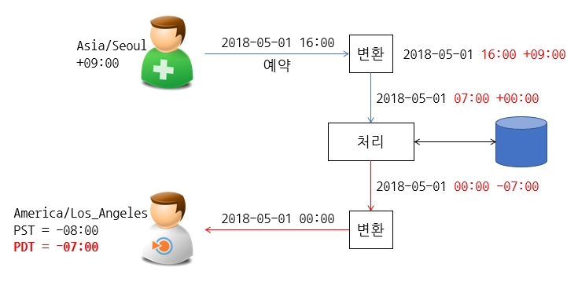

#### 1. plusDays를 사용하지 말고 개발자의 날을 계산하라.

```java
// 개발자의 날 : 매년 256번째 날 (9월 13일이지만 윤년에는 9월 12일)
int year = 2000;
for (; year <= LocalDate.now().getYear(); year++) {
    LocalDate programmersDay = LocalDate.of(year, 1, 1).plus(Period.ofDays(255));

    System.out.println(programmersDay);
}
```

```
2000-09-12
2001-09-13
2002-09-13
2003-09-13
2004-09-12
2005-09-13
2006-09-13
2007-09-13
2008-09-12
2009-09-13
2010-09-13
2011-09-13
2012-09-12
2013-09-13
2014-09-13
2015-09-13
2016-09-12
2017-09-13
2018-09-13
```

#### 2. LocalDate.of(2000, 2, 29)에 1년을 더하면 어떻게 되는가? 4년을 더할 때는 어떠한가? 마지막으로 1년을 4번 더하면 어떻게 되는가?

```java
// 2000 : 윤년
// 2001
// 2002
// 2003
// 2004 : 윤년
LocalDate date = LocalDate.of(2000, 2, 29);

System.out.println(date);                   // 2000-02-29
System.out.println(date.plusYears(1));		// 2001-02-28
System.out.println(date.plusYears(4));		// 2004-02-29

for (int i = 1; i <= 4; i++) {
    date = date.plusYears(1);
    System.out.println(i + " = " + date);
}
// 1 = 2001-02-28
// 2 = 2002-02-28
// 3 = 2003-02-28
// 4 = 2004-02-28ystem.out.println(i + " = " + date);
}
```

#### 3. Predicate&lt;LocaleDate&gt;를 받고 프레디케이드를 수행하며 다음 번 날짜를 돌려주는 조정기(adjuster)를 반환하는 next 메서드를 구현하라. 예를 들어 다음 호출은 다음 번 평일을 계산한다.

```java
today.with(next(w -> getDayofWeek().getValue() < 6))
```

```java
public static TemporalAdjuster next(Predicate<LocalDate> predicate) {
    return (temporal) -> {
        LocalDate d = (LocalDate) temporal;
        do {
            d = d.plusDays(1);
        } while (!predicate.test(d));

        return d;
    };
}

LocalDate today = LocalDate.now();
System.out.println("today = " + today);
// today = 2018-03-03

LocalDate next = today.with(next(w -> w.getDayOfWeek().getValue() < 6));
System.out.println("next  = " + next);
// next  = 2018-03-05
```

#### 4. 지정한 월을 달력을 표시하며 유닉스 cal 프로그램과 같은 프로그램을 작성하라. 예를 들어 java Cal 3 2013을 실행하면 다음과 같은 달력을 표시하고 3월 1일이 금요일임을 나타내야 한다(주말을 주의 끝에표시한다).

```java
int year = 2013;
int month = 3;

LocalDate date = LocalDate.of(year, month, 1);
LocalDate last = date.with(TemporalAdjusters.lastDayOfMonth());

// 빈 공백 찍기
for (int i = 1; i < date.getDayOfWeek().getValue(); i++) {
    System.out.printf("   ");
}

for (; !date.isAfter(last); date = date.plusDays(1)) {
    System.out.printf("%2d ", date.getDayOfMonth());

    if (date.getDayOfWeek() == DayOfWeek.SUNDAY) {
        System.out.println();
    }
}
```

```java
             1  2  3
 4  5  6  7  8  9 10
11 12 13 14 15 16 17
18 19 20 21 22 23 24
25 26 27 28 29 30 31
```

#### 5. 지금까지 자신이 며칠을 살아왔는지 출력하는 프로그램을 작성하라.

```java
LocalDate birthday = LocalDate.of(1983, 11, 12);
LocalDate today = LocalDate.now();

long days = ChronoUnit.DAYS.between(birthday, today);
System.out.println("days = " + days);
```

#### 6. 20세기에 있는 13일의 금요일을 모두 나열하라.

```java
LocalDate start = LocalDate.of(1901, 1, 1);
LocalDate end = LocalDate.of(2000, 12, 31);

LocalDate d = start.with(TemporalAdjusters.nextOrSame(DayOfWeek.FRIDAY));
do {
    if (d.getDayOfMonth() == 13) {
        System.out.println(d);
    }
    d = d.with(TemporalAdjusters.next(DayOfWeek.FRIDAY));
} while (!d.isAfter(end));
```

```
1901-09-13
1901-12-13
1902-06-13
1903-02-13
1903-03-13
1903-11-13
1904-05-13
1905-01-13
1905-10-13
1906-04-13
1906-07-13
...
1995-10-13
1996-09-13
1996-12-13
1997-06-13
1998-02-13
1998-03-13
1998-11-13
1999-08-13
2000-10-13
```

#### 7. 캘린더 이벤트(주어진 날짜의 10:00~11:00에 잡힌 미팅과 같은)에 적합한 시간 간격을 표현하는 TimeInterval 클래스를 구현하라. 아울러 시간 간격 두 개가 겹치는지 검사하는 메서드를 제공하라.

```java
package ch12;

import java.time.LocalTime;

public class TimeInterval {

	private LocalTime begin;
	private LocalTime end;

	public TimeInterval(LocalTime begin, LocalTime end) {
		this.begin = begin;
		this.end = end;
	}

	public LocalTime getBegin() {
		return begin;
	}

	public LocalTime getEnd() {
		return end;
	}

	public boolean isOverlap(TimeInterval t) {
		if (t == null) {
			return false;
		}

		if (t.begin.isAfter(this.begin) && t.begin.isBefore(this.end)) {
			return true;
		}
		if (t.end.isAfter(this.begin) && t.end.isBefore(this.end)) {
			return true;
		}

		return false;
	}

}
```

#### 8. 현재 시간 인스턴트를 지원하는 모든 시간대에서 오늘 날짜의 오프셋을 구하라. ZoneId.getAvailableIds를 스트림으로 전화하고, 스트림 연산으로 작업한다.

```java
ZonedDateTime today = ZonedDateTime.now();
Instant instant = today.toInstant();

System.out.println(today);
System.out.println();

ZoneId.getAvailableZoneIds().stream().forEach(zoneId -> {
    ZonedDateTime zoned = instant.atZone(ZoneId.of(zoneId));
    System.out.printf("%-40s = %s\n", zoneId, zoned.getOffset());
});
```

#### 9. 이번에도 스트림 연산으로 오프셋이 정각이 아닌 모든 시간대를 찾아라.

```java
Instant instant = Instant.now();

ZoneId.getAvailableZoneIds().stream()
        .map(t -> ZoneId.of(t))
        .filter(t -> t.getRules().getOffset(instant).getTotalSeconds() == 0)
        .forEach(t -> System.out.println(t));
```

#### 10. 로스 엔젤레스에서 프랑크푸르트로 가는 항공기가 지역 시간으로 오후 3:05에 출발하고 10시간 50분이 걸린다. 항공기가 언제 도착하겠느가? 이와 같은 계산을 처리할 수 있는 프로그램을 작성하라.

```java
// 일광 절약시간을 사용하는 지역들이다.
// America/Los_Angeles (PST -> PDT) : https://www.timeanddate.com/time/zone/usa/los-angeles
// Frankfurt (CET -> CEST) : https://www.timeanddate.com/time/zone/germany/frankfurt
LocalDate date = LocalDate.of(2018, 3, 2);
// 출발
LocalTime time = LocalTime.of(15, 5, 00);
ZoneId zoneId = ZoneId.of("America/Los_Angeles");
ZonedDateTime departure = ZonedDateTime.of(date, time, zoneId);
// 도착
ZonedDateTime arrival = departure.plusHours(10).plusMinutes(50).toInstant().atZone(ZoneId.of("CET"));

System.out.println(departure);
System.out.println(arrival);
// 2018-03-02T15:05-08:00[America/Los_Angeles] -> 2018-03-03T10:55+01:00[CET]
```

#### 11. 돌아오는 항공기가 프랑크푸르트에서 14:05에 출발해서 로스 엔젤레스에 16:40에 도착한다. 비행 시간이 얼마나 걸렸는가? 이와 같은 계산을 처리할 수 있는 프로그램을 작성하라.

```java
ZonedDateTime departure = ZonedDateTime.of(2018, 1,22,14,5,0, 0, ZoneId.of("CET"));
ZonedDateTime arrival = ZonedDateTime.of(2018, 1,22,16,40,0, 0, ZoneId.of("America/Los_Angeles"));

Duration between = Duration.between(departure, arrival);
System.out.println(between);
// PT11H35M
```

#### 12. 12.5절의 시작 부분에서 설명한 문제를 해결하는 프로그램을 작성하라. 서로 다른 시간대에서 잡힌 일련의 약속을 읽고, 어느 약속이 지역 시간으로 다음 한 시간 이내에 기한이 되는지 사용자에게 알림을 줘야 한다.

```
서로 다른 시간대에 잡힌 일련의 약속을 UTC 로 관리한다.
```



```java
ZonedDateTime kst = ZonedDateTime.of(2018, 5, 1, 16, 0, 0, 0, ZoneId.of("Asia/Seoul"));
ZonedDateTime utc = kst.toInstant().atZone(ZoneId.of("UTC"));
ZonedDateTime pst = utc.toInstant().atZone(ZoneId.of("America/Los_Angeles"));

System.out.println("KST = " + kst); // KST = 2018-05-01T16:00+09:00[Asia/Seoul]
System.out.println("UTC = " + utc); // UTC = 2018-05-01T07:00Z[UTC]
System.out.println("PST = " + pst); // PST = 2018-05-01T00:00-07:00[America/Los_Angeles]
```